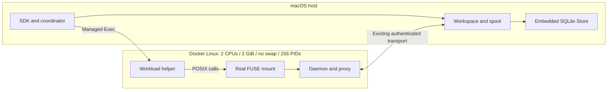
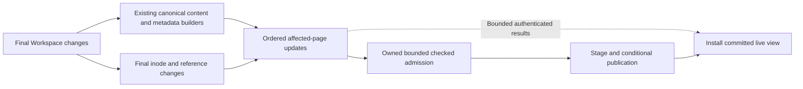
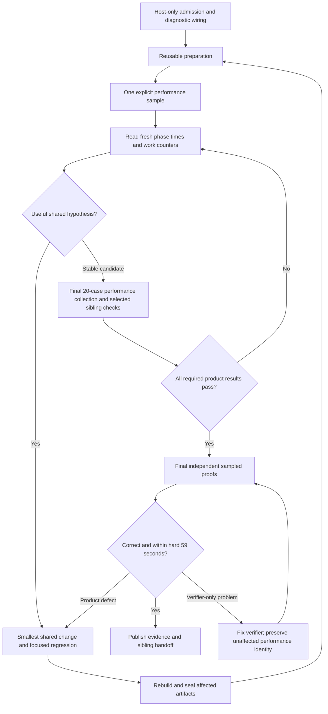
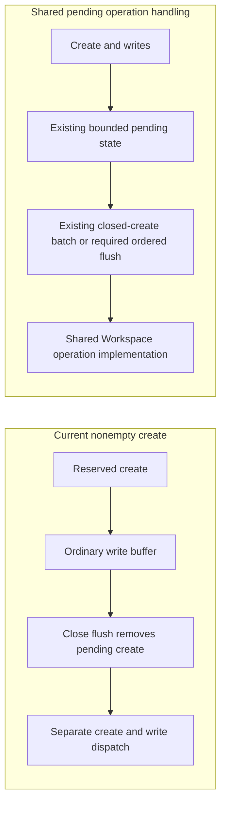

# Issue 46: tiny-file churn through shared Exec and Commit improvements

Status: implementation in progress, 2026-09-05. The execution ledger below records current work; earlier source findings are hypotheses and may have been superseded. Terminal PASS is not yet established.

Issue: [#46](https://github.com/Ephemeral-AI-Lab/layerfs/issues/46). Parent: [#39](https://github.com/Ephemeral-AI-Lab/layerfs/issues/39). This is the first implementation step of #39 and establishes the approach for its remaining families.

Focused follow-up, 2026-09-06: [#47](https://github.com/Ephemeral-AI-Lab/layerfs/issues/47) is attached to #46 and narrows the next implementation step to the two original bulk tier-100 cases, each strictly below 1,000 ms. Its [shared Workspace redesign plan](issue47-subsecond-workspace-plan.md) builds on checkpoint `3faaf3839`. The remaining #46 cases and parent obligations are not automatically qualified by this child.

The plan combines three read-only reviews of Exec, Commit, and benchmark infrastructure. The inspected checkout was clean at `e180b7b6e` after the workload-layout migration in `1997836c6`. Recheck the current source and preserve unrelated changes before implementation. Source findings below establish actual repeated work; its present wall-clock importance needs fresh host measurements.

## Latest execution amendment — 2026-09-05

The user raised the performance execution/watchdog allowance to **120 seconds**, with sufficient outer-command overhead (130 seconds by default), while retaining the **15-second optimization/PASS target**. Complete slower runs are `TARGET_MISS`, not PASS or incomplete. The separate proof allowances remain 45 seconds work / 59 seconds hard end-to-end. Resume at the lowest failing case, `tiny-bulk-create-100`; obtain complete phase timings and optimize it before any further tier-500 run. This amendment supersedes the earlier 15-second execution cutoff in this guide and historical evidence.

## 1. Controlling decisions

These latest user decisions supersede contradictory historical instructions in #39/#46 and older benchmark plans:

1. **Host SQLite only, permanently.** macOS owns SDK/coordinator, Workspace, spool, and embedded SQLite. Docker Linux runs the daemon, workload helper, and real FUSE. Docker-owned SQLite is prohibited, including as a fallback for unsupported families. No host-directory bind mounts, Docker data volumes, or Docker socket sharing. The FUSE mount inside Linux is required and is not a data-sharing mount.
2. **Fresh host absolutes are the performance evidence.** Historical records identify problematic workloads and possible causes. Do not reproduce an old baseline, target an old timing, or derive historical speedup claims. Preserve old receipts without relabeling them.
3. **Performance-first iteration.** Reuse preparation, run one selected performance sample serially, diagnose one cause, make one shared change, run its focused correctness regression, rebuild, and remeasure. Independent benchmark verification/proof runs only after performance collection is complete. Do not pair every performance sample or initial smoke with a proof.
4. **Final performance target: all 20 registered tiny-file cases complete within 15 seconds each**, using one fixed-seed sample per case initially. Keep all declared work and measure the complete public-call sum. Repeat a particular comparison only when noise or contradictory evidence prevents a decision. No automatic three-seed matrix, old median-ratio gate, or claim of statistical scaling from a single sample.
5. **Final proofs are sampled and bounded:** 45 seconds of work inside a 59-second hard end-to-end deadline for each selected invocation. Declare coverage and omissions. No exhaustive namespace/body campaign and no SDK full-byte mode.
6. **Unified product implementation.** Improve shared semantic operations and algorithms. No family-name checks, tiny/large engines, deletion-density thresholds, or policy-selected optimization routes. Bounded buffers and required flushes are resource/lifetime constraints, not alternative algorithms.

This plan does not authorize release publication or automatically close #39 or any sibling. Update the issue checklists and live runner documentation to these decisions during implementation; do not rewrite historical evidence.

## 2. Required topology

Host CPU is uncapped and host CPU/RSS/IO remain separately reported. Container limits do not bound the host. Preserve current applicable Workspace/candidate/spool budgets, each file at most 500 MiB, and aggregate logical files below 1 GiB at every workload state. No system-cache tuning or increased resource limits to turn a failure into a pass.

Preparation remains a protected, closed/quiescent host Store plus an independent writable sample copy. Reuse compatible preparation across builds; producer provenance and executing source identities are distinct. Native fixture import may remain a preparation operation on the host, but it must not replace timed live POSIX creation.

## 3. Actual starting gaps

| Finding in current source | Consequence | First action |
|---|---|---|
| `shared/runner.py` still accepts `--topology docker` | The permanent ban is not enforced | Reject/remove that execution choice and retire its reachable runner dispatch; preserve Linux image builds and daemon/workload support |
| `HOST_FAMILIES` excludes `tiny_file_churn` | The required host command currently fails selection | Admit tiny through existing generic host preparation/execution, then run compact host performance smokes |
| QUICKSTART still says to run a proof immediately after performance | Documentation conflicts with the new cycle | Change live instructions to final-only independent proofs |
| Generic tiny `fast-verify` replays the workload and walks canonical/FUSE namespaces and uncovered bodies | The current name does not mean bounded sampling | Add the bounded Workspace sample checker described in section 9, reusing the current verifier |
| Successful runner stderr is parsed for initialization diagnostics only | Detailed Commit attribution may not survive in the compact result | Capture the existing Commit diagnostics deliberately; keep output bounded |

The prior tiny smoke is evidence of an earlier Docker route only. It neither admits tiny to host execution nor qualifies large cases. The shared host master/clone, transport, exchange, and cleanup machinery already exists; no second infrastructure implementation is needed.

The runner currently has a 15-second outer product-command timeout as well as a fixed 15-second declared-product check. Record command wall and product time separately. A command timeout is incomplete execution, not a completed product timing. Do not raise the product budget; report command-startup/instrumentation overhead separately if it prevents a useful observation.

## 4. Scope and fixtures

The authoritative family registry is `benchmark/fs-bench-pro/families/tiny_file_churn/mod.rs`.

| Operation | Tier 1 and 10 IDs | Tier 100 and 500 IDs | Required outcome |
|---|---|---|---|
| Create selected files | `tiny-create-{N}-compact-v2` | `tiny-create-{N}` | New Commit with prescribed files |
| Stat selected files | `tiny-stat-{N}-compact-v2` | `tiny-stat-{N}` | `UpToDate`, unchanged root/head |
| Unlink selected files | `tiny-unlink-{N}-compact-v2` | `tiny-unlink-{N}` | New Commit with selected removals |
| Create bulk tree | `tiny-bulk-create-{N}-compact-v2` | `tiny-bulk-create-{N}` | Complete live creation and Commit |
| Delete bulk tree | `tiny-bulk-delete-{N}-compact-v2` | `tiny-bulk-delete-{N}` | Complete live deletion and Commit |

This is 20 cases, with seed 1 as the initial fixed seed. The three original recovery cases are `tiny-bulk-create-100`, `tiny-bulk-create-500`, and `tiny-bulk-delete-500`; other cases are controls, not newly declared failures.

Compact bulk fixtures use 25 files per shard; original bulk fixtures use 200. Tier 10 compact has 250 files, while original tier 100 has 20,000 and tier 500 has 100,000. Inspect actual bytes, directories, file populations, and operation counts in the registry/receipt; tier labels alone do not define a comparable growth curve. Ordinary small-operation cases can have a large untouched background at high tiers.

Preserve all required writes, metadata normalization, sync, traversal, unlinks/rmdirs, witness paths, and publication counts. No fixture shrinkage or moving required work into setup.

## 5. Reuse audit and unified direction

| Existing optimization | Actual transfer to tiny-file churn |
|---|---|
| Exact eight-entry metadata cache | Already instantiated in frontier construction |
| Sorted directory updater | Already receives the full ordered directory delta stream; bounded directory batching is fallback behavior |
| Sorted inode updater | Already shared, but frontier supplies at most 128 pending records per group |
| Checked admission, 8,191-object / bounded-byte carried batches | Already on the Workspace Commit path; do not repeat the old batch-cap fix |
| Owned memory and physical-order spilled candidate consumption | Already used by shared admission |
| Stage / conditional publish / retire and exact returned snapshot | Already shared; correctness does not imply cheap refresh |
| Native producer scheduling and flat-directory balancing | Native initialization only; Workspace frontier is not thereby parallelized |
| Sequential content capture | One running file capture; writing another node invalidates it, so it is not multi-file capture reuse |

The common Commit target is below. Boxes describe existing responsibilities and the desired removal of repeated work, not instructions to introduce one module/class per box.

Small and large mutations should use the same incremental machinery: revisit affected pages, retain untouched children, emit final values once, and retain bounded ownership. Do not build a full manifest for every small Commit. Preserve supported error/resource domains of existing fallbacks until they are transferred; never introduce another policy-selected fast path. Removing every candidate implementation in one patch is not a prerequisite for a useful shared fix.

Native compact inode-pair serialization is **not a general external sorter**: it preserves native task/preorder. Do not feed that stream into a sorted Workspace updater while assuming its order is suitable. Any bounded ordering requirement must be demonstrated and solved explicitly, preferably using an already ordered change structure before considering new machinery.

### Universality across LayerFS Exec and Commit

The solution must improve shared LayerFS Exec and Commit operations, with tiny-file churn as the first workload used to expose and measure their costs. Every caller reaching an improved shared operation should receive the improvement automatically, without a separate optimization integration for each benchmark family.

**Universality requires maximum practical reuse in both directions:** #46 must consume existing code and optimizations, and its improvements must become reusable shared product behavior for all applicable #39 siblings. This is an implementation requirement, not an optional later cleanup or a handoff consisting only of advice.

- **Reuse what already exists.** Before implementing a mechanism, audit its existing helpers, algorithms, callers, tests, telemetry, preparation, and proof infrastructure, including #38/#40 and earlier optimizations. Distinguish already active code from useful code whose callers have not transferred. Extend or repair the existing implementation; explain a concrete semantic or resource gap before adding new code. Do not copy an optimized body into another family or reconstruct an optimization already present.
- **Make #46 improvements inherit automatically.** Place changes in the existing shared Exec, Workspace, content, or Store owner. When sibling callers perform the same semantic operation, ensure they reach the improved implementation as part of the shared change. Do not leave avoidable duplicate callers behind for another ticket to port, and do not add sibling-specific opt-in flags or adapters merely to activate the optimization.
- **Cover every #39 sibling in the reuse audit.** Record the actual call path, inherited mechanisms, any semantic mismatch, and demonstrated versus unmeasured benefit for directory construction/traversal, Git workflow, namespace mutation, Workspace change locality, and Branch history. Include other families deferred to #39, such as mixed load-bearing work and Workspace reliability, in the applicability map. A family whose dominant operation bypasses a mechanism still belongs in the audit; do not fabricate a performance benefit or force unrelated operations through it.
- **Make later work cumulative.** Subsequent sibling optimization starts from #46's shared implementation, diagnostics, reusable preparation, and bounded proof primitives. Extend the same shared responsibility when a remaining bottleneck warrants it; do not fork another family engine. Remove superseded duplication after supported behavior transfers.

The handoff must therefore show both provenance (which existing optimizations were reused and where) and adoption (which sibling callers inherit each #46 change and which gaps remain). Preserve this as a concise section of the result report, not a new registry or framework. Audit all siblings read-only; measure only selected relevant sibling cases during this task, keeping the performance-first and final-only proof sequence.

| Shared layer | Responsibilities improved | Applicable callers |
|---|---|---|
| Exec filesystem operations | Creation/write buffering, metadata mutation, directory-emptiness checks, and unlink processing | Workloads using those operations through LayerFS FUSE, including tiny-file churn, Git, namespace mutation, and editor workflows |
| Commit processing | Final inode/reference accounting, ordered tree updates, checked admission, publication, and continuation | Workspace Commits performing the corresponding changes, whether the changes originated from Exec/FUSE or SDK operations |

For each retained change:

1. Identify the existing shared function or data flow being improved and trace all callers of that responsibility.
2. Confirm applicable callers use the improved implementation automatically; record any untransferred implementation or supported-domain exception explicitly.
3. Preserve one implementation per semantic responsibility. Product code must not inspect benchmark family, case, or tier to choose an optimization.
4. Keep small changes incremental and large changes bounded. Remove duplicate implementations only after their supported behavior and resource/error semantics have transferred.
5. Exercise selected different workload shapes to find regressions or callers that bypass the improvement; follow the performance-first and final-only proof sequence below.

Exec and Commit retain distinct responsibilities: Exec maintains live filesystem state and operation ordering; Commit constructs and publishes immutable state. Reuse appropriate primitives across them without forcing both operations into one engine. Required semantic distinctions, such as fsync ordering and open-unlinked lifetime, remain explicit.

Universality is an implementation and caller-transfer requirement, not a promise of equal speedup for every operation. Read-only work does not benefit from creation batching, a clean Commit has little construction work, and native initialization bypasses live FUSE creation. Report demonstrated improvement separately from expected applicability. A shared design alone does not establish that every caller has transferred or that every sibling has passed its performance gate.

## 6. Performance-first iteration

Run performance and proof commands serially; subagents may perform read-only reviews but must not launch competing builds/measurements. Do not use an automatic whole-family or baseline/candidate matrix during diagnosis.

For each hypothesis, record: observed cost; source-level cause; predicted counter change; minimal patch; focused regression; one same-case/seed remeasurement; keep/revise/reject decision. If the counter does not improve, reject the explanation. If it improves but complete time does not, investigate the new dominant cost rather than polishing a minor saving. Repeat a noisy comparison only when necessary to decide. Preserve failed receipts and revert only the owned unsuccessful patch.

Progress through compact tier 1, compact tier 10, original tier 100, then original tier 500 when each new size answers a concrete question. A larger case is not warranted merely because a small one passes. Do not rerun a known-slow unchanged large workload to reconfirm a timeout.

### Attribution to retain

| Layer | Existing observations | Minimal missing attribution |
|---|---|---|
| Complete lifecycle | `pure_call_sum_ns`, Create/Exec/Commit/visibility/End, command wall | Preserve incomplete/timeout phase evidence without calling it a full sample |
| Workload within Exec | Plan/workload time, syscall counts, bytes/files, normalization and sync times | None until current observations identify a gap |
| Proxy and host | Kernel operation counts, frame/copy/socket/dispatch and spool metrics | Closed-create files/bytes versus standalone messages; flush reasons; chmod/mtime request counts and client/host time |
| Commit | Plan, content, namespace, candidate finish, admission/SQL, publication, in-place rebase, resume | Split frontier file construction from directory/metadata/first inode-pass work if needed |
| Structural work | Namespace visits, snapshot calls/rows/bytes, candidate counts | Inode flush/page counts, reference-pass rewrites, release cursor/page work, rebase resolution versus installation |

`content_ns` currently includes directory updates, metadata, and first-pass inode flushes in the frontier loop. Do not treat it as pure file/CDC time. Existing host dispatch timing does not completely attribute metadata-only requests. Add counters to existing telemetry rather than a new profiling framework. Nested timers overlap: never add Exec-contained workload time or admission subphases to their parent totals.

## 7. Experiments worth trying

Priority is provisional: compact host measurements select the dominant work. E1 is a small concrete reuse opportunity; E3/E4 may deserve most effort if Commit dominates. Run one experiment at a time, not all experiments before remeasurement.

### E1 — carry ordinary nonempty creates through existing batching

**Observed:** nonzero writes enter the ordinary write buffer; unpin flushes it, removes pending creation, and emits separate create/write messages before closed-create batching can consume the file. Existing `PendingCreate.writes`/byte fields are not filled by production writes.

**Experiment:** connect eligible writes to the existing pending representation and closed-create endpoint. Existing capacity limits cause a flush of the same mechanism, not a different small/large-file engine. Preserve current fallback/ordering behavior on read, link, truncate, fsync, pause, and bounds.

**Prediction:** fewer standalone frames/dispatches and lock acquisitions, with unchanged bytes/syscalls and lower complete Exec time. Reserved create/write/unpin already use no-reply messages: do not claim one synchronous RTT saved per file.

**Focused check:** nonzero, overlapping and zero writes; bound-triggered flush; read/reopen visibility; fsync/pause; existing deferred-error semantics. **Stop:** discard a design that delays synchronous errors or changes visibility; move on if dispatch work falls but is a minor share.

**Owners/reuse:** `layerfs-fuse/src/proxy_client.rs`, existing protocol and `layerfs-workspace/src/projection.rs`. Applies to ordinary FUSE creation callers, including Git-generated files; no new bulk API.

### E2 — remove redundant metadata work without changing acknowledgements

**Observed:** normalization performs separate chmod and utimensat calls; each currently makes a synchronous proxy exchange. A combined single-callback setattr RPC cannot combine these prescribed separate syscalls.

**Experiment:** first attribute Chmod and SetMtime count/time and host resolution/update work. Reuse authoritative operation results and avoid repeated validation/resolution/mutation only where semantics permit. An equal-value guard on the host saves bookkeeping, not the transport RTT; a client guard needs proof that the cached identity/state remains authoritative through unlink, pause, aliases, and errors.

**Prediction:** fewer redundant mutations/lookups or lower time per required metadata operation; if round trips remain dominant, document that constraint before proposing a protocol change. **Focused check:** unchanged/changed modes, timestamp semantics, stale or removed nodes, paused state, error propagation. **Stop:** no generic asynchronous chmod/mtime queue that shifts synchronous errno reporting, no removal of timed normalization, no claim of RTT improvement from a host-only guard.

**Owners/reuse:** common FUSE metadata methods and Workspace metadata mutation. Applies to all callers of these operations; measure a selected sibling before claiming its benefit.

### E3 — construct final inode/reference values with less repeated table work

**Observed:** frontier iterates a HashMap, creates new records with reference count zero, flushes at most 128 pending inode updates, then looks up and rewrites new records in a later reference-adjustment pass. Sorting within each group does not give global update order.

**Experiment:** resolve final reference changes before emitting final new records, preserving alias/move accounting; then investigate monotonic ordered consumption of affected inode changes. Reuse the existing sorted updater. Separate elimination of the second record write from any larger bounded-ordering change so each has its own measurement.

**Prediction:** fewer record constructions/lookups, reference rewrites and affected-page rebuilds. **Focused check:** canonical parity, new aliases, rename/replacement, removal of one of several links, small edit in a large untouched namespace, bounded scratch. **Stop:** no global manifest/all-node copy for small changes, no unsupported assumption that native pair streams are sorted, no arbitrary increase from 128 to 8,191 as a substitute for eliminating repeated work.

**Owners/reuse:** `layerfs-workspace/src/changes.rs`, existing `layerfs-content/src/tree/batch.rs`, existing Store candidate machinery. Benefits ordinary structural Commits across tiny churn, namespace mutation, Git, and history when those paths are exercised.

### E4 — use the produced committed state during continuation

**Observed:** `rebase_committed` visits materialized nodes, resolves surviving paths from the new root, checks aliases, and reloads attributes/state immediately after candidate construction produced final values.

**Experiment:** carry the smallest bounded authenticated construction result needed for continuation, or reuse existing bounded authenticated multi-inode reads where results are not retained. Improve the single shared continuation path; do not introduce a tiny-file refresh.

**Prediction:** fewer path resolutions, snapshot calls/rows/bytes, and lower `in_place_rebase_ns`. **Focused check:** stable NodeIds, aliases, pinned/open-unlinked spools, exact returned snapshot after another publication, publication-success/presentation-failure recovery without recommit. **Stop:** no second unbounded path graph, weaker validation, or eager walk of untouched siblings.

**Owners/reuse:** `layerfs-workspace/src/{changes,lifecycle,cow_tree}.rs`. Likely benefits many-file creation, rewrites and repeated Commits; benefits depend on materialized live state, not benchmark name.

### E5 — reuse bounded emptiness and deletion traversal

**Observed:** shared unlink checks rmdir emptiness by materializing `directory_entries`, although `directory_is_empty` already exists with bounded pages/early exit. Commit release requests one directory entry per page step; reference passes repeat some old-name lookups.

**Experiments, separately:** (a) use the existing emptiness helper after checking equivalence; (b) carry bounded pages/cursors during immutable release; (c) avoid duplicate parent/name or reference-pass lookups when the same authenticated information is available.

**Prediction:** fewer materialized nodes/maps, page requests and repeated lookups; lower Exec rmdir or Commit release time. **Focused check:** nonempty rejection, last-child deletion, nested subtree deletion, surviving aliases, open-unlinked data and old-root readability. **Stop:** no deletion-density policy, survivor-only alternate engine, root-reset shortcut, or reclamation of immutable history chunks.

**Owners/reuse:** shared `cow_tree.rs` unlink/emptiness, `changes.rs` reference/release, and existing traversal primitives. Small and large deletions use the same algorithm.

### Deferred until evidence justifies them

Multi-file capture, producer pools, a new spool layout, SQLite tuning, larger admission batches, a generic external sorter, and complete candidate-planner consolidation are not first steps. They must address a remaining measured cost after smaller reuse fixes. Content capture invalidation does not by itself justify thousands of retained captures or threads.

## 8. Implementation packages and handoff boundaries

| Package | Work and likely files | Exit condition |
|---|---|---|
| A: host-only admission and documentation | `shared/runner.py`, `runtime.py` only where needed, existing tests, README/QUICKSTART, issue checklists | Docker-owned mode rejected; tiny compact create/delete performance works on host; identities/isolation/cleanup retained; no independent proof run |
| B: diagnostic preservation and bounded checker | Existing telemetry, `src/infra.rs`, `src/workspace_bench.rs`, `src/workspace_verify.rs`, `workload/workspace_common.rs`, verifier tests | Compact diagnostics distinguish actual costs; sampled checker implemented/tested without launching benchmark proofs |
| C: measured shared product experiments | One of E1–E5 at a time under its existing owner | Predicted work reduction, focused correctness check, same-case fresh host remeasurement and explicit keep/reject decision |
| D: final performance | Registry-driven explicit selections through shared runner | 20/20 complete samples at most 15 seconds; affected sibling performance checks; all resources and cleanup pass |
| E: final proofs and report | Existing selected verifier plus result report | Relevant sampled proofs pass under 59 seconds; focused semantic regressions pass; current evidence and transfer limitations published |

Packages A/B should stay small; no new benchmark framework. Their implementation can be staged as needed, but all independent benchmark proofs remain in package E. If E finds a product defect, return to C and refresh affected final performance before re-proving. Verifier-only changes preserve unchanged performance under its producing identity, with explicit product/source equivalence; never relabel old receipts.

## 9. Final proof contract

Reuse the existing selected verifier and bounded namespace-sampling helpers. The current tiny generic fast path has no covered-file certificates, promotes uncovered files to witnesses, and scans broad canonical/FUSE state. Replace that behavior for the bounded Workspace proof with deterministic selection, not a second oracle framework.

Start with the existing namespace precedent of at most 11 sampled regular files and at most 64 KiB per selected file. Allocate samples across touched parents, first/middle/last or seeded positions, representative file sizes, and the untouched witness. Keep missing-path checks separately bounded (at most 11); for bulk deletion check the removed `bulk` root plus selected descendants, never every removed path. If a necessary property needs a different small selection, declare it rather than silently expanding the scan.

Derive selected paths and expected bytes directly from the deterministic fixture recipe or retained prepared metadata. Do not enumerate the whole namespace, generate every expected file body, or build an all-path expected map merely to choose a few samples. Oracle selection and generation are also part of the proof's bounded work.

| Semantics | Final independent sampled observations |
|---|---|
| Create / bulk create | Selected expected paths, exact length/mode/mtime, independently generated bounded bytes, unchanged witness |
| Unlink | Selected targets absent, surviving parents/siblings and witness valid |
| Bulk delete | Removed bulk root and selected former descendants absent; witness survives |
| Stat | `UpToDate`, unchanged pinned root/head, selected target metadata and witness state |
| Common publication | Returned/persisted root and Branch head agreement, Store reconnect and actual fresh FUSE reopening where claimed, isolation and cleanup |

Record selected paths/ranges, seed, input/source/image identities, expected observations, root/head, reconnect/reopen coverage, wall/resource observations and omissions. Explicitly declare `full_namespace_verified=false` and `full_file_bytes_verified=false`. Workload-reported counts are observations, not an independent namespace census. Alias/open-handle/failure guarantees also require the focused product regressions; these workloads do not prove every such semantic by sampling alone.

Only after final performance collection, run the chosen proofs serially. Select enough cases to cover the changed semantics; do not multiply every case/seed into a proof. Each final invocation includes cache validation, clone, startup, any replay, checking, cleanup, and receipt publication inside 59 seconds. Prewarm compatible preparation separately, but do not hide remaining setup/validation from the proof wall.

The existing separate full selected workload replay may remain if it fits the 45-second work allowance. If replay/setup cannot fit, report TIMEOUT/INCOMPLETE. A smaller-case proof establishes only that case's selected coverage. Keeping a sealed completed performance sample to avoid replay requires explicit owned-artifact lifecycle work because current samples are deleted; do not assume such a flag exists or build it before measuring the need.

## 10. Command shapes after host admission

These commands are not instructions to launch work while reviewing this plan. Tiny currently fails host selection until package A lands. Use a matching built host binary and immutable Linux image identity; do not treat the image tag in QUICKSTART as current after source changes.

~~~bash
# From the repository root; build only when affected source changes.
python3 benchmark/fs-bench-pro/shared/runner.py --build-host
export LAYERFS_BENCH_IMAGE="$(python3 benchmark/fs-bench-pro/shared/runner.py --build-image)"

# Explicit selection; use a new output path for each invocation.
python3 benchmark/fs-bench-pro/shared/runner.py \
  --topology host-store --family tiny_file_churn \
  --case tiny-bulk-create-1-compact-v2 --seed 1 \
  --prepare-only --output "$ISSUE46_PREPARE_OUTPUT"

python3 benchmark/fs-bench-pro/shared/runner.py \
  --topology host-store --family tiny_file_churn \
  --case tiny-bulk-create-1-compact-v2 --seed 1 \
  --perf-fast --output "$ISSUE46_PERFORMANCE_OUTPUT"

# Final stage ONLY, after performance collection. Values come from the
# selected final performance receipt, not from an earlier candidate.
python3 benchmark/fs-bench-pro/verify-selected.py \
  --topology host-store --family tiny_file_churn \
  --case "$ISSUE46_CASE" --seed 1 \
  --source "$ISSUE46_PERFORMANCE_SOURCE" \
  --input "$ISSUE46_PERFORMANCE_INPUT" \
  --image "$ISSUE46_PERFORMANCE_IMAGE" \
  --output "$ISSUE46_PROOF_OUTPUT"
~~~

Set the task-specific output variables to fresh paths before running. Tiny uses `--seed`, not SDK `--repetition`. Do not use implicit smoke selection when a specific create/delete case is intended. Preparation may be acquired automatically on a miss; it must remain measured separately and safely reusable.

## 11. Acceptance and universality evidence

- [ ] Host-only mode is enforced across supported benchmark launchers; no Docker-owned SQLite escape/fallback, data mount, or socket sharing.
- [ ] Fresh host results cover all 20 registered cases, one initial sample each, every complete `pure_call_sum_ns` at most 15 seconds. No failed/disabled case is counted as passing.
- [ ] Required work, canonical semantics, applicable resource bounds, independent samples and cleanup are preserved. Create/Exec/complete Commit/visibility/End remain timed.
- [ ] Retained changes remove demonstrated work through shared implementations; no new family/size/deletion-density optimization policy. Small changes remain incremental and large changes bounded.
- [ ] For each changed Exec/Commit responsibility, the caller audit demonstrates automatic reuse by applicable callers and explicitly records untransferred implementations or semantic bypasses. No separate per-family optimization integration is required for callers already using the shared operation.
- [ ] Each new mechanism records the existing code/optimization reused and any concrete gap requiring new implementation. The handoff maps inheritance across every #39 sibling, including other deferred families; avoidable duplicate same-operation callers are transferred with the shared change rather than left for per-family reimplementation.
- [ ] Inspect actual-work transitions and selected sibling performance for unexplained regressions. Repeat only uncertain comparisons. Single samples are not median or statistical scaling qualification.
- [ ] Final selected independent proofs pass within 59 seconds each and disclose sampled coverage. Relevant focused semantic regressions pass. Performance PASS alone is insufficient.
- [ ] Publish source-bound results, every attempted selected outcome, phase/counter/resource changes, and unresolved limitations. Historical times are not the optimization denominator.

Use a compact iteration ledger: case/seed, source, product/Exec/Commit time, dominant subphase, predicted/observed counter, decision, and final proof identity/status when available. Do not add a new results framework.

Universality is established by actual call sites, not by promising equal speedups:

| Shared responsibility | Sibling evidence to select only when affected | Paths that bypass it |
|---|---|---|
| FUSE create/write batching | One small Git/new-file or mixed workload | Native import, direct SDK edits |
| Metadata updates | One metadata-heavy namespace/Git operation | Operations that do not mutate metadata |
| Inode/reference updates | One sparse structural/alias case and one affected many-file case | Clean Commit; unrelated read work |
| Continuation | Existing exact-snapshot/failure regressions plus a repeated-Commit or materialized-state performance case | Native initialization without a live Workspace |
| Deletion traversal | Sparse unlink/nonempty rmdir and subtree mutation | Content-only edits |

Place these selected performance checks before the final proof stage. Reuse existing passing focused evidence when it remains applicable; do not replay all nine completed families to market genericity. Handoff: shared functions changed, real callers, demonstrated reductions, expected-but-unmeasured applicability, known bypasses and remaining costs. No sibling or parent closes automatically.

## 12. Source map for implementation

- [Quickstart](../../../../benchmark/fs-bench-pro/QUICKSTART.md), [runner](../../../../benchmark/fs-bench-pro/shared/runner.py), [runtime](../../../../benchmark/fs-bench-pro/shared/runtime.py), [selected verifier](../../../../benchmark/fs-bench-pro/verify-selected.py).
- [Tiny registry](../../../../benchmark/fs-bench-pro/families/tiny_file_churn/mod.rs), [ordinary workloads](../../../../benchmark/fs-bench-pro/workload/ordinary_workloads.rs), [metadata/native verification helpers](../../../../benchmark/fs-bench-pro/workload/workspace_common.rs).
- [FUSE callbacks](../../../../crates/layerfs-fuse/src/filesystem.rs), [proxy client](../../../../crates/layerfs-fuse/src/proxy_client.rs), [proxy host](../../../../crates/layerfs-fuse/src/proxy_host.rs), [protocol](../../../../crates/layerfs-fuse/src/protocol.rs).
- [Workspace projection](../../../../crates/layerfs-workspace/src/projection.rs), [mutation/emptiness](../../../../crates/layerfs-workspace/src/cow_tree.rs), [candidate construction](../../../../crates/layerfs-workspace/src/changes.rs), [continuation](../../../../crates/layerfs-workspace/src/lifecycle.rs), [capture](../../../../crates/layerfs-workspace/src/capture.rs).
- [Sorted tree updater](../../../../crates/layerfs-content/src/tree/batch.rs), [Store admission](../../../../crates/layerfs-layerstack-store/src/objects.rs), [Store publication](../../../../crates/layerfs-layerstack-store/src/workspace.rs), [telemetry](../../../../crates/layerfs-layerstack-store/src/telemetry.rs).
- [Infrastructure dispatch](../../../../benchmark/fs-bench-pro/src/infra.rs), [Workspace benchmark](../../../../benchmark/fs-bench-pro/src/workspace_bench.rs), [Workspace verifier](../../../../benchmark/fs-bench-pro/src/workspace_verify.rs), [namespace sample precedent](../../../../benchmark/fs-bench-pro/src/main.rs).
- [#38 progress](issue38-progress.md), [nine-family sampled baseline contract](nine-family-fast-baseline.md), [earlier bulk investigation](bulk-create-delete-optimization-notes.md). Historical numbers and superseded replay instructions in these files are not current gates.

## 13. Execution ledger — current user contract, 2026-09-05

The controlling acceptance is 20 complete seed-1 cases, each complete declared product-call sum <=15 seconds, followed by selected sibling performance and bounded final sampled proofs. No extra speedup, per-phase, median, scaling-ratio, or headroom gate applies.

Starting checkout: `7278a1fd4`, with only this supplied guide untracked. The host-only prohibition and startup cleanup repair were already delivered by that commit. This task admitted tiny to the existing host runner and updated QUICKSTART to final-only independent proofs. Existing stdout `operation` and `commit-diagnostics` records already retain Commit phases/counters; no duplicate telemetry was added. Seven historical containers were idle (one process, 0% CPU, <1 MiB each); their retained state was preserved.

Actual compact tiny bulk fixtures use 50 files per shard, not the older guide's 25: tier 1 creates 50 files / 1,048,576 bytes; tier 10 creates 500 files / 10,485,760 bytes. Original tiers remain 20,000 and 100,000 files. Case labels are not interchangeable work dimensions.

| Attempt (seed 1) | Complete product seconds | Exec | Commit | Result / decision |
|---|---:|---:|---:|---|
| `issue46-baseline-create1` | 0.265519 | 0.204234 | 0.050086 | PASS performance only; continuation 0.036627 s |
| `issue46-baseline-create10` | 0.721459 | 0.512396 | 0.195141 | PASS performance only; continuation 0.123118 s |
| `issue46-baseline-delete1` | 0.134203 | retained in receipt | retained in receipt | PASS performance only |
| `issue46-baseline-create100` | incomplete | watchdog exhausted budget during Exec | not reached | NO-GO; active product 15.000314 s, outer command 15.899592 s, cleanup PASS. No speedup denominator. |

Receipts: `benchmark-results/host-store/results/<attempt>/perf.jsonl`. Baseline host/image product seal `2a0f830a18ed0b9df7197c2dd0d7df921215b8c78cf60fe07c658715de5efee5`; executing source seal/image source `4ee0a7c596ceb346...` is recorded completely in each receipt. Every sample uses a protected host master and independent writable clone, authenticated transport, no Docker data mounts, and 2 CPU / 2 GiB / no swap / 256 PID container bounds. Host resources are separate observations.

First shared experiment: transfer the final global buffered write into `PendingCreate.writes` at unpin and consume it through the existing bounded closed-create endpoint. Existing read, metadata, truncate, sync, pause and earlier-write flushes remain ordering boundaries. Shrink transferred allocation to actual bytes so the 1 MiB payload bound also bounds retained buffer capacity. The direct >=1 MiB write caller now flushes reserved creation through the same existing ordered send helper. Prediction: fewer standalone create/write/unpin dispatches for ordinary closed writes; no synchronous RTT-saving claim. Initial expanded test accidentally drained metrics before an existing aggregate assertion (test failure retained in session); removing that test-only drain restored all 11 unit + 5 proxy integration tests. No independent benchmark proof has run.

Further observations: closed-create tier 10 completed in 0.740006 s (Exec 0.526375; Commit 0.198344), versus 0.721459 initially. Payload-copy metrics confirm transfer to the existing closed batch, but the overall sample does not demonstrate a speedup. Vectored framing combines header/body writes across requests, responses, and byte payloads without changing wire format, acknowledgements, or payload copies. Its focused test first failed on two writes, then passed for one write, interrupted/partial writes, and zero-write errors. All 12 FUSE unit and 5 integration tests passed.

Vectored tier 10: 0.699140 s complete (Exec 0.484276; Commit 0.198756). Vectored original tier 100: **incomplete** at cumulative 15.000060 s during Commit. Its Exec completed in 14.947934 s, with 20,000 writes / 104,857,600 bytes and metadata normalization 10.100463 s across 20,234 entries. This identifies synchronous metadata cost as the remaining dominant obstacle; no complete runtime or speedup is claimed. Cleanup passed. A bounded diagnostic transport probe found the pre-existing tunnel slower than the current endpoint (429.436 ms versus 187.083 ms / 1,000 exchanges); it was rejected without any routing/configuration change. The probe is diagnostic, not product evidence.

The sampled verifier now uses bounded recipe selections and shared canonical/native readers, bypassing the generic complete expected-tree and namespace walks for tiny cases. It records <=11 files, <=11 absent paths, <=11 explicit directory samples, <=64 KiB/file, and <=132 components/path. Existing preparation identity validation may enumerate fixture descriptors; it does not choose samples or generate expected bodies. The independent proof deadline still includes preparation acquisition/validation, clone, replay, reconnect, fresh FUSE reopen, checking and cleanup. A focused unit regression passed recipe equivalence at compact tiers, selected corruption/metadata/absence rejection, and an unread 500 MiB untouched native sparse file. No benchmark proof has run.

The shared frontier now emits final counts for new inodes from fully materialized bindings and skips their later additions rewrite; existing inode counts and old-binding release remain unchanged. This reuses the existing inode updater, metadata cache, bounded candidate buffer and checked admission. Expanded structural regression covers two surviving new aliases and a new directory whose namespace count is 1 although POSIX links is 2; its expected census was updated from 328 to 329 for that added directory. All other 45 Workspace unit tests passed, and the corrected structural test passed. Performance impact remains to be measured.

Retained final-reference experiment: `issue46-finalrefs-create10` completed at 0.687995 s (Exec 0.481299; Commit 0.193930). Namespace phase dropped from 11.205 ms to 1.042 ms and namespace-final visits from 4,501 to 3,215; candidate workload remained 500 files / 10 MiB. Continuation remained ~129 ms and was not optimized. This is demonstrated removal of repeated work, not a statistical speedup claim. Read-only review found no product correctness/resource regression. Proof review identified missing initial stat-head comparison and inode-record validation; both were repaired and the focused bounded checker regression passed again. These verifier-only corrections preserve product/fixture/workload equivalence of performance observations.

### Shared adoption and remaining paths

| Caller/family | Automatically inherited behavior | Bypasses / remaining work |
|---|---|---|
| tiny_file_churn | closed nonempty creates, vectored frames, final new-inode counts, bounded final sample checker | high-tier synchronous metadata, continuation and deletion costs remain measured obligations |
| directory_construction_traversal | vectored live requests; new-directory final counts | scans are read-only; file-create batching does not help mkdir-only construction |
| git_tool_workflow | ordinary new-file closed batching, all proxy frames, new-inode final counts | host Git preparation still needs migration; its unsupported route is not admitted and no old bind-mount preparation is run |
| namespace_mutation | vectored rename/unlink/attribute frames; any newly created replacement inode uses final counts | existing-inode moves/releases are unchanged; bounded directory_is_empty transfer remains unimplemented |
| workspace_change_locality | all FUSE frames where Exec is used; new-inode counts where structural changes occur | dense existing-file writes and SDK edits bypass pending creates; clean Commit already bypasses candidate/rebase |
| dedup_branch_history | shared Commit construction for actual new inodes | SDK edit history bypasses FUSE; existing-inode reference handling unchanged |
| mixed_load_bearing | ordinary episode-created files and structural Commits inherit all applicable changes | not performance-qualified in this task |
| workspace_reliability | same applicable live operations and Commit owner; existing failure/rebase tests retained | sampled tiny proof does not replace alias, open-unlinked or failure injection regressions; no reliability campaign claimed |
| payload/dedup construction families | new FUSE writes inherit closed transfer until an existing bound/ordering flush; all proxy frame senders share vectored writer; new-inode Commits inherit final counts | native import bypasses FUSE creation and Workspace continuation; existing SDK content-only operations do not benefit from new-inode counts |

The shared framing change transfers ordinary request/response, directory-fragment, direct write and read-response senders together. It retains one wire representation and authenticated transport. The closed-write change uses the existing global buffer, `PendingCreate`, 128-file/1-MiB closed batch and shared projection handler. Final references use the existing frontier, sorted inode updater, eight-entry metadata cache, bounded ObjectBuffer, checked carried admission, and stage/publish/retire lifecycle. No family/tier/size/density chooses a product engine. The existing read cache, clean-Commit bypass, capture, continuation and fallbacks remain in their current owners.

Collection so far: 17/20 tiny cases have complete performance PASS, while bulk-create 100/500 and bulk-delete 500 remain incomplete budget failures. The existing create-100 Exec failure was not replayed after a Commit-only revision. Selected directory construction tier 1 passed at 0.021065 s, and namespace relocation/deletion tier 1 passed at 0.026132 s. Bulk-delete 100 completed at 5.873699 s (Exec 4.149231, Commit 1.707254); bulk-delete 500 exhausted the budget during Exec.

Deletion replan: the existing SnapshotReader caches only objects <=1 KiB, so canonical directory leaf pages (up to 8 KiB encoded) are repeatedly loaded and decoded by live `lookup_node`, even though readdirplus already materialized inode records. A single validated-leaf cache was added to the existing content directory lookup implementation and retained by Workspace. Overlay changes remain checked first; immutable directory-root identity and first/last name bounds prevent stale-root or gap errors. It retains one leaf, not a directory or a Workspace graph, and does not change the existing Store cache cap. The uncached API delegates to the same implementation. All ordinary Workspace lookup callers inherit it, including unlink batches, SDK path lookup and continuation where locality permits. Native import bypasses this persistent Workspace cache. A focused multi-leaf/gap/root-switch test demonstrates fewer page reads, and all 46 Workspace unit tests pass. Runtime effect is pending a rebuilt same-case measurement.

Leaf-cache observation: `issue46-leaf-delete100` completed at 5.016013 s (Exec 3.315802, Commit 1.683153), down from 5.873699 / 4.149231 / 1.707254 on the same case and seed. The 500-tier attempt still expired during Exec; retained as incomplete.

Next falsifiable shared revision: FUSE `readdir`/`readdirplus` previously reconstructed and cloned the complete cached directory on each kernel page, then skipped to the offset. With wide directories this repeats allocation/copying over the whole directory per page. The callbacks now request at most 128 entries from the existing proxy cache; full-list callers and other providers keep compatible forwarding behavior, and no new wire request is introduced. The first result uses the same ordered cache representation as subsequent pages. Seeking still walks BTreeMap keys, a documented ceiling; only page names/attrs are cloned. A 1,000-entry regression verifies initial/continuation/end/large offsets and one backend enumeration; all 12 FUSE unit + 6 proxy tests pass. Pending performance remeasurement determines retention.

Latest steering interrupted the broader final-control refresh after six completed samples and one already-running selection (allowed to finish/clean up). No independent benchmark proof had run. Performance watchdog is now 120 seconds, outer default130 seconds, and target remains15 seconds; target-miss receipts retain complete timers/resources/cleanup. Work returns to tiny-bulk-create-100 before any higher tier.

First complete 120-second-allowance observation: `issue46-120s-create100`, seed1, **24.489626 s TARGET_MISS**. Exec15.341586 s (normalization10.375220 s), full Commit9.096349 s (continuation7.460079 s, content/frontier1.081239 s, admission0.431807 s), Create0.009936 s, visibility0.000137 s, End0.041618 s. All20,000 files /104,857,600 bytes and required syscalls completed; cleanupPASS, no swap/OOM. The previous interpretation of an external latency obstacle did not establish a terminal blocker: work continues on this lowest failing tier with complete timings.

Current continuation hypothesis: reuse already-authenticated parent-directory resolutions within the exact immutable published view. The bounded BTreeMap borrows parent paths from existing Workspace state, retains at most128 IDs (further constrained by the current final-delta policy), and discards the index on capacity. Every final file binding and alias still resolves through the shared lookup and retains presentation validation; at most one non-directory node remains staged. All9 lifecycle regressions passed, including exact returned-snapshot installation, aliases/open-unlinked spools and publication-failure recovery. Awaiting same-case remeasurement.

### Checkpoint before the focused child work — 2026-09-06

The parent-resolution measurement completed before the implementation task was interrupted: `issue46-parent-create100` is **22.142764 s TARGET_MISS**, with Exec 15.086029 s, Commit 6.988436 s, continuation 5.258958 s, construction bucket 1.156603 s, and admission 0.451293 s. This supersedes the preceding pending-measurement note, not the older producing receipts. The latest unprofiled delete-100 comparator remains `issue46-pages-delete100`: 4.991831 s complete, Exec 3.297524 s, Commit 1.679852 s, namespace 1.671591 s.

The user requested committing this existing work before a new child of #46 investigates both original tier-100 bulk cases below 1,000 ms each. This checkpoint is incomplete optimization progress, not terminal PASS or release qualification. No independent benchmark proof has run. The source task is idle/interrupted; no competing benchmark was started for this checkpoint. Before committing, the 13 offline runner tests, 9 lifecycle regressions, and diff whitespace check passed. Previously recorded broader focused checks retain their original scope.
