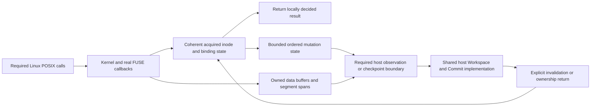

# Issue 47: Exec root causes and structural optimization opportunities

Date: 2026-09-06. Read-only research against source HEAD `8aec76f76` / product checkpoint `3faaf3839`, with retained host benchmark evidence. Three subagents investigated metadata/FUSE/transport, host write/spool processing, and deletion/workload attribution; the parent cross-checked mount configuration and latest receipts. No new builds, benchmarks, profiles or independent proofs were run. This document does not modify the Commit implementation being developed in a separate Codex task.

Scope: the original `tiny-bulk-create-100` and `tiny-bulk-delete-100`, each with complete lifecycle target strictly below 1,000 ms. macOS retains SDK/Workspace backing storage/SQLite; Docker Linux runs the workload and real FUSE. No Docker-owned SQLite, data mounts or socket sharing. The [implementation plan](issue47-subsecond-workspace-plan.md) remains Commit-first; these findings prepare the later Exec work and its shared-state interfaces.

## 1. Findings in one page

1. **Creation's dominant measured envelope is metadata normalization.** The latest complete create Exec is 15.086 seconds, including 10.175 seconds normalization. The source usually executes chmod and timestamp changes as serial synchronous host exchanges after creation has closed. That does not establish that 10.175 seconds is all network time.
2. **Required syscalls produce many more FUSE callbacks than logical file operations.** Roughly 182,000 callbacks are recorded in the detailed earlier create receipt. One FUSE worker services callbacks; entry/attribute TTL is one second. Expiry and repeated path validation may amplify callback work, but their exact contribution has not been measured.
3. **Logical file creation entails per-file host temporary storage.** Create-100 opens 20,000 host spools, retains their descriptors, and performs repeated fstat/stat checks around every write. Latest open/write processing is 1.930 seconds. The PieceTree sequential-write optimization is already active; it does not remove these host operations.
4. **Deletion is already partly local and batched.** Its 20,000 unlink callbacks are not 20,000 synchronous host round trips. Repeated acquisition/materialization and rediscovery of directory/inode state remain, along with real Linux syscall/callback work.
5. **Telemetry currently misleads if read as a complete operation census.** Normalization bypasses some syscall counters; read/write transport timing omits metadata-only service; the retained host profile covers one thread/window, not whole-system CPU attribution.
6. **The strongest direction is fewer dependencies and fewer representations.** Execute operations at an owner with enough authoritative state to decide them, acquire directory/inode information once, and store mutable bytes in bounded shared extents. Merely making RPCs asynchronous or raising caches is not equivalent.

The investigation establishes code-level causes and missing measurements, not a guaranteed subsecond result or a physical impossibility. The new Commit task may change shared structures; recheck these interfaces before implementation.

## 2. Evidence and workload shape

| Latest unprofiled receipt | Create-100 | Delete-100 |
|---|---:|---:|
| Directory under `benchmark-results/host-store/results/` | `issue46-parent-create100` | `issue46-pages-delete100` |
| Complete product lifecycle | 22.142764 s | 4.991831 s |
| Exec | 15.086029 s | 3.297524 s |
| Workload body | 15.046854 s | 3.293363 s |
| Descriptor planning | 34.990 ms | 0.000209 ms |
| Metadata normalization | 10.175039 s | 0.000676 s |
| Root-sync envelope | 0.087568 s | 0.000429 s |
| Host spool open/write envelope | 1.930172 s | 0 |

These cases have different product/harness identities: delete predates the parent-resolution-cache change. They are latest observations, not a same-source final pair. The earlier full `issue46-120s-create100` supplies detailed counts and had Exec 15.341586 seconds / normalization 10.375220 seconds; do not mix its timings with the newer receipt. `issue46-vectored-create100` completed Exec but was cut off during Commit and is not a complete lifecycle result.

Both original bulk cases concern 20,000 files / 104,857,600 bytes plus a witness tree. They are not flat directories or sparse 100-operation cases:

- 6,400 files under the wide directory: 64 per shard across 100 shards.
- 13,500 files in regular per-shard directories: 135 per shard.
- 100 files under a 128-level spine: one per shard.
- 233 created/removed directories in the measured bulk tree.
- Per shard, 128 files of 1 KiB, 64 of 8 KiB and eight of 48 KiB.

Create generates required bytes during its measured workload. Its roughly 35 ms descriptor plan is not all byte-generation time. The 100 MiB generator runs before writes and is not separately attributed. The small difference between workload/plan times and Exec suggests process-launch/output plumbing is not a multi-second explanation, but no exact disjoint timing equation is assumed.

## 3. Actual creation dependency chain

```text
Linux workload, one serial operation stream
    |
    +-- open/create -> FUSE create -> reserved live inode
    +-- generate bytes -> pwrite -> FUSE write -> buffered transport
    +-- close -> FUSE flush/release -> closed-create/write drain
    |
    `-- after creation: normalize 20,234 changed paths
           |
           +-- chmod -> FUSE setattr -> proxy gate/flush
           |                           -> host mutation -> response
           |
           `-- utimensat -> FUSE setattr -> proxy gate/flush
                                           -> host mutation -> response

Host write processing
    create one spool per logical file
       -> fstat/stat and high-water checks
       -> positional append
       -> physical allocation observation
       -> piece/dirty state installation

Final root fence -> workload exits -> Exec completes
```

### Metadata normalization: measured envelope, incomplete attribution

`Ops::finish` sorts changed paths and normalizes each through `common::set_metadata`, which performs permissions and timestamp operations separately. The current non-pending proxy setters each call `flush_write`, then a synchronous `exchange_at`. That exchange takes the exclusive proxy gate, checks pause state, drains buffered writes, locks the single stream and waits for a response. Host mutation takes Workspace access and changes in-memory mode/mtime plus mutation bookkeeping; it is not an SQLite transaction per setter.

For pending creates, mode/mtime already execute locally. Most final normalization happens after files are closed and their bounded creation batches have been sent, so those files are no longer in that pending category. Keeping all files pending until normalization would tie behavior to the benchmark and break existing bounds.

The final attribute lookup in FUSE setattr often hits proxy state; do not assume a third remote Attr request for every callback. Repeated gate acquisitions are confirmed, but one serial workload does not by itself prove lock contention. The measured normalization envelope also includes path sorting/bookkeeping; there is no current matching create profile assigning its entire duration to RPC waiting.

### Operation accounting

The detailed full create receipt records 60,469 attempted syscalls through `Ops::call`. Normalization invokes its two filesystem operations directly, outside that counter. It adds 20,234 × 2 = 40,468 prescribed calls, for about 100,937 counted-plus-normalization operations before library-internal syscalls. The separately recorded 233 mkdir-related chmods are already in the first count.

Kernel observations are consistent with 40,701 setattr callbacks = 40,468 normalization operations + 233 directory chmods. Other recorded callbacks include 41,061 lookup, 20,146 getattr, and 20,000 each of create/write/flush/release. These are not host request counts.

This distinction matters for the subsecond target: reducing remote requests is necessary but leaves significant real kernel/callback work. Counts can themselves fall through correct caching; the current count is not an immutable lower bound.

## 4. FUSE and scheduling: structural leverage, not a knob sweep

Confirmed configuration:

- `host_mount.rs`: one FUSE worker, no cloned FUSE descriptor.
- `adapter.rs`: one-second entry/attribute TTL.
- `filesystem.rs`: parallel-directory and readdirplus capabilities requested, but capability advertisement does not create more userspace workers.
- Newly created handles use `FOPEN_DIRECT_IO` to keep sequential creation memory-bounded; later opens use `FOPEN_KEEP_CACHE`.
- Default kernel permission checking remains enabled. TCP_NODELAY is already enabled on transport streams.

A callback that blocks for a host response occupies the sole worker. Additional workers/connections cannot automatically accelerate a serial workload that waits for each syscall, and can introduce ordering/concurrency requirements. The first objective is eliminating unnecessary dependencies.

The multi-second create/normalization run exceeds the one-second cache TTL. Expired entries or attributes may produce repeated lookup/getattr work, especially in deep paths. This is a plausible amplification mechanism, not yet a demonstrated share of elapsed time. Faster local metadata processing might reduce expiration pressure even without changing TTL.

The disruptive opportunity is event-driven cache coherence tied to live ownership and explicit invalidation, allowing kernel/proxy state to remain authoritative where justified. Increasing TTL blindly can hide stale state after SDK edits, namespace replacement or revocation. Audit inode and entry invalidation, aliases, permission observations, negative lookups and host-originated changes first.

Do not simply enable writeback caching, remove direct I/O, or disable permissions to improve the benchmark. Created-handle memory/mmap behavior and write acknowledgement/fence semantics are existing contracts. Kernel caching changes are a separate measured coherence decision after the live-state contract is established.

## 5. Host spool/write root causes

### Confirmed per-file work

`new_spool_node_reserved_inner` creates/truncates a host file named by NodeId, observes descriptor metadata, creates the edited-file representation, and retains the descriptor in `open_spools`. A Linux close unpins the logical file but does not close the host descriptor for a still-linked file.

For a normal successful nonzero write, the source performs:

1. Workspace/node validation; logical range and next PieceTree calculation.
2. Path/alias and budget bookkeeping.
3. `spool_file`: descriptor fstat plus pathname stat, identity comparison and allocation observation.
4. Another descriptor fstat immediately afterward for high-water validation.
5. Positional append.
6. Another descriptor fstat to record allocation, including a partial append before rollback.
7. Logical edit installation only after append success.

That is four metadata syscalls around each payload write, plus the create observation. The earlier receipt's 100,000 physical observations match one at creation, three during write and one at the final whole-Workspace fence per file. Pathname stats add syscalls without an additional observation count. This is a source-derived ledger, not a new syscall trace.

`PhysicalSpoolMetrics` maintains an aggregate by per-node deltas. It is not scanning all files on every observation. Ordinary write clones the affected file's alias paths, not the entire Workspace. No measured quadratic physical-accounting bug was found.

### Important root-sync correction

The current `Workspace::fsync` path enumerates the selected/all edited nodes, clones their spool paths, validates descriptors through `spool_file`, and finishes capture. It does not call `File::sync_all` or `sync_data` in this implementation. The root-sync envelope must not be described as 20,000 disk fsyncs or as proof of a stronger crash-durability guarantee. Preserve the actual ordering/visibility contract and any separately specified persistence guarantee.

### Reuse versus representation change

The immediate reusable reduction is to return/reuse the descriptor metadata already obtained by `spool_file` for the high-water check. This can remove one fstat per write while retaining identity and length checks. Keep the post-append observation needed for physical peak/failure accounting. It is useful but cannot remove per-file opens or the dominant metadata RPCs.

The structural change is stable segment ownership:

```text
Current read/write ownership
    Logical NodeId -> pathname -> retained file descriptor
         |                 |
         |                 `-- repeated pathname/descriptor validation
         `-- read plans may reopen pathname

Proposed ownership
    Logical pieces -> owned segment spans -> retained segment descriptor
                         |
                         `-- bounded append, observation and reclamation
```

Retaining descriptor/segment ownership in read plans eliminates the need to rediscover backing bytes by per-node path. A Workspace-owned bounded append store can replace tens of thousands of host file lifecycles with segment operations. Reuse positional IO, existing PieceTree base/zero/inline logic, rollback order and resource admission.

Preserve the existing compact sequential-span optimization. Today a contiguous per-file spool can be represented by length alone; with shared storage it should remain a compact `(segment, start, length)` span rather than forcing every sequential write into a fragmented tree.

Rollback must never truncate another later writer's append. Open-unlinked spans retain storage, while dead space around a small retained span must not grow without bound. Account physical segment allocation rather than inventing per-logical-file block counts. Reclamation/compaction work remains part of observed product costs. mmap alone does not remove per-file ownership; begin with retained positional-IO extents and measure before adding mapping complexity.

### Copies are real but currently lower priority

For 100 MiB, latest write metrics report 100 MiB each of client request, framing payload and host decode copies. Timed host open/write/check work is about 1.930 seconds, while socket-write time is about 24 ms. Existing encode/decode observations are much smaller than metadata and host spool work.

Socket-read time includes waiting and overlaps processing; host dispatch contains nested spool work. Do not add these times into Exec or interpret all of them as copy CPU. Reuse owned buffers and vectored framing, but another copy patch is not a credible sole path from 15 seconds to subsecond.

## 6. Deletion Exec: reuse acquired state

The prescribed workload recursively lstats each path, enumerates and sorts directory names, removes children, then calls rmdir. It records 20,233 lstat, 20,000 unlink and 233 rmdir calls. Those obligations remain even if FUSE serves them locally.

Current useful reuse is already present: proxy directory/attribute caches, queued regular-file unlinks, up-to-512-entry unlink messages, one host Workspace lock per batch, a validated leaf cache, and bounded FUSE reply copies.

Remaining work:

1. A cache miss still requests a complete Readdir/ReaddirPlus list from the host. Kernel reply paging does not make acquisition bounded/streamed.
2. Host enumeration collects canonical entries, loads inode/metadata/file state, constructs paths and a materialized entry map.
3. Cached reply pages use `.skip(offset)`, revisiting preceding keys. The 6,400-entry wide directory makes this worth counting, but the recent copying change did not materially accelerate delete-100, so do not assume cursor work dominates.
4. The host unlink batch loops ordinary unlink, which resolves the binding again. Enumeration knowledge is not passed as an authoritative mutation operand.
5. Readdir callbacks call a barrier before consulting cache. Count barriers that actually drain or wait, not just method invocations.
6. Rmdir still uses full `directory_entries(...).is_empty()` although the existing bounded `directory_is_empty` helper can preserve the check with less materialization. Empty base directories still require checking removed names; no promise of zero traversal.

Recommended direction: acquire authenticated binding/inode state once, service enumeration/lookup/getattr and ordered mutations from the same coherent view, and hand final validated deltas to the host without replaying discovery. Stable directory cookies/cursors must preserve arbitrary valid offsets, buffer retries, dot entries, mutation behavior and handle lifetime. A mutable-array index is not automatically a stable cookie.

Do not replace recursive POSIX deletion with a bulk API or root reset. Keep nonempty/missing/type errors, aliases, unlink/recreate order, open-unlinked state, host visibility and bounded backpressure.

## 7. Recommended disruptive design and required proof of authority

The shared design has three parts:

1. **Coherent live metadata/namespace execution.** The acknowledging owner has authoritative inode existence/lifetime, validated inputs, operation order and capacity. Most steady-state callbacks can finish without a host exchange.
2. **Bounded ordered host handoff.** Existing reservation, pending-operation, pause/drain and invalidation primitives carry changes before host observers/edits, fsync, Commit or revocation. Host backing storage and SQLite remain on macOS. There is no second Store or new general-purpose distributed service.
3. **Shared segment-backed written data.** Logical extents retain their backing owner across reads and checkpointing; avoid path-based per-file storage lifecycles.



This is **not** equivalent to making Chmod/SetMtime no-reply. Current synchronous errors must be decided before acknowledging success. Pending-create local setters show useful primitives, not sufficient authority for every cached inode. A reclaimed inode, failed creation, revoked owner, exhausted mutation capacity or host observer cannot be ignored because cached attributes exist.

Audit every host observer/mutator, not just the pause calls already present in SDK edit paths. Define generation/ownership transitions so queued updates cannot cross rename/unlink/recreate or host edits incorrectly. Do not retain all files in the pending-create buffer until normalization. No workload/family/size-selected engine or unsafe equal-value shortcut.

Coordinate interfaces with Commit's candidate-bound checkpoint facts and shared extents. The Exec redesign must feed the same Commit implementation and must not reset the mount or live handles after ordinary publication. Full active-shell/concurrent Commit support remains a separate explicit snapshot-generation feature; this research does not authorize removing current guards.

## 8. Measurements that resolve the remaining uncertainty

Run these later through the designated execution owner, serially and only when Commit work permits. They were not run for this research.

| Priority | Minimal measurement/experiment | Decisive evidence |
|---|---|---|
| 1 | Split normalization sort/bookkeeping, chmod and timestamp time; per-op local hit/remote count, client wait and host service | Distinguish mandatory remote dependencies from host work and callback overhead |
| 2 | Split host spool open, descriptor/path validation, high-water check, append and post-write observation | Show whether simple result reuse or representation change removes the material host work |
| 3 | Attribute directory acquisition/materialization, cached page seek/copy, remote lookup/unlink and actual barrier drains | Choose between acquisition reuse, local mutation authority and cursor work for delete |
| 4 | Linux callback elapsed/CPU by phase alongside host time; cache expiry/invalidation counts | Establish callback cost after remote dependencies are removed; test the TTL amplification hypothesis |
| 5 | Time actual generated bytes separately from write syscall elapsed | Keep generator cost inside Exec and avoid blaming it without evidence |
| 6 | One authoritative metadata or namespace slice with focused semantic tests | Remote dependencies collapse without weaker errors, lifetime or visibility |
| 7 | Shared extent prototype if host-file ownership remains material | Bounded host opens/descriptors, fewer path metadata operations, identical logical writes and rollback |
| 8 | Same-source unprofiled create-100/delete-100 pair | Total lifecycle improves; no equivalent work merely shifts to Commit/End |

Use lightweight counters before full syscall tracing; tracing a hundred thousand calls can perturb the result. Profiles are diagnostic-only. Native filesystem or exact-tree native-initializer controls can contextualize work but do not qualify the real FUSE workload or prove a mathematical lower bound.

Keep 120 seconds diagnostic / 130 seconds outer allowance. Scope remains the two original tier-100 cases; no whole-family or tier-500 campaign. Final independent sampled proofs remain at the end, after both full performance targets pass, within 45 seconds work / 59 seconds hard end-to-end each.

## 9. Claims and approaches rejected by the evidence

- “Every kernel callback/unlink is a remote round trip”: proxy caches and unlink batches already serve many locally.
- “The host is 82% idle, so the network is the root cause”: 260/316 receive-wait samples describe one service thread/window in a delete profile, not total CPU or create metadata attribution.
- “The generator/normalizer is quadratic”: no such demonstrated path; normalizer sorting is roughly N log N with path-length costs, physical accounting uses aggregate deltas.
- “Root sync performs 20,000 disk fsyncs”: current implementation validates spool descriptors and fences capture/operations.
- “Enable TCP_NODELAY / more connections / more threads”: NODELAY is already enabled; more parallel capacity does not remove a serial syscall dependency.
- “A combined setattr RPC fixes normalization”: it cannot merge separate prescribed chmod/timestamp syscalls.
- “Just lengthen TTL or make metadata asynchronous”: neither establishes coherent state or correct acknowledgement semantics.
- “Replace the extent tree”: PieceTree and canonical extent reuse already work; the missing reuse concerns backing ownership and results between stages.
- “Copy optimization alone gets to subsecond”: current encode/decode/framing costs do not explain multi-second metadata/spool work.
- “Eliminate all metadata and Exec is solved”: latest non-normalization Exec is still about 4.911 seconds, including sync, generation, callbacks, creation and host writes.
- “A small Exec result is enough”: all handoff, construction, publication, checkpoint and End work remain in the child's complete lifecycle.

## 10. Sources and handoff

Primary receipts: latest create (historical local artifact: `../../../../benchmark-results/host-store/results/issue46-parent-create100/perf.jsonl`), earlier detailed create (historical local artifact: `../../../../benchmark-results/host-store/results/issue46-120s-create100/perf.jsonl`), latest unprofiled delete (historical local artifact: `../../../../benchmark-results/host-store/results/issue46-pages-delete100/perf.jsonl`), delete diagnostic stack (historical local artifact: `../../../../benchmark-results/host-store/results/issue46-delete100-host-stack.txt`), profile classification (historical local artifact: `../../../../benchmark-results/host-store/results/issue46-profile-classification.json`).

Source: [workload operations](../../../../benchmark/fs-bench-pro/workload/ordinary_workloads.rs), [metadata/content helper](../../../../benchmark/fs-bench-pro/workload/workspace_common.rs), [generator](../../../../benchmark/fs-bench-pro/workload/sdk_edit_common.rs), [FUSE callbacks](../../../../crates/layerfs-fuse/src/filesystem.rs), [mount configuration](../../../../crates/layerfs-fuse/src/host_mount.rs), [TTL/attribute adapter](../../../../crates/layerfs-fuse/src/adapter.rs), [proxy](../../../../crates/layerfs-fuse/src/proxy_client.rs), [host service](../../../../crates/layerfs-fuse/src/proxy_host.rs), [protocol](../../../../crates/layerfs-fuse/src/protocol.rs), [host projection](../../../../crates/layerfs-workspace/src/projection.rs), [spool/write ownership](../../../../crates/layerfs-workspace/src/file_io.rs), [namespace and physical accounting](../../../../crates/layerfs-workspace/src/cow_tree.rs), [piece representation](../../../../crates/layerfs-workspace/src/file_edit.rs), [daemon execution](../../../../crates/layerfs-daemon/src/main.rs).

Handoff expectation: recheck these findings against the Commit task's delivered source; keep implementation ownership separate; select the next experiment by the remaining measured Exec cost. Preserve operation/error/resource semantics, use one shared implementation, and explicitly map benefits to create, delete, Git, namespace mutation and other applicable #39 callers. This research is not an instruction to run concurrent measurements or to claim subsecond feasibility before it is demonstrated.
