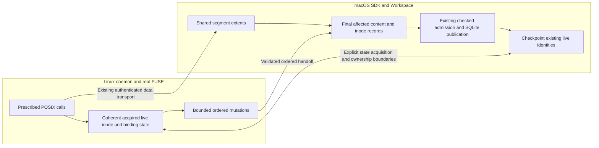
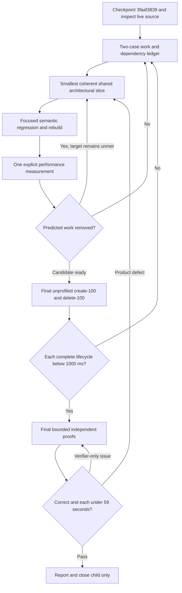

# Issue 47: subsecond bulk create/delete through shared Workspace redesign

Status: reviewed implementation proposal, 2026-09-06. No implementation or subsecond qualification is claimed by this plan.

Tracking: [#47](https://github.com/Ephemeral-AI-Lab/layerfs/issues/47), a GitHub sub-issue of [#46](https://github.com/Ephemeral-AI-Lab/layerfs/issues/46), under [#39](https://github.com/Ephemeral-AI-Lab/layerfs/issues/39).

Starting checkpoint: **`3faaf3839`**, local `main`, not pushed. This preserves the work from Codex task `01a071c0-4365-73f0-9a8f-9acd114a5a55`, including the [#46 guide and attempt ledger](issue46-tiny-file-churn-implementation-plan.md). The source task was idle/interrupted before the commit. Thirteen offline runner checks, nine lifecycle regressions, and diff checks passed at checkpoint time; independent benchmark proofs had not run. Earlier focused tests retain their recorded scope.

## 1. Smaller workload scope, substantial implementation freedom

Deliver these two original registered cases, seed 1, each with **complete `pure_call_sum_ns < 1,000,000,000`**:

- `tiny-bulk-create-100`: create 20,000 files / 100 MiB through the actual Linux POSIX/FUSE workload, normalize metadata, sync, Commit and End.
- `tiny-bulk-delete-100`: traverse and delete the corresponding 20,000-file tree, preserve the witness, sync, Commit and End.

These are not `tiny-create-100` and `tiny-unlink-100`, which perform sparse operations. Do not change IDs, workloads, inputs, file counts, metadata/syscall obligations or publication counts to meet the target.

Only these two performance cases are mandatory in this child. Selected small semantic/sibling controls are permitted when a shared change affects them. No tier 500 or all-20 campaign, automatic multi-seed matrix, strict scaling-ratio gate, or additional performance headroom. The parent's other cases and completion obligations remain open.

The target is an acceptance requirement, not an established capability. Existing measurements do not prove either physical impossibility or guaranteed success. On a failed experiment, revise the mechanism or the next diagnostic; do not silently loosen the target or call partial-phase success terminal PASS.

## 2. Fixed topology and execution contract

macOS owns SDK/coordinator, Workspace backing storage, canonical construction, and embedded SQLite. Docker Linux runs the daemon, workload helper and real FUSE. Docker-owned SQLite remains permanently prohibited. No data mounts/volumes or Docker socket. Keep 2 CPUs / 2 GiB / no swap / 256 PIDs for Linux and separate host resource observations; host CPU is uncapped.

Keep current applicable Workspace, candidate, spool and aggregate workload limits. Reuse protected closed preparation and independent writable samples. Preparation and proof are separate from product time, but no required live workload or retirement work may be moved into preparation or after measured End.

Use the current **120-second product diagnostic watchdog / 130-second outer allowance** to obtain complete failing results. The existing parent classifier accepts up to 15 seconds; this child must separately assess strict `<1,000,000,000 ns`. A 1–15-second parent PASS is a child TARGET_MISS. Add one shared receipt assessment if needed; no case-specific product timer or optimization mode.

One explicit performance sample per iteration, serial. Focused correctness regressions may run when semantics change. Independent benchmark proofs run only after both performance targets pass, with 45 seconds work / hard 59 seconds end-to-end each. Retain explicit sampled coverage.

## 3. Evidence and implications

| Receipt | Complete product | Exec | Commit | Main Commit cost |
|---|---:|---:|---:|---|
| `issue46-parent-create100` | 22.142764 s | 15.086029 s | 6.988436 s | Rebase 5.258958 s |
| Earlier `issue46-120s-create100` | 24.489626 s | 15.341586 s | 9.096349 s | Rebase 7.460079 s |
| Latest unprofiled `issue46-pages-delete100` | 4.991831 s | 3.297524 s | 1.679852 s | Namespace 1.671591 s |

Receipts: `benchmark-results/host-store/results/<receipt>/perf.jsonl`. Parent-cache create uses a newer product/image than the delete observation. Preserve full source/product/image/harness identities; these are latest observations, not a same-source final pair. Profiled delete is diagnostic-only and must not replace the unprofiled comparator.

Useful work observations from the earlier completed create:

- 20,000 host spool opens and 100 MiB of writes; recorded spool-write processing about 1.887 seconds.
- Metadata normalization about 10.375 seconds; approximately 40,701 setattr callbacks.
- Approximately 182,000 listed FUSE callbacks across create/write/flush/release, lookup/getattr, metadata and directory operations.
- 82,672 canonical candidate objects / 113.4 MB / 28 admission transactions; about 0.432 seconds admission.
- Non-rebase Commit alone about 1.636 seconds.
- Rebase includes path/record reconstruction **and** per-file spool metadata/unlink, handle close and allocation retirement. Do not attribute its whole timer to lookups.

Delete publishes only nine objects / 22,318 bytes, while Commit performs 27,546 snapshot database calls and visits 20,234 base paths. The primary opportunity is repeated namespace/record discovery, not bulk SQLite insertion.

These are current implementation costs, not immutable floors. Removing only rebase, only metadata, or increasing a cache/batch cannot explain a complete subsecond design. Historical initializer numbers are context only.

## 4. Recommended architecture: one live state, one compilation, one checkpoint

The design should eliminate repeated representation changes. Keep existing crate responsibilities and canonical encodings unless an explicit measured need and compatibility plan justify a change. Do not introduce another Store, universal backend interface, actor framework, or family-selected engine.

This is a design direction, not a claim that the current proxy cache is authoritative enough. There must be one authority for a semantic operation at a time. Host backing/persistence remains authoritative; bounded delegated execution at the live presentation owner cannot permit simultaneous contradictory host/proxy mutations.

### A. Execute metadata and namespace operations at an owner with sufficient facts

Existing pending creates already support local metadata mutation, cached attributes, reserved identities and bounded batches. Existing pause/callback draining and targeted invalidation provide useful handoff boundaries.

Extend these primitives into one coherent live-state contract:

1. Acquire authenticated inode/binding information on demand, with the state and resource reservations needed to decide an operation's success or failure.
2. Execute lookup/getattr and locally decidable metadata/namespace mutations against that same state. All aliases share the same inode; open handles retain inode lifetime independently of names.
3. Record bounded ordered changes and drain them before host observers/edits, fsync, Commit, revocation or projection replacement as required by the actual contract.
4. If required authoritative facts are unavailable, acquire them through the same protocol; do not invent a size/family fast path or treat stale cached attributes as authority.

The host and local owner must reuse validation and normalization logic. A host-side equal-value check saves mutation work but not a round trip. A local check is safe only when inode existence/lifetime, active ownership, pending errors, value validation and capacity are known.

**Do not turn synchronous chmod/mtime into fire-and-forget commands.** Moving actual validated execution is different from returning success before the responsible component executes it. Define error behavior for capacity exhaustion, host rejection, disconnect and revocation before adopting a local acknowledgement. Keep the workload's separate chmod and timestamp syscalls.

For deletion, acquired enumeration information should service subsequent lookup/getattr/unlink/rmdir without asking the host to rediscover the same binding. Stable bounded cursors replace repeated full enumeration/copying. The host consumes validated deltas and required reference accounting, not a replay of every callback's path discovery.

### B. Remove reconstructed ordinary-Commit rebase

Construction already determines final inode identities, content/metadata roots, directory roots and references. Preserve the smallest candidate-bound installation facts until publication/install completes; do not consume the only copy during object admission.

| Existing node/state | Ordinary successful checkpoint |
|---|---|
| New or edited linked file | Set final canonical inode identity and Base content root/length |
| Changed directory | Adopt final base root and clear the published delta |
| Unchanged live node | Preserve identity, paths, pins and unchanged attributes |
| Open-unlinked node | Preserve its data/extent lifetime and handle identity |
| Workspace | Advance exact returned head/root/base and clean only published changes |

Retain existing live maps where possible. No post-publication all-path walk or reconstruction of another Workspace just to prove that construction produced its own input. Replace reread-based validation with checked construction/installation consistency and focused canonical-equivalence regressions.

Admission rejection must leave the working overlay usable. Publication-success/install-failure retains the published identity and unfinished installation facts; retry completes installation rather than creating another Commit. Retained installation data is budgeted and may use existing bounded serialization, not a second complete live graph.

Reconciliation can genuinely change the visible state. Preserve its semantics until equivalent final-state installation covers it; this is not a workload-size policy. The obsolete Two-store V2 history is not a reason to retain reconstruction in ordinary Commit.

### C. Replace per-logical-file spools with bounded shared extents

Current per-file spool ownership causes tens of thousands of host creates, metadata observations, descriptor retentions, unlinks and closes. Reuse PieceTree's base/zero/written-range model and adapt written ranges to segment identity plus offset/length.

- One shared mechanism for ordinary writes, with bounded segment sizes, append ownership and descriptor count.
- Per-node extent ownership preserves sparse/overlap semantics and open-unlinked data.
- Move existing short-write rollback, physical/live allocation accounting and fsync guarantees to the new ownership boundary.
- Retire/reuse unreachable segment space without one host unlink per logical file or indefinite retention of dead storage around a small pinned extent.
- No in-memory-fitting exception or tiny/large storage selector. Bounded rotation/drain is resource management of the same mechanism.

This is a real representation change. Introduce only the required segment/extent owner and records under existing Workspace ownership; no pluggable old/new spool framework. Moving spool cleanup from Commit to End is not an improvement in the complete timer.

### D. Compile final changed state once

Retain #46's final new-inode reference fix, metadata cache, sorted directory builder, checked owned admission and conditional publication.

Use bounded ordered changed-inode updates; settle alias/move effects before release. Consume removed-directory children through bounded pages and reuse existing batched authenticated inode reads, while each mutation observes the latest pending reference state. Avoid one-child-per-root-seek traversal and duplicate lookups. Do not rebuild survivors using a deletion-density policy.

Native compact inode-pair serialization preserves task/preorder; it is not an arbitrary-inode sorter. Reuse framing/storage only where its contract fits. Do not require a full-table scan to order a few changes.

If canonical work still dominates, test bounded reuse of write-produced content and final records. Remove an actual reread/rebuild or demonstrate critical-path overlap. Moving the same work from Commit to Exec is insufficient, and a producer per file is not the proposed solution.

## 5. Running commands and the snapshot boundary

The live Workspace must remain usable across Commit: no reset of its mount/path/handles merely because a snapshot was published. This child requires correct same-session continuation.

The two named workloads finish their command before Commit. Current managed execution returns Busy if Commit is requested while a command is active. Concurrent active-command Commit is not necessary for these performance gates and must not become an accidental feature expansion.

If a new ownership design needs a generation boundary, define it explicitly: freeze generation G for publication, retain its extents, keep later writes in G+1 dirty, and never clear them when installing G. Full concurrent shell/Commit support requires its own explicit validation of observation, failure and backpressure. Do not simply delete Busy or promise zero pauses because publication is a SQLite transaction.

## 6. Decisive exploration, then staged implementation

### Step 0 — establish the remaining work, without another broad campaign

Use retained results wherever sufficient. Add narrow phase deltas only for unanswered decisions: metadata local/remote dependencies, generation versus spool work, rebase lookup/materialization versus installation/cleanup, deletion directory reads versus record/flush work. Snapshot-read counters must have matching scope; an End lifetime total is not a rebase-only measurement.

If useful, time the existing host initializer on the exact independently prepared final create tree (equivalent to delete's initial bulk tree plus witness after recipe equality is checked). Preparation already creates such trees; time the initialization call separately from generation/manifest work. Do not register a new family or substitute native import for Exec. Native and callback controls are nonqualifying comparisons, not mathematical floors.

Measure whether required callback/dependency work leaves a plausible budget before committing to broad storage changes. A control omitting product work must remain explicitly nonqualifying; it cannot grant permission to omit that work in the real case.

### Step 1 — prove one coherent live-state slice

Choose the dominant metadata or deletion binding sequence, reuse acquisition/reservation/invalidation primitives, and establish where success is authoritatively decided. Predict reduced remote dependencies and repeated host materialization. Validate ordering, errors and host-observer visibility before expanding the same mechanism.

### Step 2 — ordinary checkpoint using produced final facts

Implement candidate-bound installation into existing nodes with rejection and partial-install recovery. Predict near-elimination of post-publication path/inode rediscovery, not merely higher cache hit rate. Split spool retirement so its remaining cost is visible.

### Step 3 — shared extent ownership

Replace per-file host spool lifecycle with bounded segments. Predict fewer host creates/opens/unlinks/closes and physical-observation calls while bytes, sparse behavior and durability remain unchanged. This step can move earlier if measured creation cost dominates; avoid parallel edits to shared Workspace state.

### Step 4 — final-state compilation and deletion accounting

Use bounded cursors, ordered updates and authenticated lookup batches; preserve reference effects and untouched children. Measure whether work moved or disappeared. Revisit canonical readback/admission only if it remains necessary for the subsecond target.

### Step 5 — same-source final pair, then proofs

Run each original case once, seed 1, serial and unprofiled, on the final product identity. Assess both strict `<1,000,000,000 ns` results from complete timers. Only after both pass, run selected independent sampled proofs and finish the result/adoption report.

Every no-go must produce an explicit revised hypothesis, experiment or design decision. Continue through recoverable problems without retrying unchanged failures. An unproven ownership model or disappointing experiment is not proof the hardware makes the target impossible. Conversely, do not fabricate success if faithful measurements miss. Keep precise unresolved constraints visible. Stop after the two runtime gates, correctness and resource requirements pass; no marginal-tuning campaign.

## 7. Focused correctness and final sampled proofs

During implementation, use existing tests for the changed semantic boundary, adding the smallest regression that would catch its failure:

- Ordered create/write/close/metadata/rename/unlink/recreate, repeated aliases and stale identities.
- Ownership acquisition/revocation, host observer, pause/fsync and resource errors; no delayed metadata errno.
- Sparse/overlapping/zero writes, interrupted/short append rollback, segment lifetime/accounting and reclamation.
- Open-unlinked reads, last-reference deletion, nonempty rmdir, old-root readability.
- Exact returned snapshot, clean repeated Commit, rejection leaves overlay intact, publication-success/install-failure recovery.
- Small changed sets remain incremental and do not require a whole-Workspace traversal.

Final benchmark proof reuses #46's bounded recipe-derived canonical/native checks: selected created files, bounded bytes/metadata, selected removed paths, witness preservation, root/head and Commit outcome, reconnect/reopen where actually executed, and cleanup. Retain maximum work/end-to-end deadlines of 45/59 seconds. Oracle selection must not enumerate/generate the full tree just to choose samples.

Proof setup/replay/cleanup remaining in the invocation count toward its wall. No automatic proof after each iteration; no all-seed/all-case expansion. Declare full-namespace/full-byte coverage false when sampled. Component tests establish semantics not independently exercised by the two sample recipes.

## 8. Adoption, output and acceptance

Reuse in both directions is mandatory: map existing #38/#40/#46 code consumed and sibling callers inheriting each change. Keep shared validation, lifetime and construction implementations; do not copy optimized bodies into families. Audit all applicable #39 siblings read-only, and use only selected affected performance/semantic controls before final proofs.

| Deliverable | Required evidence |
|---|---|
| Two-case runtime | Both original complete timers strictly below 1,000,000,000 ns, fixed seed 1, final delivered product identity |
| Environment and resources | Host SQLite only, real Linux FUSE, no data mounts, unchanged workload/resource bounds, independent samples and cleanup |
| Architectural benefit | Reduced mandatory dependencies, host file lifecycle operations, duplicate construction or namespace discovery; no case/size/density selector |
| Correctness | Focused semantic regressions plus final bounded sampled proofs, exact coverage and omissions |
| Reuse | Existing code provenance, actual sibling call paths, measured versus expected benefit, remaining untransferred semantics |
| Reporting | Complete attempted outcomes, source/image/harness identities, diagnostics labelled separately, remaining limitations; no relabelled older receipts |

Do not impose arbitrary per-phase millisecond budgets, percent gains, or extra margin as gates. Component budgets are editable estimates used to assess feasibility; only complete measured results establish the performance target.

Create `issue47-subsecond-workspace-results.md` only when actual work/results exist. Update #47 with final evidence and commit identities, clearly stating local versus pushed state. Close #47 only on terminal PASS. Do not close #46/#39 or qualify their other cases automatically, and do not publish a release.

## 9. Source map

- [Parent guide and checkpoint ledger](issue46-tiny-file-churn-implementation-plan.md), [quickstart](../../../../benchmark/fs-bench-pro/QUICKSTART.md), [shared runner](../../../../benchmark/fs-bench-pro/shared/runner.py).
- [Tiny registry](../../../../benchmark/fs-bench-pro/families/tiny_file_churn/mod.rs), [workload operations](../../../../benchmark/fs-bench-pro/workload/ordinary_workloads.rs), [fixture/metadata helpers](../../../../benchmark/fs-bench-pro/workload/workspace_common.rs).
- [FUSE callbacks](../../../../crates/layerfs-fuse/src/filesystem.rs), [proxy live state](../../../../crates/layerfs-fuse/src/proxy_client.rs), [host dispatch](../../../../crates/layerfs-fuse/src/proxy_host.rs), [protocol](../../../../crates/layerfs-fuse/src/protocol.rs).
- [Workspace nodes and namespace](../../../../crates/layerfs-workspace/src/cow_tree.rs), [projection handoff](../../../../crates/layerfs-workspace/src/projection.rs), [spool and writes](../../../../crates/layerfs-workspace/src/file_io.rs), [piece representation](../../../../crates/layerfs-workspace/src/file_edit.rs).
- [Candidate construction](../../../../crates/layerfs-workspace/src/changes.rs), [Commit and continuation](../../../../crates/layerfs-workspace/src/lifecycle.rs), [worker admission](../../../../crates/layerfs-workspace/src/worker.rs), [capture](../../../../crates/layerfs-workspace/src/capture.rs).
- [Sorted tree updates](../../../../crates/layerfs-content/src/tree/batch.rs), [object/segment/admission primitives](../../../../crates/layerfs-layerstack-store/src/objects.rs), [conditional publication](../../../../crates/layerfs-layerstack-store/src/workspace.rs), [telemetry](../../../../crates/layerfs-layerstack-store/src/telemetry.rs).
