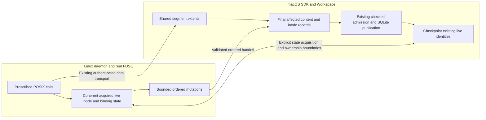
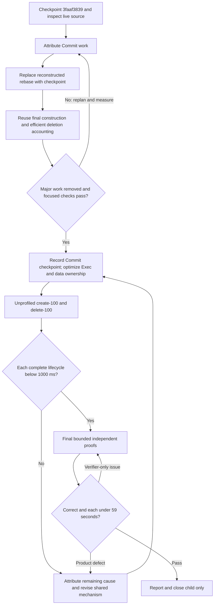

# Issue 47: subsecond bulk create/delete through shared Workspace redesign

Status: implementation in progress, 2026-09-06. Ordinary checkpoint migration implemented and component-tested in the isolated worktree; performance qualification remains pending. See [implementation results](issue47-subsecond-workspace-results.md).

Tracking: [#47](https://github.com/Ephemeral-AI-Lab/layerfs/issues/47), a GitHub sub-issue of [#46](https://github.com/Ephemeral-AI-Lab/layerfs/issues/46), under [#39](https://github.com/Ephemeral-AI-Lab/layerfs/issues/39).

Latest architectural requirement: [one construction and persistence pipeline, different inputs](issue47-unified-construction-pipeline.md). Both native initialization and ordinary Commit must use the actual bounded final-output delivery flow; a shared insertion wrapper alone is insufficient. The newer implementation/results ledger below remains authoritative for measured progress.

Execution-order amendment, 2026-09-06: **optimize Commit first, starting by replacing reconstructed ordinary rebase with in-place checkpointing; then optimize Exec.** This supersedes the earlier Exec-ownership-first sequence. Full-lifecycle targets and final-only proof requirements are unchanged. A Commit-phase checkpoint is progress, not child completion.

Starting checkpoint: **`3faaf3839`**, local `main`, not pushed. This preserves the work from Codex task `01a071c0-4365-73f0-9a8f-9acd114a5a55`, including the [#46 guide and attempt ledger](issue46-tiny-file-churn-implementation-plan.md). The source task was idle/interrupted before the commit. Thirteen offline runner checks, nine lifecycle regressions, and diff checks passed at checkpoint time; independent benchmark proofs had not run. Earlier focused tests retain their recorded scope.

## 1. Smaller workload scope, substantial implementation freedom

Deliver these two original registered cases, seed 1, each with **complete `pure_call_sum_ns < 1,000,000,000`**:

- `tiny-bulk-create-100`: create 20,000 files / 100 MiB through the actual Linux POSIX/FUSE workload, normalize metadata, sync, Commit and End.
- `tiny-bulk-delete-100`: traverse and delete the corresponding 20,000-file tree, preserve the witness, sync, Commit and End.

These are not `tiny-create-100` and `tiny-unlink-100`, which perform sparse operations. Do not change IDs, workloads, inputs, file counts, metadata/syscall obligations or publication counts to meet the target.

Only these two performance cases are mandatory in this child. Selected small semantic/sibling controls are permitted when a shared change affects them. No tier 500 or all-20 campaign, automatic multi-seed matrix, strict scaling-ratio gate, or additional performance headroom. The parent's other cases and completion obligations remain open.

The target is an acceptance requirement, not an established capability. Existing measurements do not prove either physical impossibility or guaranteed success. On a failed experiment, revise the mechanism or the next diagnostic; do not silently loosen the target or call partial-phase success terminal PASS.

## 2. Fixed topology and execution contract

macOS owns SDK/coordinator, Workspace backing storage, canonical construction, and embedded SQLite. Docker Linux runs the daemon, workload helper and real FUSE. Docker-owned SQLite remains permanently prohibited. No data mounts/volumes or Docker socket. Keep 2 CPUs / 2 GiB / no swap / 256 PIDs for Linux and separate host resource observations; host CPU is uncapped.

Keep current applicable Workspace, candidate, spool and aggregate workload limits. Reuse protected closed preparation and independent writable samples. Preparation and proof are separate from product time, but no required live workload or retirement work may be moved into preparation or after measured End.

Use the current **120-second product diagnostic watchdog / 130-second outer allowance** to obtain complete failing results. The existing parent classifier accepts up to 15 seconds; this child must separately assess strict `<1,000,000,000 ns`. A 1–15-second parent PASS is a child TARGET_MISS. Add one shared receipt assessment if needed; no case-specific product timer or optimization mode.

One explicit performance sample per iteration, serial. Focused correctness regressions may run when semantics change. Independent benchmark proofs run only after both performance targets pass, with 45 seconds work / hard 59 seconds end-to-end each. Retain explicit sampled coverage.

## 3. Evidence and implications

| Receipt | Complete product | Exec | Commit | Main Commit cost |
|---|---:|---:|---:|---|
| `issue46-parent-create100` | 22.142764 s | 15.086029 s | 6.988436 s | Rebase 5.258958 s |
| Earlier `issue46-120s-create100` | 24.489626 s | 15.341586 s | 9.096349 s | Rebase 7.460079 s |
| Latest unprofiled `issue46-pages-delete100` | 4.991831 s | 3.297524 s | 1.679852 s | Namespace 1.671591 s |

Receipts: `benchmark-results/host-store/results/<receipt>/perf.jsonl`. Parent-cache create uses a newer product/image than the delete observation. Preserve full source/product/image/harness identities; these are latest observations, not a same-source final pair. Profiled delete is diagnostic-only and must not replace the unprofiled comparator.

Useful work observations from the earlier completed create:

- 20,000 host spool opens and 100 MiB of writes; recorded spool-write processing about 1.887 seconds.
- Metadata normalization about 10.375 seconds; approximately 40,701 setattr callbacks.
- Approximately 182,000 listed FUSE callbacks across create/write/flush/release, lookup/getattr, metadata and directory operations.
- 82,672 canonical candidate objects / 113.4 MB / 28 admission transactions; about 0.432 seconds admission.
- Non-rebase Commit alone about 1.636 seconds.
- Rebase includes path/record reconstruction **and** per-file spool metadata/unlink, handle close and allocation retirement. Do not attribute its whole timer to lookups.

Delete publishes only nine objects / 22,318 bytes, while Commit performs 27,546 snapshot database calls and visits 20,234 base paths. The primary opportunity is repeated namespace/record discovery, not bulk SQLite insertion.

These are current implementation costs, not immutable floors. Removing only rebase, only metadata, or increasing a cache/batch cannot explain a complete subsecond design. Historical initializer numbers are context only.

## 4. Recommended architecture: one live state, one compilation, one checkpoint

### Commit mental model: reuse the trees, repair the handoffs

**Read this before implementing the Commit refactor. The existing optimized extent/piece trees are already used by Commit.** The task is to carry their results through the operation more efficiently, not replace them with a new content algorithm. Most builder, validation and persistence boxes already exist; missing or inefficient connections are the main target.

| Representation | Current responsibility | Optimization boundary |
|---|---|---|
| Workspace `PieceTree` | Mutable logical composition of `Base`, `Inline`, `Zero` and `Spool` ranges | Preserve its edit/extent reuse; a later shared-segment design changes the backing of written ranges |
| Canonical V3 extent tree | Immutable `FileStateV3` / `ExtentNodeV3` content representation with CAS payload references | Already produced by `rope::build` and updated through `FileMutationBatch`; retain these algorithms |
| Proposed shared spool segments | Bounded physical storage for written extents across logical files | Not implemented at the checkpoint; this is distinct from both existing trees and belongs to the later data-ownership work |

Current file construction is already incremental where its semantic input permits:

```text
CURRENT FILE CONTENT -- ALREADY IMPLEMENTED

Live file and its PieceTree
    |
    +-- Unchanged existing file ------> Reuse existing canonical root
    |
    +-- Edited existing file ---------> Base/replacement pieces
    |                                      |
    |                                      v
    |                                  FileMutationBatch
    |                                      |
    |                                      v
    |                                  Updated V3 extent tree
    |                                  retaining unchanged content
    |
    +-- Valid completed capture ------> Reuse root and canonical objects
    |
    `-- New file without capture -----> Read final Workspace bytes
                                           |
                                           v
                                       rope::build
                                           |
                                           v
                                       New V3 extent tree
```

The matching existing-file path is `changes.rs::mutate_existing_file`: it consumes the pieces, preserves base ranges, and uses `FileMutationBatch::replace` / `finish`. The frontier uses a valid captured root directly where available; otherwise a new file goes through `WorkspaceFileReader` and `rope::build`. Preserve existing supported-domain fallback semantics while transferring callers.

For bulk creation, all file bytes are new: there is no previous per-file canonical tree to retain. Canonical processing must happen at least once; the opportunity is avoiding duplicate reads/construction and retaining completed results. For bulk deletion, changing namespace references does not require rewriting every removed file's content tree; immutable history keeps those content objects.

```text
CURRENT ORDINARY COMMIT -- WHAT THE CHECKPOINT ACTUALLY DOES

Stable live Workspace / piece trees / directory changes
    |
    v
Existing content, metadata and sorted tree builders
    |   - inode updates can revisit pages across bounded groups
    |   - final live-node installation facts are not carried forward
    v
ObjectBuffer: candidate plus provisional intermediate structure
    |
    v
Finish / select reachable objects
    |
    v
Read selected candidate objects, including spill readback
    |
    v
Owned bounded pages -> checked admission -> stage / publish
    |
    v
Open published snapshot and resolve materialized paths AGAIN
    |
    v
Reload records / rebuild node maps / retire old spools
    |
    v
Continue Workspace
```

The desired handoffs are explicit below. `KEEP` means existing machinery; `IMPROVE` means change its input/order/lifetime, not write another algorithm; `ADD` marks the missing Workspace-owned result handoff.

```text
TARGET ORDINARY COMMIT -- BRIDGE THE EXISTING COMPONENTS

Stable live Workspace
    |
    v
[IMPROVE] Final changed bindings, content and reference accounting
    |
    v
[KEEP] PieceTree + FileMutationBatch / rope builders
[KEEP] Exact metadata cache + sorted directory/inode builders
    |                 ^
    |                 `-- [IMPROVE] Ordered/coalesced final inode deltas
    |
    +--------------------------------------+
    |                                      |
    v                                      v
Canonical object output             [ADD] Candidate-bound facts
    |                               NodeId -> final inode/content/
    v                               directory backing and lifetime
[KEEP] Required finality/selection          |
    |                                      | retain through rejection,
    v                                      | publication and install retry
[IMPROVE] Owned final-output delivery       |
    |       reduce avoidable spill/replay   |
    v                                      |
[KEEP] Shared checked insertion,            |
       bounded transactions and receipts   |
    |                                      |
    v                                      |
[KEEP] Stage + conditional publication      |
    |                                      |
    +-------------------+------------------+
                        |
                        v
              [ADD] Checkpoint existing nodes
              preserve paths / NodeIds / handles
              install exact final backing identities
              advance returned head / base
              clear only published changes
                        |
                        v
              Same Workspace continues
              NO reconstructed ordinary Workspace
              NO repeated all-path rediscovery
```

| Component | Status at checkpoint / required change |
|---|---|
| Pause/quiesce and stable Commit boundary | Already present; do not silently remove execution/writer guards |
| Content/extent and exact metadata algorithms | Already used; carry valid content/record results instead of redoing them |
| Sorted directory updates | Already consume the full ordered directory delta stream |
| Sorted inode updates | Already used; improve final accounting and operation-wide ordering to reduce intermediate table versions |
| Reachability/finality and owned candidate pages | Already present; preserve selection for provisional objects |
| Checked insertion and bounded admission | Already present; unify useful owned-output delivery without importing native empty-Store assumptions |
| Stage and conditional publication | Already present; keep failure and history semantics |
| Construction-to-continuation facts | Missing as a complete handoff; keep mutable NodeIds with Workspace rather than Store's generic `BuiltRoot` |
| In-place checkpoint without reconstruction | Missing at the checkpoint; replaces ordinary `rebase_committed`, not its required guarantees |

**Do not interpret the target drawing as permission to stream every generated object into permanent storage.** Intermediate tree pages may be superseded. Establish final reachability before bypassing candidate retention; retain readable provisional state where builders need it. Early admission must preserve failed-construction/publication object-retention and receipt semantics. Native initialization's empty-Store guard and destructive failed-initialization cleanup cannot become Workspace behavior.

Measure success through work removed across the complete lifecycle: fewer inode/table re-encodes and page visits, fewer candidate payload writes/readbacks, fewer repeated content passes, and fewer post-publication lookups. A shared consumer refactor without a changed delivery path is code reuse, not a demonstrated speedup. Moving work from Commit to Exec or End does not remove it. Spool retirement must remain separately attributable even when reconstructed rebase disappears.

The following broader architecture is the later destination; follow section 6's **Commit-first** order rather than implementing its Exec/segment changes ahead of the checkpoint work.

The design should eliminate repeated representation changes. Keep existing crate responsibilities and canonical encodings unless an explicit measured need and compatibility plan justify a change. Do not introduce another Store, universal backend interface, actor framework, or family-selected engine.



This is a design direction, not a claim that the current proxy cache is authoritative enough. There must be one authority for a semantic operation at a time. Host backing/persistence remains authoritative; bounded delegated execution at the live presentation owner cannot permit simultaneous contradictory host/proxy mutations.

### A. Execute metadata and namespace operations at an owner with sufficient facts

Existing pending creates already support local metadata mutation, cached attributes, reserved identities and bounded batches. Existing pause/callback draining and targeted invalidation provide useful handoff boundaries.

Extend these primitives into one coherent live-state contract:

1. Acquire authenticated inode/binding information on demand, with the state and resource reservations needed to decide an operation's success or failure.
2. Execute lookup/getattr and locally decidable metadata/namespace mutations against that same state. All aliases share the same inode; open handles retain inode lifetime independently of names.
3. Record bounded ordered changes and drain them before host observers/edits, fsync, Commit, revocation or projection replacement as required by the actual contract.
4. If required authoritative facts are unavailable, acquire them through the same protocol; do not invent a size/family fast path or treat stale cached attributes as authority.

The host and local owner must reuse validation and normalization logic. A host-side equal-value check saves mutation work but not a round trip. A local check is safe only when inode existence/lifetime, active ownership, pending errors, value validation and capacity are known.

**Do not turn synchronous chmod/mtime into fire-and-forget commands.** Moving actual validated execution is different from returning success before the responsible component executes it. Define error behavior for capacity exhaustion, host rejection, disconnect and revocation before adopting a local acknowledgement. Keep the workload's separate chmod and timestamp syscalls.

For deletion, acquired enumeration information should service subsequent lookup/getattr/unlink/rmdir without asking the host to rediscover the same binding. Stable bounded cursors replace repeated full enumeration/copying. The host consumes validated deltas and required reference accounting, not a replay of every callback's path discovery.

### B. Remove reconstructed ordinary-Commit rebase

Construction already determines final inode identities, content/metadata roots, directory roots and references. Preserve the smallest candidate-bound installation facts until publication/install completes; do not consume the only copy during object admission.

| Existing node/state | Ordinary successful checkpoint |
|---|---|
| New or edited linked file | Set final canonical inode identity and Base content root/length |
| Changed directory | Adopt final base root and clear the published delta |
| Unchanged live node | Preserve identity, paths, pins and unchanged attributes |
| Open-unlinked node | Preserve its data/extent lifetime and handle identity |
| Workspace | Advance exact returned head/root/base and clean only published changes |

Retain existing live maps where possible. No post-publication all-path walk or reconstruction of another Workspace just to prove that construction produced its own input. Replace reread-based validation with checked construction/installation consistency and focused canonical-equivalence regressions.

Admission rejection must leave the working overlay usable. Publication-success/install-failure retains the published identity and unfinished installation facts; retry completes installation rather than creating another Commit. Retained installation data is budgeted and may use existing bounded serialization, not a second complete live graph.

Reconciliation can genuinely change the visible state. Preserve its semantics until equivalent final-state installation covers it; this is not a workload-size policy. The obsolete Two-store V2 history is not a reason to retain reconstruction in ordinary Commit.

### C. Replace per-logical-file spools with bounded shared extents

Current per-file spool ownership causes tens of thousands of host creates, metadata observations, descriptor retentions, unlinks and closes. Reuse PieceTree's base/zero/written-range model and adapt written ranges to segment identity plus offset/length.

- One shared mechanism for ordinary writes, with bounded segment sizes, append ownership and descriptor count.
- Per-node extent ownership preserves sparse/overlap semantics and open-unlinked data.
- Move existing short-write rollback, physical/live allocation accounting and fsync guarantees to the new ownership boundary.
- Retire/reuse unreachable segment space without one host unlink per logical file or indefinite retention of dead storage around a small pinned extent.
- No in-memory-fitting exception or tiny/large storage selector. Bounded rotation/drain is resource management of the same mechanism.

This is a real representation change. Introduce only the required segment/extent owner and records under existing Workspace ownership; no pluggable old/new spool framework. Moving spool cleanup from Commit to End is not an improvement in the complete timer.

### D. Compile final changed state once

Retain #46's final new-inode reference fix, metadata cache, sorted directory builder, checked owned admission and conditional publication.

Use bounded ordered changed-inode updates; settle alias/move effects before release. Consume removed-directory children through bounded pages and reuse existing batched authenticated inode reads, while each mutation observes the latest pending reference state. Avoid one-child-per-root-seek traversal and duplicate lookups. Do not rebuild survivors using a deletion-density policy.

Native compact inode-pair serialization preserves task/preorder; it is not an arbitrary-inode sorter. Reuse framing/storage only where its contract fits. Do not require a full-table scan to order a few changes.

If canonical work still dominates, test bounded reuse of write-produced content and final records. Remove an actual reread/rebuild or demonstrate critical-path overlap. Moving the same work from Commit to Exec is insufficient, and a producer per file is not the proposed solution.

## 5. Running commands and the snapshot boundary

The live Workspace must remain usable across Commit: no reset of its mount/path/handles merely because a snapshot was published. This child requires correct same-session continuation.

The two named workloads finish their command before Commit. Current managed execution returns Busy if Commit is requested while a command is active. Concurrent active-command Commit is not necessary for these performance gates and must not become an accidental feature expansion.

If a new ownership design needs a generation boundary, define it explicitly: freeze generation G for publication, retain its extents, keep later writes in G+1 dirty, and never clear them when installing G. Full concurrent shell/Commit support requires its own explicit validation of observation, failure and backpressure. Do not simply delete Busy or promise zero pauses because publication is a SQLite transaction.

## 6. Decisive exploration, then staged implementation

### Step 0 — establish the remaining work, without another broad campaign

Use retained results wherever sufficient. First attribute Commit's construction, candidate/readback/admission, rebase lookup/materialization versus installation/cleanup, and deletion directory reads versus record/flush work. Snapshot-read counters must have matching scope; an End lifetime total is not a rebase-only measurement. Defer deeper metadata/remote-dependency investigation to the Exec phase rather than delaying the first Commit implementation.

If useful, time the existing host initializer on the exact independently prepared final create tree (equivalent to delete's initial bulk tree plus witness after recipe equality is checked). Preparation already creates such trees; time the initialization call separately from generation/manifest work. Do not register a new family or substitute native import for Exec. Native and callback controls are nonqualifying comparisons, not mathematical floors.

During the later Exec phase, measure whether required callback/dependency work leaves a plausible budget before committing to broad storage changes. A control omitting product work must remain explicitly nonqualifying; it cannot grant permission to omit that work in the real case.

### Step 1 — remove reconstructed ordinary rebase

Implement candidate-bound installation into existing nodes with rejection and partial-install recovery. Predict near-elimination of post-publication path/inode rediscovery, not merely higher cache hit rate. Split spool retirement so its remaining cost is visible.

Retain required head/base advancement, canonical identities, dirty-state checkpointing, handles/aliases and recovery. Do not merely bypass the existing function or replace it with another reconstruction cache. Same-session continuation remains correct; current active-execution guards are not silently removed.

### Step 2 — complete the substantive shared Commit improvements

Use bounded cursors, ordered updates and authenticated lookup batches; preserve reference effects and untouched children. Measure whether work moved or disappeared. Revisit canonical readback/admission only if it remains necessary for the subsecond target.

Reuse final construction results and existing owned admission; distinguish final reachable output from provisional structural objects. For create-100, remove repeated inode construction and avoidable candidate payload replay where safe. For delete-100, prioritize repeated release traversal/record lookup over its already small admission cost. Preserve failure/footprint semantics when changing admission timing.

After the identified major Commit work is removed and focused regressions pass, record a source-bound Commit-phase checkpoint and proceed to Exec. Do not impose a new standalone Commit millisecond gate or spend time on marginal gains. Complete performance samples remain necessary to show costs were removed rather than shifted into Exec or End; full-lifecycle misses at this intermediate stage are expected and remain misses.

### Step 3 — optimize coherent Exec state and remote dependencies

Choose the dominant metadata or deletion binding sequence, reuse acquisition/reservation/invalidation primitives, and establish where success is authoritatively decided. Predict reduced remote dependencies and repeated host materialization. Validate ordering, errors and host-observer visibility before expanding the same mechanism. Use the improved common checkpoint instead of creating a separate Commit path for this live-state design.

### Step 4 — shared extent ownership and remaining data work

Replace per-file host spool lifecycle with bounded segments where the measured create/write/retirement cost requires it. Predict fewer host creates/opens/unlinks/closes and physical-observation calls while bytes, sparse behavior and durability remain unchanged. If Step 1 reveals storage retirement is inseparable from its principal Commit change, integrate only that necessary ownership slice earlier and record the dependency; do not launch a broader Exec redesign ahead of the Commit checkpoint. Avoid parallel edits to shared Workspace state.

### Step 5 — same-source final pair, then proofs

Run each original case once, seed 1, serial and unprofiled, on the final product identity. Assess both strict `<1,000,000,000 ns` results from complete timers. Only after both pass, run selected independent sampled proofs and finish the result/adoption report.



Every no-go must produce an explicit revised hypothesis, experiment or design decision. Continue through recoverable problems without retrying unchanged failures. An unproven ownership model or disappointing experiment is not proof the hardware makes the target impossible. Conversely, do not fabricate success if faithful measurements miss. Keep precise unresolved constraints visible. Stop after the two runtime gates, correctness and resource requirements pass; no marginal-tuning campaign.

## 7. Focused correctness and final sampled proofs

During implementation, use existing tests for the changed semantic boundary, adding the smallest regression that would catch its failure:

- Ordered create/write/close/metadata/rename/unlink/recreate, repeated aliases and stale identities.
- Ownership acquisition/revocation, host observer, pause/fsync and resource errors; no delayed metadata errno.
- Sparse/overlapping/zero writes, interrupted/short append rollback, segment lifetime/accounting and reclamation.
- Open-unlinked reads, last-reference deletion, nonempty rmdir, old-root readability.
- Exact returned snapshot, clean repeated Commit, rejection leaves overlay intact, publication-success/install-failure recovery.
- Small changed sets remain incremental and do not require a whole-Workspace traversal.

Final benchmark proof reuses #46's bounded recipe-derived canonical/native checks: selected created files, bounded bytes/metadata, selected removed paths, witness preservation, root/head and Commit outcome, reconnect/reopen where actually executed, and cleanup. Retain maximum work/end-to-end deadlines of 45/59 seconds. Oracle selection must not enumerate/generate the full tree just to choose samples.

Proof setup/replay/cleanup remaining in the invocation count toward its wall. No automatic proof after each iteration; no all-seed/all-case expansion. Declare full-namespace/full-byte coverage false when sampled. Component tests establish semantics not independently exercised by the two sample recipes.

## 8. Adoption, output and acceptance

Reuse in both directions is mandatory: map existing #38/#40/#46 code consumed and sibling callers inheriting each change. Keep shared validation, lifetime and construction implementations; do not copy optimized bodies into families. Audit all applicable #39 siblings read-only, and use only selected affected performance/semantic controls before final proofs.

### Concrete Commit file changes and retirement contract

Method/type names below describe intended changes, not implemented new APIs. Keep the first Commit changes in existing files; no new crate, selectable old/new Commit implementation, or generic backend facade.

| File | Required change | Superseded code to remove after caller transfer |
|---|---|---|
| `layerfs-workspace/src/changes.rs` | One Workspace-owned prepared result containing the generic `BuiltRoot` plus bounded candidate-bound checkpoint facts; coalesce/order final inode deltas and reuse existing builders | Competing ordinary-Commit construction bodies once their supported cases transfer; the repeated `FrontierInodes::flush` intermediate-table update loop and one-child-at-a-time release implementation |
| `layerfs-workspace/src/lifecycle.rs` | `commit`/`transition_committed` consume the prepared result; install a checkpoint into current nodes; retain pending installation facts with exact publication identity | `rebase_committed` reconstruction, `lookup_committed_path`, the rebase-only parent cache, temporary reconstructed Workspace/maps, and rebase transition names after all consumers migrate |
| `layerfs-workspace/src/cow_tree.rs` | Keep checkpoint/installation facts with Workspace ownership; update node backing/dirty/lifetime state safely in place | State or helpers used solely by the removed reconstruction, after checking all callers |
| `layerfs-layerstack-store/src/objects.rs` | Extract one checked owned-page admission consumer from existing code; retain candidate selection/readability where required; native and Workspace delivery use the shared consumer where their contracts fit | Duplicate per-batch accumulation/insertion bodies once native and Workspace callers transfer; no retained legacy consumer behind a switch |
| `layerfs-layerstack-store/src/workspace.rs` | Keep stage/conditional publication; accept the appropriate prepared/checked admission result without rebuilding or readmitting it | Superseded ordinary candidate-delivery adapter after full transfer; keep distinct reconciliation/planned admission until its semantics also transfer |
| `layerfs-layerstack-store/src/layerstack.rs` | Migrate applicable native delivery to the shared owned consumer, retaining native discovery and initialization publication/cleanup semantics | Duplicated shared delivery logic, not native-specific discovery or safety checks |
| `layerfs-layerstack-store/src/telemetry.rs` and benchmark consumers | Report checkpoint rather than reconstructed-rebase work; update affected receipt consumers together and preserve old evidence interpretation | Active rebase-only telemetry names/branches after consumers migrate; historical raw receipts are never rewritten |
| Existing focused tests and documentation | Test repeated Commit, exact returned snapshot, aliases, open-unlinked state, rejection/install recovery and bounded final updates | Tests enforcing the old reconstruction layout, old/new feature flags, unused wrappers, dead helpers and live instructions recommending retired paths |

Retain generic `BuiltRoot` under Store without inserting mutable Workspace NodeIds into it. A compact Workspace-owned prepared/checkpoint record is justified by this concrete handoff. Reconciliation and preview callers of `build_candidate` must be migrated explicitly if its return type changes.

Do not delete methods solely because they look historical: `lookup_path` also serves SDK file edits; `base_manifest`/`final_manifest` currently serve `resolution_fingerprint`; `admit_planned_objects` has a production reconciliation/publication caller. Transfer those responsibilities before deleting them, or narrow their ownership/names so ordinary Commit cannot accidentally reuse them. Do not describe a remaining necessary semantic implementation as retired. Existing content-only incremental algorithms, sorted-builder supported-domain behavior, collision checks, stage/recovery, and immutable-history guarantees remain required.

For each replacement, implementation is incomplete until its ordinary production callers have transferred and the superseded ordinary path is deleted. Do not ship parallel `legacy_commit`/`fast_commit` paths, unused compatibility wrappers, or disabled historical engines for future agents to rediscover. Before completion, publish a concise kept/changed/deleted symbol ledger, search for remaining references, compile affected consumers, and run the relevant existing regressions. A separate semantic feature still awaiting transfer is explicitly listed with its real callers; it is not an excuse to retain an obsolete ordinary-Commit fallback.

| Deliverable | Required evidence |
|---|---|
| Two-case runtime | Both original complete timers strictly below 1,000,000,000 ns, fixed seed 1, final delivered product identity |
| Environment and resources | Host SQLite only, real Linux FUSE, no data mounts, unchanged workload/resource bounds, independent samples and cleanup |
| Architectural benefit | Reduced mandatory dependencies, host file lifecycle operations, duplicate construction or namespace discovery; no case/size/density selector |
| Correctness | Focused semantic regressions plus final bounded sampled proofs, exact coverage and omissions |
| Reuse | Existing code provenance, actual sibling call paths, measured versus expected benefit, remaining untransferred semantics |
| Reporting | Complete attempted outcomes, source/image/harness identities, diagnostics labelled separately, remaining limitations; no relabelled older receipts |

Do not impose arbitrary per-phase millisecond budgets, percent gains, or extra margin as gates. Component budgets are editable estimates used to assess feasibility; only complete measured results establish the performance target.

Create `issue47-subsecond-workspace-results.md` only when actual work/results exist. Update #47 with final evidence and commit identities, clearly stating local versus pushed state. Close #47 only on terminal PASS. Do not close #46/#39 or qualify their other cases automatically, and do not publish a release.

## 9. Source map

- [Parent guide and checkpoint ledger](issue46-tiny-file-churn-implementation-plan.md), [quickstart](../../../../benchmark/fs-bench-pro/QUICKSTART.md), [shared runner](../../../../benchmark/fs-bench-pro/shared/runner.py).
- [Tiny registry](../../../../benchmark/fs-bench-pro/families/tiny_file_churn/mod.rs), [workload operations](../../../../benchmark/fs-bench-pro/workload/ordinary_workloads.rs), [fixture/metadata helpers](../../../../benchmark/fs-bench-pro/workload/workspace_common.rs).
- [FUSE callbacks](../../../../crates/layerfs-fuse/src/filesystem.rs), [proxy live state](../../../../crates/layerfs-fuse/src/proxy_client.rs), [host dispatch](../../../../crates/layerfs-fuse/src/proxy_host.rs), [protocol](../../../../crates/layerfs-fuse/src/protocol.rs).
- [Workspace nodes and namespace](../../../../crates/layerfs-workspace/src/cow_tree.rs), [projection handoff](../../../../crates/layerfs-workspace/src/projection.rs), [spool and writes](../../../../crates/layerfs-workspace/src/file_io.rs), [piece representation](../../../../crates/layerfs-workspace/src/file_edit.rs).
- [Candidate construction](../../../../crates/layerfs-workspace/src/changes.rs), [Commit and continuation](../../../../crates/layerfs-workspace/src/lifecycle.rs), [worker admission](../../../../crates/layerfs-workspace/src/worker.rs), [capture](../../../../crates/layerfs-workspace/src/capture.rs).
- [Sorted tree updates](../../../../crates/layerfs-content/src/tree/batch.rs), [object/segment/admission primitives](../../../../crates/layerfs-layerstack-store/src/objects.rs), [conditional publication](../../../../crates/layerfs-layerstack-store/src/workspace.rs), [telemetry](../../../../crates/layerfs-layerstack-store/src/telemetry.rs).

## 10. Execution ledger — ordinary checkpoint migration

The authoritative saved-checkout guide was copied verbatim into the isolated worktree before edits. Product source started at `3faaf3839`, documentation at `8aec76f76`.

Implemented the first handoff: Workspace-owned `PreparedCommit { built, checkpoint }`, fixed-record anonymous checkpoint journal, construction/final-record consistency checks, and installation into existing nodes. Ordinary `rebase_committed` and `lookup_committed_path` are removed. The general manifest-based ordinary construction body and its unique helpers are removed; its supported cases transfer to the existing frontier. The localized content-only builder remains temporarily because its supported 1 KiB budget is below the frontier's current 4 KiB minimum; it uses the same prepared/checkpoint handoff.

The journal uses a 256-byte I/O buffer and 104-byte records, with at most one record per materialized node. Its disk bytes are candidate metadata, separate from payload spool allowance; no paths/pins/live graph are copied. Localized sorted scratch reserves 512 bytes for the handoff. Pending publication retains the immutable returned identity plus facts; partial installation retry performs no second Commit. Ordinary pending publication now blocks mutation. Reconciliation retains explicitly named exact-snapshot refresh.

Validation: 47 Workspace library regressions passed serially with Rust 1.85.1 and no default features. Added canonical-reference mismatch/payload-boundary regression and extended identity/alias/open-unlinked regression with a failure after one installed node. Earlier compiler failures (missing Attr equality; metadata helper restricted to CoreReader) were repaired by deriving value equality and generalizing the existing authenticated metadata reader over ObjectRead. No benchmark proof has run.

Next experiment: one full create-100 sample on this source. New `checkpoint_ns` includes `spool_retirement_ns` (unlink plus descriptor close). Historical `in_place_rebase_ns`/`commit_rebase_ns` retains its old meaning and raw receipts remain unchanged. Remaining final-record validation currently reads builder inode records; the next ordered/coalesced inode handoff should supply these results directly. No Commit-only terminal PASS is claimed.

Attempt 1 completed: `issue47-checkpoint-create100`, 19.916002292 s complete product, Commit 5.225464125 s, child TARGET_MISS. Commit snapshot database calls are 5; checkpoint 2.723398708 s includes 2.691903129 s spool retirement. Final-record validation currently contributes namespace work; revise to consume coalesced final records. Exact identities/resource observations are in the results document. This records an intermediate checkpoint, not the stable end of all major Commit work or issue completion.

Second implementation slice completed and focused-tested: all ordinary construction now uses the existing dirty-node frontier (including 1 KiB supported cases), coalesced ordered inode deltas, bounded paged release, and shared checked owned-page admission. `build_localized_candidate`, old/new selectors and `FrontierInodes::flush` intermediate-table construction are retired. Exact details and discovered pinned/unseen-alias repair are recorded in the results document. Next selected experiment: delete-100/seed 1, complete diagnostic allowance, no independent proof. Candidate payload readback remains; no unsupported early admission was introduced.

Attempt 2 completed on implementation checkpoint `55c950979`: delete-100 complete 4.061720833 s, **child TARGET_MISS** even though parent classifier says PASS. Commit 0.460068958 s, snapshot calls 1,385; cursor 15.309616 ms, record/reference work 347.007136 ms. This establishes a stable checkpoint for major Commit construction/checkpoint/deletion handoffs. Remaining work: measured create spool lifetime (2.692 s retirement) and Exec (delete 3.580 s; prior create 14.649 s). Shared bounded physical segment ownership is the documented necessary storage slice; it must retain existing piece/rope algorithms, read-plan/rollback lifetime and quota/accounting. No independent proof until both strict complete targets pass.

Attempt 3 directly measured create on the second Commit slice (`46463287c`): complete 18.940567833 s, Commit 3.561906833 s, content 0.597275834 s, namespace 0.318532333 s, checkpoint 2.117268584 s including 2.079293345 s spool retirement; 6 Commit snapshot calls and 113,434,447 candidate spill-readback bytes. Child TARGET_MISS. The shared physical-spool migration follows this measured source, not an inferred create gain from deletion.

Shared spool slice is now implemented and component-tested: written PieceTree ranges own segment identity + physical offset + length, including compact range handles. Workspace appends to nominal 1 MiB anonymous segments (a larger single write uses one segment bounded by the existing payload allowance); empty/inline/zero-only edits allocate no file. No alternate file-tree algorithm or workload selector. Existing logical quotas remain, and retained physical segment bytes also constrain admission; dead bytes inside a held segment stay charged until the segment retires. Prepared reads, rollback snapshots and open-unlinked data retain their ranges; ordinary and reconciliation checkpoints retain their lifetime/charge. Actual segment closes stay in measured Commit/End or earlier product operations. Named-file observations are explicitly scoped, and passive maintained physical counters now accompany normal before/after-Commit observations.

Next experiment is one original create-100 / seed 1 on this spool slice after the serial build, using protected independent preparation. Candidate final-output delivery remains next; no unsafe early admission has been introduced. FUSE Exec work remains separately owned, with routine sibling communication minimized per user direction.

Attempt 4 (`8cbbb425b`, shared segments) completed create-100 at 16.186989166 s, child TARGET_MISS. Commit 1.270814792 s; checkpoint 23.277250 ms includes 2.571041 ms retirement. Actual physical opens are 101 instead of 20,000, with zero physical files/allocated bytes/retained segment bytes after Commit. The complete Exec/Commit/End timer includes all work. Candidate spill readback remains 113,434,447 bytes, so the next slice is final-output delivery.

The existing phase-2.1 staging contract explicitly permits admitted CAS objects after failed construction without a stage. Early delivery therefore needs implementation safeguards, not native cleanup: finalize each file's reachable output, use one bounded operation-owned accumulator across files, preserve globally unique candidate accounting and preexisting-versus-this-attempt reuse, flush before final root staging, and keep preview/reconciliation preparation private. Provisional directory/inode output retains ordinary final reachability selection. This is the next shared handoff to implement; no permanent admission of arbitrary intermediate objects is permitted.
