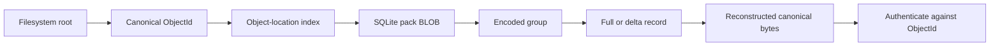
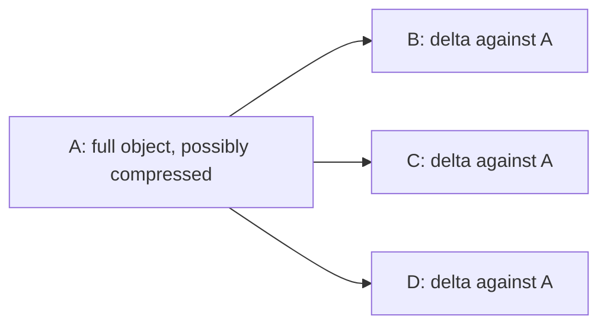
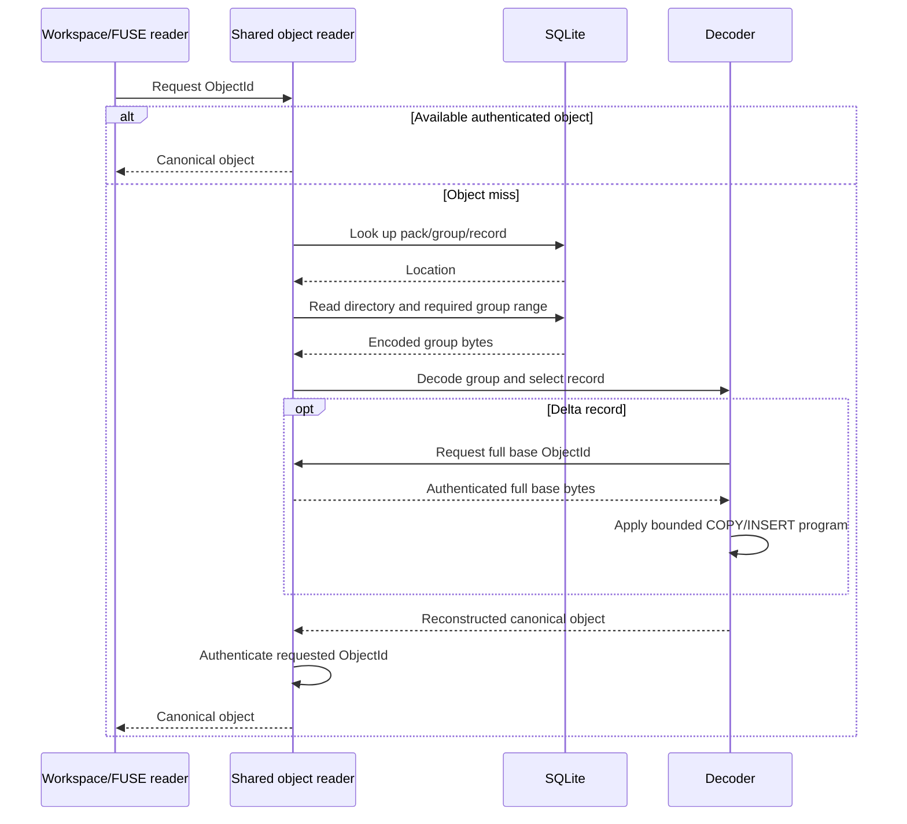
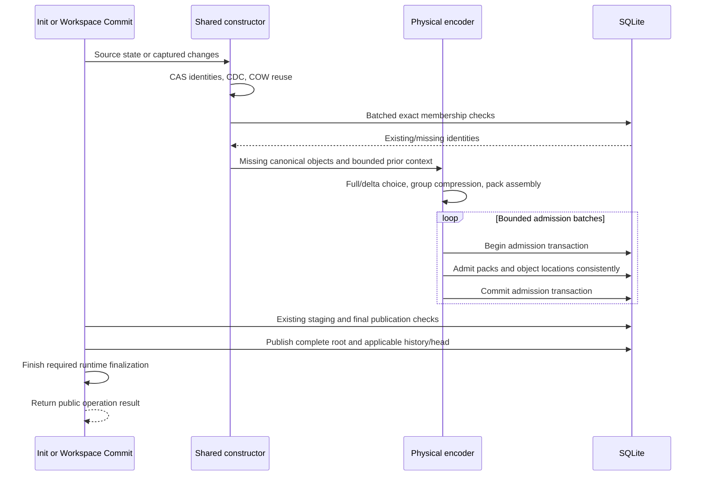

# SQLite packed-object storage: format walkthrough

**Status: proposed format walkthrough, 2026-09-08.** This is a visual companion
to the [architecture specification](storage-architecture-spec.md), not the current
on-disk format or an executable migration. SQL and binary layouts below are
illustrative. Field widths, framing, codec settings, compatibility, benchmark
family, and test environment remain to be agreed.

The [research boundary](storage-efficiency-boundary.md) controls scope: one shared
synchronous namespace Init/Workspace Commit pipeline, all authoritative storage
inside SQLite, and no new durability or crash-recovery work.

## 1. One database, two layers of identity

```text
store.sqlite
│
├── Existing filesystem and history records
│   ├── LayerStacks and Layers
│   ├── Branches and Commits
│   └── Workspace staging
│
├── Object locations
│   └── ObjectId → pack ID, group number, record number
│
└── Packs
    ├── pack 101 → immutable BLOB
    ├── pack 102 → immutable BLOB
    └── pack 103 → immutable BLOB
```



An ObjectId identifies canonical bytes. A pack ID identifies a physical SQLite
row. Group and record numbers locate data inside that row. Filesystem trees
reference ObjectIds, never SQLite offsets. Repacking, if separately implemented
later, could change locations without changing logical identities.

A Commit is not a pack. One Commit can reference many old packs and add several
new packs; a small operation can add one small pack. Shared content has one
selected stored representation, regardless of the number of paths or Branches
that reference it.

## 2. Conceptual SQL structures

The existing history tables remain responsible for their existing semantics.
The following shows only the proposed physical-object structures. It is not a
replacement schema or migration script. SQLite schema compatibility must be
resolved before implementation.

```sql
-- Illustrative only: names and fields are not frozen.
CREATE TABLE object_packs (
    pack_id INTEGER PRIMARY KEY,
    data    BLOB NOT NULL
);

CREATE TABLE object_locations (
    object_id     BLOB NOT NULL PRIMARY KEY
                  CHECK (length(object_id) = 32),
    pack_id       INTEGER NOT NULL REFERENCES object_packs(pack_id),
    group_number  INTEGER NOT NULL CHECK (group_number >= 0),
    record_number INTEGER NOT NULL CHECK (record_number >= 0)
) WITHOUT ROWID;
```

`object_packs` deliberately has an integer rowid alias in this illustration so
SQLite incremental BLOB access is possible. That API cannot open a BLOB in a
`WITHOUT ROWID` table. The location table contains no pack BLOB and can have a
different layout. See [SQLite's BLOB API](https://sqlite.org/c3ref/blob_open.html).

The lookup is small:

```sql
SELECT pack_id, group_number, record_number
FROM object_locations
WHERE object_id = ?1;
```

The next step reads the relevant pack header/directory and encoded group range;
it must not silently fetch the complete BLOB for every small object. Cache and
batch directory lookups through bounded existing mechanisms where useful.
SQL foreign keys do not validate internal group/record numbers; the format
reader must check all offsets, counts, and lengths.

The index still costs space per object. Packing reduces physical payload-row
cost; it does not remove logical object IDs, canonical metadata, or every index.
Avoid adding redundant IDs and length fields to every layer without a reason.

## 3. Pack BLOB layout

```text
                    One immutable SQLite BLOB
┌─────────────────────────────────────────────────────────┐
│ Header                                                  │
│   format discriminator/version                         │
│   group count and directory framing                     │
├─────────────────────────────────────────────────────────┤
│ Group directory                                         │
│   group 0 → encoded offset, encoded length,              │
│             decoded length, codec                       │
│   group 1 → ...                                         │
│   group 2 → ...                                         │
├─────────────────────────────────────────────────────────┤
│ Group 0 bytes: compressed metadata records               │
├─────────────────────────────────────────────────────────┤
│ Group 1 bytes: compressed content records                │
├─────────────────────────────────────────────────────────┤
│ Group 2 bytes: raw records when compression did not pay   │
└─────────────────────────────────────────────────────────┘
```

The pack is a container of encoded groups, not one giant compression stream.
A raw group still lives in the same pack format; it is not another backend.
Pack offsets use a defined origin, such as the beginning of the BLOB, which the
final codec must specify. Numeric encoding, directory representation, integrity
framing, and alignment are not frozen by this drawing.

```text
Physical placement unit:  pack BLOB
Compression unit:        independently decoded group
Logical identity unit:   canonical object
Reuse unit:              existing objects and COW extent slices
```

The proposed initial pack cap is 256 KiB of uncompressed representation data and
framing, with independent record-count and canonical-byte bounds. It is not a
fixed allocation or a promise of the compressed size. Partial packs are not
padded to capacity and do not wait for future operations.

## 4. Compression groups and records

```text
Decode one selected group
              │
              ▼
┌───────────────────────────────────────────────────────┐
│ Record count and record directory                     │
│   record number → record offset and length            │
├───────────────────────────────────────────────────────┤
│ Record 0: FULL  | canonical bytes                      │
│ Record 1: FULL  | canonical bytes                      │
│ Record 2: DELTA | base ID | output length | program    │
└───────────────────────────────────────────────────────┘
```

Record offsets refer to the decoded group, not compressed byte positions. A
record directory might use offsets, lengths, or compact cumulative lengths;
choose one representation after accounting for lookup and space costs.

Pseudotypes describe meaning, not Rust structs or a fixed wire encoding:

```text
FullRecord {
    kind: FULL
    canonical_bytes: bytes
}

DeltaRecord {
    kind: DELTA
    base_object_id: ObjectId
    reconstructed_length: integer
    instructions: [COPY(base_offset, length) | INSERT(bytes)]
}
```

A full record can be compressed because the surrounding group is compressed.
A delta program can also be compressed. Full/delta selection and raw/compressed
group selection are separate decisions.

Proposed starting groups are up to 16 KiB for metadata and 32 KiB for content,
measured before compression. A valid canonical object slightly larger than a
nominal group cap needs an explicit bounded single-record rule: a 32-KiB payload
also has canonical headers. All supported object roles must fit a declared
bounded route. No unbounded group or unexplained fallback is permitted.

## 5. Shallow deltas: one reconstruction dependency



Arrows above mean “used to reconstruct.” The first proposal permits a delta base
that has a full representation only. It does not permit delta chains.

An illustrative 6-KiB content edit, ignoring canonical headers for readability:

```text
A = prefix(2048 B) + old(32 B) + suffix(4064 B)
B = prefix(2048 B) + new(32 B) + suffix(4064 B)

B's illustrative delta against A:
    COPY   source_offset=0,    length=2048
    INSERT new_bytes[32]
    COPY   source_offset=2080, length=4064

Reconstructed length = 6144 bytes
```

The actual object encoder reconstructs the complete canonical object, including
its framing, and authenticates it to B's ObjectId. This example is not a storage
size prediction. Base references, instructions, groups, index entries and SQLite
allocation all cost bytes.

A base can be in another pack. Do not duplicate it into every dependent pack.
Keep it available while stored delta records depend on it, even if no filesystem
root references that base directly. If a full anchor stops being a good match,
store a newer full representation rather than silently increasing chain depth.

## 6. Small and large files use the same format

```text
6-KiB file                           100-MiB file
    │                                   │
    ▼                                   ▼
one payload object                  many payload objects
    │                                   │
    └───────────────┬───────────────────┘
                    ▼
          exact CAS reuse check
                    ▼
       new FULL or DELTA records
                    ▼
       bounded compression groups
                    ▼
           SQLite pack BLOBs
```

With the current 8/16/32-KiB CDC profile, a nonempty file below 8 KiB becomes one
initial payload chunk. Larger files may produce several chunks. The minimum is
not padding and does not select another storage backend.

A large file also produces small metadata and chunk objects. Physical encoding
uses object characteristics, not a per-file “small row / large pack” switch.
Growing a file produces a new extent/file state; old objects and historical
states remain unchanged. Precise captured ranges can preserve old slices.

The existing logical structure remains:

```text
namespace/inode object
    → FileState ObjectId
        → extent-tree ObjectIds
            → payload ObjectIds with offsets and lengths
```

Inlining tiny file contents or removing an extent node is a separate logical
format proposal; it is not necessary to understand or prototype this physical
pack format.

## 7. Read sequence



The base request follows the same indexed/group read path but cannot recurse
through another delta. A file read can require multiple objects and metadata
nodes; depth one bounds delta dependencies, not the whole file-read cost.

Batch requests for the same group and reuse existing bounded cache mechanisms.
A group decode can process more bytes than requested, so report amplification
and miss behavior. No correctness dependency on a warm cache, no unlimited
memory, and no extraction of whole packs into filesystem files on ordinary reads.

## 8. Shared Init/Commit write sequence



This is conceptual ordering, not a requirement to finish all encoding before
admitting the first batch. Large Init can stream bounded batches. Compression,
base preparation, and source reads stay outside SQLite writer ownership.

The final publication must reference a complete logical and physical dependency
closure. Existing Init and Workspace staging/no-change semantics remain distinct.
Do not add a transaction per object or pack unnecessarily. Canonical-byte and
object-count admission limits remain enforced independently of compressed size.
Concurrent admission rechecks and ordinary conflict handling must be specified
before implementation. Earlier admitted objects may remain if publication fails;
that allocation remains counted. This document adds no crash-recovery work.

## 9. Worked location example

The IDs below are labels, not literal hashes or measured offsets:

```text
object_locations
    ID_A → pack 101, group 0, record 0
    ID_B → pack 102, group 1, record 2
    ID_C → pack 102, group 1, record 3

pack 101 / group 0 / record 0
    FULL(A)

pack 102 / group 1 / record 2
    DELTA(base=ID_A, reconstruct=B)

pack 102 / group 1 / record 3
    FULL(C)

old file state → ID_A
new file state → ID_B
another file   → ID_C
```

Reading B obtains the relevant group from pack 102 and the full base from pack
101 as needed. Reading C needs no delta base. Reading A still returns its old
content. No old pack is rewritten just because B was added.

## 10. Format review checklist

- [ ] Object identities remain canonical; physical locations never define them.
- [ ] All authoritative data is inside SQLite; spools/temporary space is separate
      and counted, not an external retained object store.
- [ ] Pack, group and record roles and offset origins are unambiguous.
- [ ] Partial group access does not silently fetch or decode whole packs.
- [ ] Decoded bytes, canonical bytes, record counts and queue memory are bounded.
- [ ] Full/raw/compressed/delta variants authenticate to the expected objects.
- [ ] Depth-one dependencies, base retention and range checks are enforced.
- [ ] Small files and growing files use the same logical/physical pipeline.
- [ ] Packs and locations are admitted consistently before root publication.
- [ ] Synchronous footprint includes all work needed to achieve it.
- [ ] Existing-Store handling and exact schema/codec are agreed before coding.
- [ ] New benchmark-family definition and test environment remain separate TBDs.

For architecture decisions, tradeoff policy, Git comparison, and broader boundary
checklists, use the [architecture specification](storage-architecture-spec.md).
For current implementation behavior, consult the released manual and source;
this walkthrough must not be presented as an already supported SQLite format.
