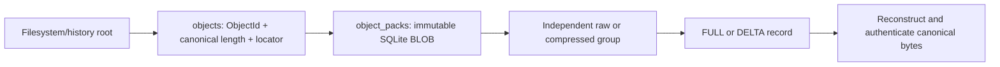
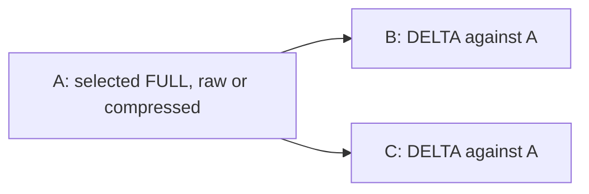
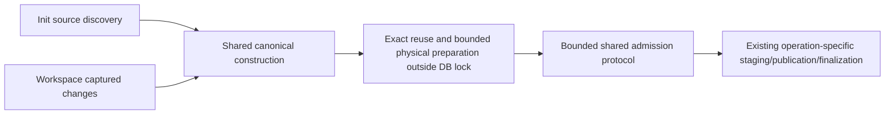

# SQLite packed-object storage: proposed format v2

**Status: concrete proposed design, 2026-09-08.** Design revision v2 proposes
pack wire version **1** and SQLite schema **6** as the next reserved design
number; neither is allocated for release until owner approval. This is not the
current format, migration code, an implementation approval, or measured
qualification. Every numerical choice below is a proposed engineering bound or
policy, not a measured conclusion. The new benchmark family, environment, and
acceptance gates remain separate TBDs; population, test-verification plans and
execution are also deferred until the specification discussion.

The [research boundary](storage-efficiency-boundary.md) controls scope. The
[compatibility transition](storage-architecture-spec.md#compatibility-transition)
is authoritative for existing Stores, reader/schema version handling, and the
replacement boundary. This document specifies the proposed bytes and locators;
it does not implement or independently authorize a migration.

## 1. One database, two layers of identity



ObjectId identifies canonical bytes. A pack ID identifies a local SQLite row;
group and record numbers locate a representation in that row. Logical trees
never reference rowids or offsets. One selected representation serves all paths
and Branches referring to an ObjectId. Unselected physical records may remain
inside admitted packs after a race; their bytes still count.

A Commit is not a pack. It may reference old packs and admit multiple new ones.
A small operation flushes its partial packs before returning, without padding,
waiting for later calls, or relying on later compaction for its footprint.

## 2. Proposed SQLite structures

These are final-shape DDL proposals, not migration statements. Existing history
and staging foreign keys continue to target the logical index named `objects`.
Replacing its old `bytes` column requires the agreed schema transition.

```sql
CREATE TABLE object_packs (
    pack_id INTEGER PRIMARY KEY,
    data BLOB NOT NULL
) STRICT;

CREATE TABLE objects (
    object_id BLOB NOT NULL PRIMARY KEY CHECK (length(object_id) = 32),
    canonical_length INTEGER NOT NULL
        CHECK (canonical_length > 0 AND canonical_length <= 16777216),
    pack_id INTEGER NOT NULL REFERENCES object_packs(pack_id),
    group_number INTEGER NOT NULL CHECK (group_number >= 0 AND group_number < 256),
    record_number INTEGER NOT NULL CHECK (record_number >= 0 AND record_number < 8191)
) STRICT, WITHOUT ROWID;
```

`object_packs.pack_id` is an integer rowid alias so incremental BLOB access can
open `data`; the locator index needs no rowid. The current schema's root foreign
keys reference `objects(object_id)` in
[`sql/schema/v5.sql`](../../../../crates/layerfs-layerstack-store/sql/schema/v5.sql).
The exact schema verifier must change through the agreed version transition.
See [SQLite's BLOB API](https://sqlite.org/c3ref/blob_open.html).

```sql
SELECT canonical_length, pack_id, group_number, record_number
FROM objects WHERE object_id = ?1;
```

Batched membership returns ObjectId and canonical length without decoding any
group. That replaces the current `length(bytes)` query while retaining its
canonical-byte receipts and length validation. Pack or record encoded length
cannot substitute for canonical length. Foreign keys validate pack existence;
they do not authenticate locator fields or internal directories.

The locator carries no duplicate base ID or record kind. Group directories
carry physical ranges; record directories carry record boundaries; DELTA headers
carry reconstruction dependencies. Each has a distinct access or validation
responsibility. Packing still pays an index entry and ObjectId per logical
object, plus SQLite allocation and partial-pack overhead.

## 3. Exact proposed pack framing

All integers are unsigned, fixed-width, **little-endian**. ObjectIds retain their
existing 32-byte encoding. There is no implicit alignment or padding. Readers
reject unknown versions, flags, codecs, kinds, opcodes, and nonzero reserved
bytes. All additions, multiplications, conversions, and range endpoints use
checked arithmetic before slicing or allocation.

```text
Pack BLOB
  16-byte header
    magic[8]       = 4c 46 50 41 43 4b 00 00  (LFPACK\0\0)
    version: u16   = 1
    flags: u16     = 0
    group_count:u32 = 1..256
  group_count consecutive 16-byte directory entries
    encoded_offset: u32  (absolute from BLOB byte zero)
    encoded_length: u32
    decoded_length: u32
    codec: u8            (0 RAW; 1 Zstandard)
    reserved[3]          (all zero)
  consecutive encoded group bytes in directory order
```

The first encoded offset equals `16 + 16 * group_count`; each subsequent offset
equals the preceding range's end; the last end equals the BLOB length. Lengths
are positive. Admission and export validate the whole directory, contiguity,
aggregate limits, and every group/record. For admission of internally constructed
packs, carry checked framing/canonical construction facts instead of decoding and
rehashing freshly encoded objects again. Reread private prepared-pack spools must
verify their operation-held exact-byte digest before insertion, as specified by
the admission protocol. Import/export of untrusted stored representations uses the
bounded decoder and canonical authentication; no unchecked producer bypass exists. Before allocating or fetching any encoded group, obtain the BLOB length from its
handle and reject lengths above **16 MiB + 41**. RAW requires encoded length equal
to decoded length; Zstandard requires `0 < encoded_length <= decoded_length <= 65,536`.
The writer's 16-byte savings threshold is policy, not a reader rejection rule.
For any group decoded length above 64 KiB, or BLOB length above 256 KiB, require
before extraction: exactly one group, RAW, offset 32, encoded range ending exactly
at BLOB end, decoded length <=16 MiB + 9. After extraction enforce exactly one
FULL record, canonical length >65,527, and BLOB length = canonical length +41.
Thus even an oversized group inside a BLOB smaller than 256 KiB uses the singleton
rule; it cannot hide in a multi-group pack. Ordinary groups use the 64-KiB hard
read bound; 16/32-KiB role targets are writer grouping policy.

A point read also validates the header and
selected entry's reserved bytes, codec, declared lengths, and range within the
BLOB beyond its directory, then validates the selected group and requested
object. It does not read every directory entry merely to prove contiguity again.
Authentication of the requested canonical object remains authoritative.

The normal pack cap is **256 KiB**, calculated as the header, complete group
directory, and sum of **decoded** group lengths, including their record framing.
Independently, each pack has at most **256 groups** and **8,191 records**. Group
compression never relaxes canonical-byte or operation-memory admission bounds.
The raw oversized singleton exception is defined below, with no unbounded route.

## 4. Groups, records, and codec

```text
Decoded group
  record_count: u32            (1..8191; pack aggregate also <=8191)
  record_end: u32[record_count] (cumulative from record-area byte zero)
  record area
    FULL:  kind:u8=0 | canonical bytes
    DELTA: kind:u8=1 | base:ObjectId | output_length:u32
           | instruction_count:u32 | instructions
```

The first record starts at record-area offset zero; each next record starts at
the preceding end. Ends strictly increase, every record contains its kind and
required fields, and the last end exactly equals the record-area length. There
are no gaps or trailing bytes. FULL canonical length is record length minus one;
DELTA output length is explicit to bound reconstruction before allocation.
Both must equal the requested object's indexed canonical length after decoding.

A COPY instruction is `opcode:u8=0 | base_offset:u32 | length:u32`.
An INSERT instruction is `opcode:u8=1 | length:u32 | literal bytes[length]`.
Instruction lengths are positive. Instruction count is `1..8191`; parsing
consumes the record exactly. Every COPY range fits the authenticated full base;
output accumulation must never exceed the declared length and must end exactly
there. DELTA target and base canonical lengths are each positive and at most
**64 KiB**. No instruction can use already reconstructed target bytes as a base.

Normal metadata groups target at most **16 KiB**, content groups at most
**32 KiB**, including decoded framing. An individually larger record uses a
single-record group up to **64 KiB decoded**, subject to the normal pack cap.
The constructor's authenticated role selects grouping; role is not another wire
field. FULL/DELTA and RAW/compressed remain independent choices.

Codec 0 stores the exact decoded group, so encoded and decoded lengths match.
Codec 1 stores exactly one ordinary [Zstandard frame (RFC 8878)](https://www.rfc-editor.org/rfc/rfc8878.html): content size is required
and equals directory decoded length, frame checksum is present and verified,
window is at most **64 KiB**, and decoded size is at most **64 KiB**. Dictionaries,
skippable frames, concatenated frames, and trailing bytes are forbidden. Reject
unsupported framing or excessive window/output declarations before decoder
allocation; enforce the output cap during decoding and exact length at finish.
The proposed writer uses **Zstandard level 1** with these explicit settings.
Level alone does not establish window, checksum, or content-size behavior.

Encode a selected group once. Keep compressed bytes only when they are at least
**16 bytes smaller** than its raw form; otherwise store RAW and count the trial
compression CPU. The directory entry has the same size in either case. Delta
selection follows the architecture policy, not repeated trials of all group
representation combinations.

### Oversized FULL route and canonical limits

A FULL record that cannot fit a 64-KiB decoded single-record group uses a **RAW,
FULL, single-record, single-group, singleton pack**. Its canonical bytes may be
at most **16 MiB** on the read route. Its decoded group is exactly canonical
length plus 9 bytes (count, one end, kind), and its pack exactly canonical length
plus **41 bytes** (16-byte header, 16-byte directory, 9-byte group framing).
No DELTA or compressed oversized exception exists. A canonical object of exactly
64 KiB is delta-eligible, but its FULL record plus group framing exceeds the
64-KiB singleton decoded cap and therefore takes this raw route when stored FULL.
This is the same pack format.

Ordinary new admission still permits at most **4 MiB minus one byte** of canonical
content per object and admission transaction, and **8,191 objects** per admission
transaction. Physical framing/encoded buffers are separately charged. The wider
16-MiB read route preserves a representation for the existing canonical codec's
limit; it does not enlarge normal write admission or authorize a migration.

The distinct existing limits are documented in
[`limits.rs`](../../../../crates/layerfs-content/src/limits.rs) and
[`objects.rs`](../../../../crates/layerfs-layerstack-store/src/objects.rs).
Modern payload chunks are at most **32,789 canonical bytes**: 32,768 payload +
9-byte outer header + 4-byte Bytes-field length + 8-byte chunk magic, as encoded
by [`extent_codec.rs`](../../../../crates/layerfs-content/src/file/extent_codec.rs).
FileState is 106 canonical bytes; extent/directory/inode-table/metadata-tree
nodes are bounded at 8,192 bytes. These common sizes do not replace the general
canonical limit. A valid chunk therefore need not be rejected or forced raw
merely because its framing crosses the nominal 32-KiB group target.

## 5. Shallow deltas: one reconstruction dependency



The selected base representation must actually be FULL. The reader rejects a
DELTA base, self-reference, cycles, and excessive lengths instead of recursively
following another delta. Authenticate the base before copying; reconstruct and
authenticate the complete target canonical bytes before role decoding/use.
A full anchor can live in another pack. Its physical dependency remains even
when no retained logical root directly references it. No per-pack base copy or
local dependency index is added. Base selection and admission rechecks belong to
the [shared admission protocol](storage-architecture-spec.md#admission-protocol).

## 6. Small and large files use the same format

```text
6-KiB file                         100-MiB file
  one initial payload object       many payload objects
              \                    /
           shared CAS/CDC/COW construction
             FULL or DELTA -> groups -> SQLite packs
```

The current 8/16/32-KiB CDC profile discovers construction boundaries; its minimum
is not allocation padding. Exact captured ranges preserve old extent slices;
whole-file replacements need discovery of reusable bytes. Crossing 8 KiB creates
new file state without relocating historical objects. Metadata-only edits still
benefit from structural reuse and metadata compression.

The unchanged logical graph is namespace/inode → FileState → extent nodes →
payload ObjectIds with offsets and lengths. Packing does not remove those
objects or indexes. Tiny-content inlining remains a separate logical-format
proposal, not a second small-file storage backend.

## 7. Read sequence and ownership

```mermaid
sequenceDiagram
    participant FS as Workspace/FUSE reader
    participant S as Existing shared object reader
    participant DB as StoreDb connection
    FS->>S: ObjectId or bounded batch
    alt Authenticated object available
        S-->>FS: Existing canonical bytes
    else Miss
        S->>DB: Acquire connection; locator query
        S->>DB: Header 16B; selected directory entry 16B; encoded group
        DB-->>S: Bounded owned encoded buffers
        S->>S: Close Blob/statements; release connection
        S->>S: Decode group; select and validate record
        opt DELTA
            S->>DB: New bounded acquisition for missing full base
            DB-->>S: Encoded base group; close handles and release
            S->>S: Decode and authenticate FULL base; apply delta
        end
        S->>S: Authenticate target; pass canonical bytes to role decoder
        S-->>FS: Filesystem bytes through existing read path
    end
```

For one cold object in one pack, the locator is one SQL query and incremental
BLOB access performs **three range reads**: header at offset 0 for 16 bytes,
selected entry at `16 + 16 * group_number` for 16 bytes, then its encoded group.
BLOB length comes from the open BLOB handle. These local SQLite operations are
not three network round trips. No explicit read transaction commit or whole-pack
`SELECT data` is required. A singleton pack's only group can naturally contain
nearly all its bytes; this is the declared oversized-object cost, not a hidden
whole-pack fallback for ordinary partial reads.

Batch/coalesce known requests sharing groups and reuse existing bounded caches.
Keep all Blob handles, statements, and connection guards inside extraction;
release them before decompression, canonical hashing, base requests, or delta
application. This matters because current `StoreDb.reader()` and `writer()` share
one connection mutex. A separate-pack base miss can repeat the three range reads
and one locator query after target decoding. Metadata traversal can require
further dependent object reads; depth one does not bound an entire file read.

Encoded buffers, decoded backing groups, reconstructed targets/bases, cache
entries, and output copies all consume memory. Charge complete retained backing
allocations, not just slice lengths. Avoid automatic duplicate object/group
caches, preserve role validation, and carry trusted authentication facts through
the existing read boundary rather than hashing scalar metadata twice. Miss
correctness and bounds never depend on a warm cache.

## 8. Shared Init/Commit write sequence



The [architecture admission protocol](storage-architecture-spec.md#admission-protocol)
is the sole algorithm for prepared-batch ownership, duplicate/base rechecks,
transaction boundaries, and publication closure. Init streams bounded batches;
Commit retains staging, no-change and head-check semantics. No transaction per
record or per pack is implied. Required encoding completes before the operation
returns. Earlier admitted/unselected records after failures or races remain in
allocation accounting. No crash-recovery or later compaction requirement is
introduced here.

## 9. Portable export and physical closure

```text
Local selected-object index       Future portable manifest
A -> local pack 101, group0, rec0  A -> portable pack key X, group0, rec0
B -> local pack 102, group1, rec2  B -> portable pack key Y, group1, rec2

X / group0 / rec0 = FULL(A)
Y / group1 / rec2 = DELTA(base=A, reconstruct=B)
```

Numeric local pack IDs have no global identity. A future exporter can keep these
BLOB bytes and translate locators through a portable manifest containing
ObjectId, canonical length, portable pack reference, group number and record
number. Pack bytes do not embed every target ObjectId, so export/reindex requires
that mapping. Reframing or recompression is not inherently required; exporting
whole packs may transfer unrelated/unselected records, while selected-record
extraction can require repacking. That is a documented migration/granularity cost.

Starting from a selected root, enumerate its logical objects **and** each selected
DELTA's full-base dependency, with its required pack/group, even if the logical
graph omits the base. Dependency discovery parses the existing records; no new
local persistent dependency index is required. Admission/export validate complete
framing; remote readers still bound/decode/authenticate without trusting the
manifest. A cold target and cross-pack base can require multiple directory and
group requests, and a raw singleton can require up to 16 MiB plus framing.
Bounded decoding therefore does not guarantee low remote latency.

Export/transport, tenant authorization, replication, remote publication services,
and reclamation remain future cloud work. CAS identity grants no authorization;
export of unrelated records needs its own access/granularity policy. SQLite
replication and object-storage export have different migration costs; SQLite is
not made concurrently writable by placing its file on object storage.

## 10. Format review checklist

- [ ] Object identities remain canonical; physical locations never define them.
- [ ] All authoritative data is inside SQLite; spools/temporary space is separate
      and counted, not an external retained object store.
- [ ] Pack, group and record roles and offset origins are unambiguous.
- [ ] Partial group access does not silently fetch or decode whole packs.
- [ ] Decoded bytes, canonical bytes, record counts and queue memory are bounded.
- [ ] Full/raw/compressed/delta variants authenticate to the expected objects.
- [ ] Depth-one dependencies, base retention and range checks are enforced.
- [ ] Small files and growing files use the same logical/physical pipeline.
- [ ] Packs and locations are admitted consistently before root publication.
- [ ] Synchronous footprint includes all work needed to achieve it.
- [ ] Existing-Store handling and exact schema/codec are agreed before coding.
- [ ] New benchmark-family definition and test environment remain separate TBDs.

For architecture decisions, tradeoff policy, Git comparison, and broader boundary
checklists, use the [architecture specification](storage-architecture-spec.md).
For current implementation behavior, consult the released manual and source;
this walkthrough must not be presented as an already supported SQLite format.
