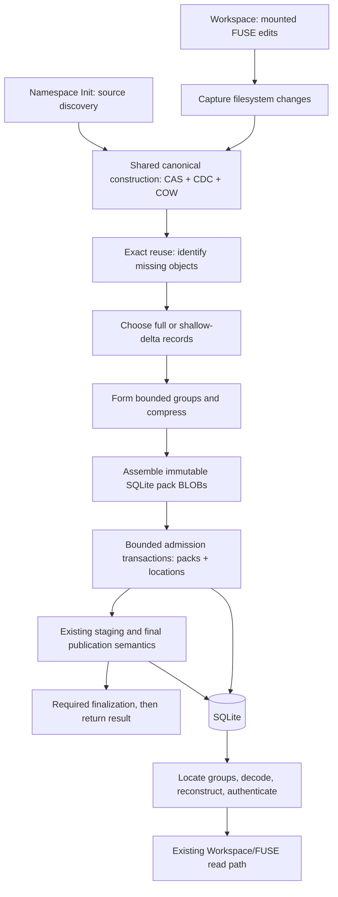

# v0.1.4 proposed storage architecture

Status: **proposed architecture v1**, 2026-09-08. Owner-requested synthesis of
the storage discussion. This specifies the intended research design, not shipped
behavior, a frozen binary format, or permission to begin benchmark collection.
Prototype parameters are distinguished from agreed boundaries. Benchmark family,
test environment, numerical acceptance gates, and format compatibility decisions
remain open.

Authority: [research boundary](storage-efficiency-boundary.md).
Context: [release scope](README.md), [evidence index](evidence.md),
[issue #18](https://github.com/Ephemeral-AI-Lab/layerfs/issues/18), and
[issue #72](https://github.com/Ephemeral-AI-Lab/layerfs/issues/72).

See the [SQLite storage-format walkthrough](sqlite-storage-format.md) for
conceptual SQL, binary-layout diagrams, and read/write sequence diagrams.

## 1. Objective and agreed boundaries

Reduce retained allocation aggressively through one synchronous storage pipeline
shared by namespace Init and Workspace Commit. Keep mounted Workspace reads and
writes efficient, preserve CAS/CDC/COW semantics, and keep all authoritative
stored representations inside SQLite.

A Workspace per agent tool call is an expected application workflow, not the
core abstraction or a mandatory cadence. The owner expects about 1 QPS normally
and no more than about 10 QPS of tool calls. Whether this applies per agent or
per Store is **TBD**; aggregate per-Store rate is an explicit planning assumption,
not a capacity guarantee. Calls differ greatly in changed bytes and file count.

Agreed boundaries:

- SQLite-only authoritative storage; packs are SQLite BLOBs, not external files.
- Required representation work finishes synchronously before the corresponding
  Init/Commit operation returns success. Internal bounded parallel work is allowed.
- Multiple SQLite admission transactions are allowed; final root/head publication
  remains consistent with existing operation semantics.
- No background encoding or later repack is required to reach the claimed footprint.
- Read-heavy and write-heavy behavior both matter; cache hits cannot stand in for
  miss behavior, and fast final publication cannot hide expensive capture work.
- New durability guarantees, crash recovery, and power-loss qualification are
  outside this phase. Existing ordinary behavior is not intentionally weakened.
- A new benchmark family is required. Existing families are supporting evidence
  and separate regression obligations, not automatically its acceptance population.
- Broader multi-Branch scaling remains v0.1.5; shared-object correctness remains
  necessary for any storage change.

## 2. End-to-end shape



Reuse the current shared construction/admission code rather than creating an
Init encoder and a separate Commit encoder. Source discovery, mutation capture,
and operation-specific publication stay with their existing owners. No new
public storage API, backend plugin registry, or agent-specific storage engine is
required by this proposal.

## 3. Logical objects and physical representations

Keep logical identities derived from canonical bytes, independently of physical
compression and placement. A successful read reconstructs the canonical object
and authenticates it before callers consume it.

| Layer | Responsibility |
| --- | --- |
| CAS | Exact content identity, authentication, global reuse within the Store |
| CDC | Discover reusable payload boundaries during content construction |
| COW extent and namespace trees | Preserve unchanged ranges and structure |
| Workspace/FUSE | Mutable filesystem operations, visibility, and capture |
| Physical encoder | Full/delta records, compression groups, pack construction |
| SQLite | Object lookup, stored representations, filesystem/history publication |

The first physical-format prototype retains canonical file/namespace encodings
and the current CDC profile: minimum 8 KiB, target 16 KiB, maximum 32 KiB.
These are variable-boundary parameters, not allocation sizes or exact chunk sizes.
The final fragment can be smaller than the minimum. A file at least 8 KiB can
still produce a single chunk.

A 4/8/32 KiB profile is a separate research candidate, not silently enabled here.
It needs its own profile identity, compatibility decision, and attribution. Do
not combine chunk-profile changes with the first physical-encoding comparison.

## 4. Exact reuse before physical encoding

Construct or reuse canonical object identities through the existing authenticated
pipeline. Filter exact duplicates within the current operation and against the
Store before compression or delta search. Preserve existing trust boundaries:
knowing an ID does not justify bypassing required canonical validation.

Reused objects keep their existing location and representation. New roots may
reference objects in any existing pack. There is no per-file, per-Branch, or
per-Commit duplication merely to achieve locality.

Use current batched membership and bounded queues. A concurrent admission can
make an earlier missing-object observation stale. The implementation must define
a serialized admission recheck and consistent conflict handling. It must never
silently redirect an ObjectId to unequal canonical content. If physical records
become redundant during admission, account for their actual bytes; never call
them payload reuse savings. Exact race/waste handling is a pre-implementation
layout decision, not grounds to add a second storage service.

## 5. Small and large files use one pipeline

```text
Small file -> one or few payload objects -> full/delta records -> groups -> packs
Large file -> several payload objects   -> full/delta records -> groups -> packs
                         existing objects are reused in both paths
```

Small objects are not excluded from compression or packing. Several small full
or delta records can share a compressed group. Metadata records are grouped by
compatible role separately from content. A record may remain logically full
while benefiting from group compression; full does not mean raw physical bytes.

File size does not select a separate row-versus-pack backend. Decisions use object
role, representation size, available similarity, and bounded read cost. Raw groups
are an encoding option inside the same pack format, not a separate storage path.
No hybrid placement policy is required for the initial prototype.

Keep the current extent representation initially. A growing file creates a new
file state referencing existing and additional objects. Crossing 8 KiB requires
no migration of old objects or historical states. Exact range capture can retain
old slices; complete replacement relies on discovery of reusable content.

Inline content or direct-payload file states remain later representation options
if canonical metadata/index overhead dominates after physical encoding. They
change the logical graph and need a separate compatibility decision. Packing
existing objects does not eliminate their object IDs or location-index entries.

Source-analysis evidence from the frozen 157-checkpoint population: 75,922 unique
regular-file contents contain 891,893,067 bytes. Of these, 48,976 (64.51%) are
below 8 KiB but account for only 15.88% of payload bytes. Contents between 8 and
64 KiB account for 56.99% of bytes. Thus both small-record overhead and broader
payload encoding matter. These are Git blob statistics, not SQLite allocation
or access-frequency measurements. See the evidence index for analysis custody.

## 6. Shallow delta records

“Shallow delta” means a bounded reconstruction dependency, not a shadow copy.
The proposed first prototype has maximum depth **one**:

```text
Full anchor A (may be compressed)
  ├── B = delta against A
  ├── C = delta against A
  └── D = delta against A

No A <- B <- C <- D delta chain in this prototype.
```

A delta contains a base identity, reconstructed length, and bounded COPY/INSERT
instructions sufficient to reproduce the complete canonical target. Canonical
IDs are not computed from delta instructions. A base may be in another pack;
pack containers are not assumed self-contained.

Base selection:

1. Use a bounded candidate set informed by prior-file extents or corresponding
   prior metadata where that context is already available.
2. If the previous object is a delta, consider its full anchor; do not accidentally
   create depth two. If unsuitable, use a new full representation.
3. Prefer already-stored full bases for the first implementation. Do not rely on
   unresolved forward references or duplicate a base solely for pack locality.
4. Never scan all retained history to find an optimal base. No persistent global
   similarity index is required initially.
5. Keep the full representation whenever the selected delta is not worthwhile.

At most four base candidates is a proposed starting bound, not an accepted
performance target. Missing context reduces delta opportunity; it does not
justify changing the filesystem input or admitting a benchmark-specific hint.

Compare total encoded costs including base references, lengths, framing, and
index implications. Group compression can change the ranking of full and delta
records. Freeze a bounded selection heuristic before measurements; report actual
final group sizes and CPU rather than claiming per-record optimality. Avoid
combinatorial trials of every group representation.

As an anchor becomes dissimilar, admit a newer full object. Read cost stays
bounded, but extra anchors may cost more space than deeper Git delta chains.
Exact recurring content still reuses its existing ObjectId and representation.

Base dependencies are physical storage dependencies even when the base has no
logical filesystem reference. Bases and their containing groups must remain
available while referenced by retained delta representations. There is no new
reclamation implementation in this phase; future reclamation must understand
these dependencies. Do not copy a base for every dependent object.

## 7. Compression groups and pack layout

A pack is a container, not a compressed chunk and not a whole-pack compression
stream. It can contain independently decoded groups of full and delta records.

```text
SQLite pack BLOB
  header: format version and group directory
  group 0: metadata records, compressed or raw
  group 1: small content records, compressed or raw
  group 2: content/delta records, compressed or raw

Object location: ObjectId -> pack ID, group number, record position
```

The concrete directory/record codec and SQL DDL are **TBD**. They must support:
object location, canonical length, representation kind, optional base identity,
group codec, encoded range, and bounded decoded length. Avoid duplicate copies
of information unless justified. Pack framing and references are validated, and
target/base canonical authentication remains authoritative.

Starting prototype settings, subject to the later measurement contract:

| Setting | Proposal, not qualification target |
| --- | --- |
| Pack input-byte cap | 256 KiB of uncompressed representation records and framing |
| Metadata group | Up to 16 KiB uncompressed records |
| Content group | Up to 32 KiB uncompressed records |
| Codec | A fast Zstandard setting; exact version/level TBD |
| Delta depth | At most one |
| Base candidate count | At most four |
| Compression-benefit threshold | TBD; include framing and raw alternative |
| Pack/group record-count bounds | TBD; required independently of byte caps |

Canonical object headers can make a maximum payload chunk exceed a nominal
32-KiB group. Such an object uses a single-record unit sized to its declared
canonical bound. Group/pack caps need an explicit bounded oversized-record rule
for other supported object roles; a nominal payload size must not become an
accidental rejection of valid metadata. No unbounded exception is permitted.

Bound canonical bytes represented as well as encoded/representation bytes: many
small deltas can represent much more canonical data than their encoded size.
Compression does not relax existing memory or admission budgets.

Compress bounded compatible groups once using the selected policy. A group can
stay raw when compression does not pay; report the CPU spent trying. Do not
exclude all small files from compression based on the CDC minimum. Dictionaries,
multiple codecs, and adaptive classifiers are not required for the first design.

Packs are immutable once admitted. Flush partial groups/packs at operation or
required admission boundaries without padding to capacity or waiting for future
calls. No one-pack-per-file, one-pack-per-Commit, or large-old-pack rewrite rule.
Many tiny synchronous operations can still create small pack/index overhead;
measure it honestly. Later merging is not assumed to repair the primary footprint.

## 8. SQLite admission and publication

Reuse the shared constructor and bounded admission paths in
[objects.rs](../../../../crates/layerfs-layerstack-store/src/objects.rs),
Init publication in [layerstack.rs](../../../../crates/layerfs-layerstack-store/src/layerstack.rs),
and existing [Workspace staging](../../../../crates/layerfs-layerstack-store/src/staging.rs).

```text
Outside writer ownership:
    canonical construction -> reuse plan -> representation/group/pack assembly

Admission transaction(s):
    insert complete packs and corresponding object locations consistently

Existing operation-specific staging/publication:
    make selected complete root available
    validate expected destination/head
    publish Layer/Commit and applicable references
    finish required runtime finalization
    return public operation result
```

Do not hold the SQLite writer while waiting for source discovery, base retrieval,
compression, or producer work. Do not create a transaction per record or per pack
when an existing bounded admission transaction can carry several. Preserve the
current Workspace stage/no-change/publication lifecycle; sharing the encoder
does not require making Init and Commit identical state machines.

The inspected baseline caps admission at 8,191 objects and 4 MiB minus one byte
of canonical content. Preserve those bounds unless explicitly revised, and count
encoded bytes, index overhead, and physical writes separately. Pack count does
not replace object count. Final batch handling may follow the existing publisher.

A root/head must not become visible before all required logical and physical
base dependencies are available. Establish closure through carried construction
facts and the existing validation path; do not add an exhaustive historical scan
to each final transaction. Retained rows from failed attempts are not proof that
an arbitrary root has complete closure.

Prior admission transactions may remain committed if final publication fails.
Preserve and account for those bytes; do not claim whole-operation rollback.
Use authoritative existing operation results to distinguish unpublished failure
from a published result followed by presentation/finalization failure. No blind
republication or extra crash-recovery framework is introduced.

## 9. Reads, FUSE, and bounded memory

```text
Existing authenticated object/Workspace hit -> use available data
Miss -> batched object locations -> required encoded group ranges
     -> decode groups -> reconstruct full or depth-one delta object
     -> authenticate -> interpret canonical object -> serve requested bytes
```

Use partial BLOB access or another measured range-access mechanism so a lookup
does not materialize the entire pack. If using SQLite incremental BLOB I/O, its
rowid/table restrictions must be reflected in schema design. Whole-pack retrieval
is not an acceptable hidden fallback for a partial-read claim.

A depth-one delta may require its group's data plus the base's group. This bounds
delta dependency depth, not the total groups in a file-range or tree traversal.
Batch/coalesce requests to the same group where possible. Authenticate a base
before applying its bytes, validate COPY ranges and output lengths, and reject
invalid framing, cycles, excessive expansion, or wrong reconstructed identity.

Reuse existing batched reads and caches. Any decoded-group cache must be bounded
and integrated into declared memory accounting. Avoid automatic duplicate full
copies in both group and object caches; consider backing slices when compatible
with existing ownership. Cache misses remain correct and measured. No dedicated
new cache hierarchy is required by this specification.

Warm CPU-bound reads can regress even when cold I/O improves. Report small random
reads, metadata traversal, and larger sequential reads separately when the family
is defined. Avoid repeatedly decoding large groups for tiny requests. Read/write
amplification, copied bytes, base fetches, and encode/decode work must stay visible.

## 10. Git comparison and expected sources of improvement

| Mechanism | Expected opportunity | Limitation |
| --- | --- | --- |
| Exact CAS/COW reuse | Avoid unchanged payload/structure and re-encoding | Does not encode similarity between different objects |
| Group compression | Reduce repeated small-record and payload patterns | Benefits depend on batch contents and read amplification |
| Shallow deltas | Reuse bytes inside changed objects | Bounded online search/depth may miss Git's better bases/chains |
| SQLite packing | Reduce physical payload-record overhead | Lookup rows, SQLite allocation, and logical metadata still cost space |
| Compact future file representation | Remove unnecessary graph overhead | Requires a separate canonical-format decision |

The matched #72 control reports 289,480,704 allocated bytes for compressed Git
packs without deltas, 56,373,248 with deltas, and 940,310,528 for LayerFS. These
are evidence of opportunity, not size predictions for this design. Git retains
the selected contents, paths, executable bits and symlinks; it does not retain
LayerFS's full metadata. Original clone history differs and is not the matched
comparison. See [evidence](evidence.md) for immutable reports and limitations.

Git-like efficiency is a target, not something already attained or guaranteed by
using the same mechanisms. This design has less look-ahead than offline Git
repacking and incurs SQLite plus filesystem-specific overhead. All metadata,
indexes, full bases, group framing, unreferenced admitted records, and allocation
slack count. Do not compare only compressed payload with a complete Git repository.

Compare matched logical populations and report exact differences. Foreground
Git construction and later Git packing are distinct costs. LayerFS's primary
footprint must already exist at synchronous operation completion. No later
compact measurement substitutes for that figure.

## 11. Performance and measurement boundary

The owner's tradeoff remains conditional: about 50% more elapsed latency can be
acceptable for genuinely Git-comparable storage; 50% more latency for only 10%
less allocation is unacceptable. No universal 50% regression allowance or 1.25×
Git tolerance is adopted. Per-operation ceilings and comparability are **TBD**.

At 10 aggregate operations/s, average inter-arrival is 100 ms; this is not a
universal operation deadline. Queueing depends on total serialized work, changed
bytes, file count, and burst behavior. Record queue/wait time separately from
encoding, admission, and publication. Start with existing bounded execution and
serialized database access; no per-Workspace worker pools or background service
are prescribed.

Keep separate: Init, filesystem capture/Commit, ordinary reads, historical reads,
and application lifecycle when selected. Count synchronous work wherever it
occurs, even before the final Commit timer. Decompose compression/decompression,
canonical encoding/decoding, authentication, base search, SQLite I/O, index work,
and buffering where practical. Reuse current monitors/receipts before extending.

Never trade correctness for footprint. Do not average a severe individual
regression away, hide CPU in an uncounted host, or depend on unbounded caches.
Report actual allocated storage, logical retained bytes, canonical bytes, encoded
bytes, exact reuse, delta savings, group compression, indexes, and temporary peaks
separately. Overlapping savings must not be added together as independent gains.

## 12. Boundary and correctness checklists

These are obligations for the future implementation, not claims of passing tests.
Exact test IDs, populations, and sample counts remain in the new-family placeholder.

### Shared architecture and storage

- [ ] Init and Workspace Commit use the same canonical/physical admission path.
- [ ] All authoritative packs, object locations and history records are in SQLite.
- [ ] Public filesystem semantics, COW isolation and canonical IDs are preserved.
- [ ] Existing objects are reused without unnecessary recompression or copying.
- [ ] Small and large files use one pipeline; no backend migration at 8 KiB.
- [ ] Successful operations finish required encoding before acknowledgement.
- [ ] No later compaction is needed to achieve the primary reported footprint.
- [ ] Multiple transactions retain complete-root publication and no-change behavior.

### Encoding, lookup, and retained-state correctness

- [ ] Full, raw, compressed and delta records reconstruct exact canonical bytes.
- [ ] Invalid lengths, offsets, codec framing, COPY ranges and output sizes fail.
- [ ] Depth one is enforced; delta-to-delta bases and cycles are rejected.
- [ ] Physical base dependencies remain readable even without direct logical refs.
- [ ] Duplicate admission and recurring A/B/A content preserve identity and accounting.
- [ ] Empty/tiny files, final partial groups, group boundaries and oversized valid
      object handling are correct; no capacity padding is misreported as payload.
- [ ] Growth/shrink across CDC thresholds preserves old states and current bytes.
- [ ] Metadata-only changes preserve content and supported filesystem metadata.
- [ ] Multi-Branch shared content and later divergent writes remain independent.
- [ ] Reads through the public Workspace/FUSE path and normal reopen are correct.
- [ ] Ordinary admission/publication/finalization failures retain honest status and
      allocated-byte accounting without duplicate publication.

### Performance, compatibility, and evidence

- [ ] Read/write amplification, queue time, memory and SQLite scopes are explicit.
- [ ] Compression-group reads do not silently retrieve/decode the whole pack.
- [ ] Canonical, encoded, record-count and queue bounds are independently enforced.
- [ ] Small Commit latency, larger Init throughput and read behavior are all evaluated.
- [ ] Numerical tradeoff gates are frozen before candidate qualification.
- [ ] Existing-Store reader/schema handling is explicitly agreed before format work.
- [ ] Historical reports and failed results retain their original identities.
- [ ] No durability, power-loss or crash-recovery work is added to this phase.
- [ ] Implementation uses existing shared modules and focused regressions rather
      than scenario-specific product paths or a new backend framework.

## 13. Benchmark and environment placeholders

**New benchmark family:** TBD. Name/IDs, fixtures, file-size distributions, edit
schedules, baseline/candidate revisions, public operation surfaces, timing,
repetitions, ordering, cache conditions, Git scope, verifier coverage, resource
budgets, acceptance and artifact layout will be discussed separately. Existing
reports are supporting evidence, not automatically the acceptance population.
No existing tier sequence or sample count is imported here.

**Test environment:** TBD. Host/container ownership, hardware/runtime identities,
limits, timeouts, preparation, transport, build/cache reuse, isolation, sampling,
coordination and cleanup remain placeholders. Existing repository instructions
apply until explicitly amended. This placeholder authorizes no conflicting run.

## 14. Decisions needed before implementation

- [ ] Resolve existing 0.1.x schema compatibility and existing-Store handling;
      adopting this architecture does not silently override that contract.
- [ ] Specify exact pack/group framing, record bounds, locator schema and partial
      BLOB read mechanism, including concurrent admission policy.
- [ ] Freeze codec, bounded delta/base selection and representation-choice policy.
- [ ] Confirm proposed byte/count/memory bounds and oversized-record handling.
- [ ] Define the new benchmark family and environment, then numerical gates.

Prototype settings may change prospectively with a recorded rationale. Once
measurements are frozen, version any contract change and retain earlier evidence.

## References

- [Git pack format](https://git-scm.com/docs/gitformat-pack): full and delta
  representations, copy/insert instructions, and indexed packing.
- [Git pack-objects](https://git-scm.com/docs/git-pack-objects): base search and
  depth tradeoffs; no claim that bounded online encoding matches its output.
- [Zstandard](https://github.com/facebook/zstd): codec and small-data background;
  library throughput is not a LayerFS performance result.
- [SQLite incremental BLOB access](https://sqlite.org/c3ref/blob_open.html): partial
  BLOB interface and schema restrictions.
