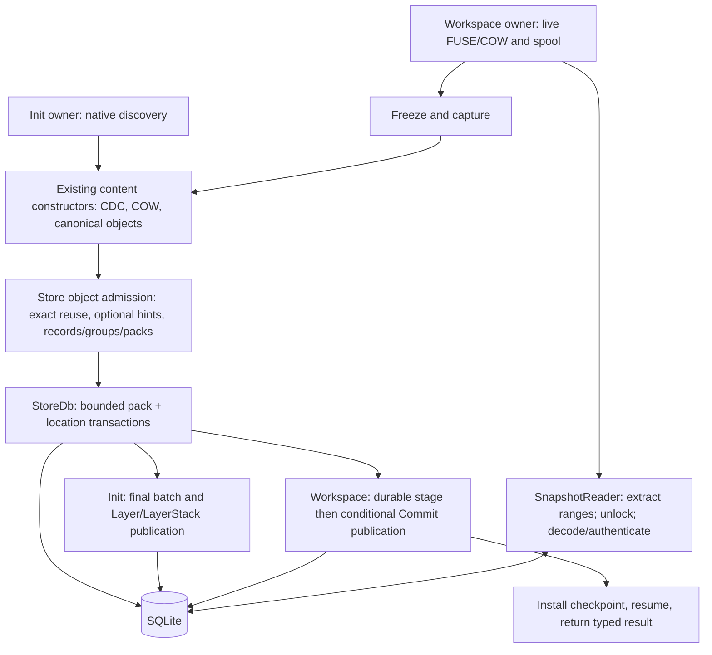

# v0.1.4 proposed storage architecture

Status: **proposed architecture v2**, 2026-09-08. Revises the independent review
of PR #77 against product revision `28177560c8f049c02192e18c263cdc5543c1ab52`.
This is a concrete design recommendation, not shipped behavior or implementation
approval. Proposed bounds below are engineering choices, not measured optima.
The compatibility disposition requires an owner decision. Benchmark family,
population, environment, numerical acceptance criteria, verification plans and
execution are deferred until the specification is discussed with the owner.

Authority: [research boundary](storage-efficiency-boundary.md).
The [physical format](sqlite-storage-format.md) owns exact wire fields and limits;
this document owns construction, selection, admission and lifecycle policy.
[Evidence](evidence.md) owns historical attribution. [Review disposition](review-disposition.md)
tracks finding closure and distinguishes design confidence from measurement.

## 1. Objective and boundaries

Reduce retained allocation through one synchronous object path shared by namespace
Init and Workspace capture/Commit. Preserve CAS, current CDC, extent/namespace COW,
FUSE, canonical identities, ordinary correctness and historical reads. All
selected representations, packs, locations and published history remain in SQLite.
Existing temporary spools remain separately accounted. Full/delta records and
raw/compressed groups are independent choices in one format.

A Workspace per tool call is an expected application flow, not a second storage
engine or mandatory cadence. About 1 call/s typical and up to about 10 call/s is
an individual/workload expectation; its per-agent/per-project scope must be stated
in any calculation. It is never an aggregate Store or machine ceiling.

Required encoding finishes before public success; later compaction does not
rescue the reported footprint. Multiple bounded admission transactions are allowed.
Synchronous does not mean one transaction, holding a writer during compression,
or a new durability guarantee. New fsync policy, crash recovery, failover and
power-loss work remain excluded. No background packer, external durable packs,
cloud service or second authoritative backend is added.

## Compatibility transition

Packed storage is an incompatible, explicitly versioned physical Store format.
The proposed next schema identity is **6**, paired with pack wire version **1**;
these are proposed assignments, not changes to the current schema-5 verifier.
Retain the application ID, canonical encodings, ObjectIds, current CDC profile,
public operation outcomes and acknowledgement behavior. A schema version is not
part of a logical ObjectId. The existing exact-schema check must dispatch only to
explicitly supported schemas, never accept arbitrary tables or reinterpret bytes.

**Recommended transition package:** first implement only explicit new packed-Store
creation after the owner approves the format change. Opening an existing Store
never converts or rewrites it. The packed implementation rejects legacy formats
explicitly; existing compatible tools remain usable for those Stores. This is
source preservation, not a claim of legacy support in the new implementation.
Do not retain parallel writable object encoders just to minimize the patch.

If the owner requires existing Stores to move to the packed implementation, the
recommended route is an explicit separate-destination conversion using the legacy
reader as an import adapter. The source remains unchanged, and no automatic
replacement, deletion or conversion-on-open occurs. That subsequently authorized
contract must preserve supported IDs, canonical bytes, history and staging state,
or reject unsupported source state before making a destination usable. This
revision specifies no converter, migration procedure or conversion deliverable.

**Owner decision before implementation:** accept this new-Store-only transition
and either a narrow exception to the [0.1 schema rule](../README.md#compatibility-boundary)
or placement of the incompatible mechanism in 0.2. If legacy access in the new
binary is required, agree its read/write/conversion scope with that same decision.
Until then the current 0.1 contract remains in force. All non-format compatibility
obligations remain; a release label or this proposal grants no migration authority.

## 2. Shared owners and operation boundaries

| Owner | Input and required output | Mutable state / memory | Lock and failure boundary |
| --- | --- | --- | --- |
| Init discovery | Native source -> bounded file/namespace tasks | Existing discovery and producer state | No Store permit/connection while discovering or waiting; failure publishes no root |
| Workspace capture | Frozen generation and COW/spool facts -> changed-state input | Existing live owner, host backing and spool | Preserve freeze, writer-quiescence and capture outcomes; these are not physical deltas |
| Content constructors | Input + retained roots -> authenticated canonical objects and complete candidate root | Existing builders, bounded output, root/child facts, optional hints | Source and canonical work outside Store serialization; fresh untrusted/spooled reads authenticate |
| Shared object admission | Owned canonical output -> committed or validated object/dependency facts | One bounded operation-owned accumulator and physical scratch | Protocol below; never return provisional inserts as admitted |
| Init publisher | Complete root/final prepared batch -> Layer and LayerStack | Existing Init result/receipt | Short permit and final transaction; name conflict leaves earlier admitted objects |
| Workspace publisher | Complete candidate -> retained stage -> conditional Commit/head | Existing expected head/base, stage and pending-publication state | Stage and publication stay distinct; head movement cannot roll back the retained stage |
| Workspace finalizer | Published outcome + prepared checkpoint -> installed active state | Existing checkpoint and spool lifecycle | Preserve installation/resume and published-but-finalization-failed distinction |
| Object reader | ObjectId -> authenticated canonical bytes -> role interpretation | Owned encoded buffers, decoder/output and existing bounded cache | Extract under connection; decode/hash outside it; malformed or unequal bytes fail before use |

The existing `objects.rs` admission/access owner gains a private physical codec;
no public codec API, backend trait, service, scheduler or plugin registry is needed.
Source discovery and capture stay distinct. Physical batch construction does not
make Init and Commit identical state machines.

## 3. Identity, reuse and small files

CAS supplies exact identity and sharing within a Store; CDC discovers reusable
content regions; COW retains unchanged extents and namespace structure. Keep the
current 8/16/32-KiB CDC profile and logical file graph. The 8-KiB minimum is not
padding: short final chunks are valid, and crossing it relocates no old object.
An accurate range edit can retain old slices directly; whole-file replacement
requires content discovery and does not inherit an accurate diff from writes.

Small and large files use the same full/delta record and group/pack path. Full
records may be group-compressed; raw groups are the same backend. Metadata and
content have separate group accumulators within the same pack accumulator.
Tiny-file inlining or removal of extent nodes is deferred until residual logical
metadata/index cost justifies a separately compatible canonical change.

Exact duplicates are filtered before delta search or compression. Reused IDs keep
their selected representation and location. Canonical length lives in the selected
object index, so membership and canonical-byte receipts never use compressed size
or decode groups merely to obtain a length. Required equality/integrity checks
still read and authenticate stored bytes; membership alone does not authorize use.

The source distribution (64.51% of unique regular contents below 8 KiB, only
15.88% of bytes) is historical Git-blob evidence, not SQLite allocation or read
frequency. No file-size population or different CDC profile is adopted here.

## 4. Delta hints and bounded selection

The record wire format supports FULL and depth-one DELTA. A base must already be
admitted, authenticated and selected as FULL, including when its group is compressed.
A speculative FULL in the same unadmitted batch is never a base: it might lose an
admission race to an existing delta representation. No forward references, base
copies for locality, global similarity index or scan of retained history is used.

### Hint provenance

Hints are optional internal facts attached to canonical output, not changes to
canonical bytes or the public API. Use up to four distinct prior IDs already known
while building that output, in producer-provided order with ObjectId as the tie
break. For payload construction, these come from prior extents intersecting the
replaced range that the builder already visits; metadata construction may supply
the prior corresponding page it replaces. Do not perform a new whole-file/tree
walk solely to find hints. Accurate small range edits may have no useful physical
base because COW already retained the old bytes.

Fresh Init supplies no predecessor hints in this revision. Nonempty-Store Init
also does not invent a predecessor from path names or Store occupancy. It still
uses the identical encoder with an empty hint list, exact reuse and full-record
group compression. Reconciliation uses available canonical construction context,
not a separate delta encoder. Whole-file replacements may provide only weak or
no hints. Missing context is a full-record outcome, not an error or hidden search.

### Preparation and selection policy

These deterministic caps are proposed engineering limits, not performance gates:

| Scope | Proposed limit / rule |
| --- | --- |
| Delta target/base eligibility | Same known canonical role; each canonical object <=64 KiB; other roles/sizes use FULL |
| Prior IDs per target | At most four; deduplicate before lookup |
| Full anchors | Prior FULL itself, or one decoded prior DELTA's declared FULL base; deduplicate anchors before fetching/trial |
| Per-target preparation | At most eight distinct record/group fetch paths, 512 KiB encoded bytes including framing, and 512 KiB decoded group bytes |
| Per-target trials | At most four, one per eligible full anchor; one base/index and one best delta retained at a time |
| Per-admission-batch preparation | At most 8 MiB fetched encoded bytes and 8 MiB decoded group bytes for hint/base preparation |
| Per-admission-batch delta work | At most 512 base trials and 16 MiB of candidate match-byte comparisons |
| Exhausted optional budget | Keep best complete eligible delta so far or FULL; never skip required integrity validation to fit a budget |

A hint exceeding a declared size/budget is skipped before its optional fetch. A
missing optional hint is ignored. Prior-record inspection validates framing and
codec output, but does not claim authentication of an unused prior DELTA target:
its extracted base ID remains an untrusted hint. The selected FULL base must be
fully authenticated and role-validated before a trial. Detected framing/integrity
errors or an invalid selected base fail the operation rather than being hidden.
If a prior target's canonical bytes are actually consumed, reconstruct/authenticate
it through the normal reader, charging that work. Account for prior-record inspection
separately from applying a delta; no unnecessary reconstruction is required merely
to discover an untrusted anchor hint. Sharing groups or
anchors can reduce actual work; cache hits cannot enlarge these policy budgets.
Required duplicate validation and public object reads are not optional hint work.

Use one bounded greedy COPY/INSERT matcher inside the physical encoder: index
non-overlapping 16-byte base seeds, retain at most four increasing offsets per
seed, and scan target offsets in increasing order. Compare at most those four
matches at each offset, extend matches within the remaining comparison budget,
choose longest match (lowest base offset breaks ties), and emit COPY only for at
least 16 matching bytes. Otherwise accumulate INSERT bytes. Charge seed inspection
and extension comparisons to the comparison budget. On budget/instruction-limit
exhaustion, discard the incomplete trial; do not emit a partial program. The base
seed table has at most 4,096 entries, fits a charged 256-KiB scratch allowance, and
is rebuilt for only one base at a time. This is an operation-local index, not a
persistent similarity database. No optimized-match or Git-equivalent claim follows.

Choose the smallest complete delta by raw record size (tie: base ObjectId), only
if it saves at least `max(64 bytes, ceil(FULL record size / 8))` over FULL including
the delta base ID, lengths and instructions. Record-directory cost is the same
for these choices. This is deliberately an approximate **pre-compression** score:
compressed FULL may beat the chosen delta. Do not trial every combination or
compress records independently to pretend to know their group contribution.
Compress each selected group once; use RAW unless compression saves at least 16
bytes. Final allocation, anchors and all trial CPU decide whether this policy is
worth retaining. If it is not, remove or revise the policy prospectively rather
than claiming optimality. No numerical acceptance gate is implied.

A target with no worthwhile delta becomes a new FULL anchor. Anchor renewal is
this local decision, not a timed rewrite or periodic maintenance pass. Exact A/B/A
recurrence still reuses the existing ID/representation. Depth one deliberately
trades potential compression for bounded dependency depth; Git parity is unknown.

## 5. Grouping, framing and memory

The [format](sqlite-storage-format.md) defines all wire sizes and rejection rules.
Normal metadata/content groups target 16/32 KiB decoded representation bytes;
normal packs cap decoded representation plus pack framing at 256 KiB. Oversized
records use the specified bounded singleton route. The current modern maximum
chunk is 32,789 **canonical** bytes including framing, not exactly 32 KiB.
The general canonical codec allows 16 MiB; ordinary new Store admission remains
at most 4 MiB minus one byte and 8,191 objects per transaction. Do not conflate
these limits or reject valid stored objects using the nominal group target.

No pack pads to capacity or waits for future calls. Each object has one selected
locator; unused records caused by an admission race are physical waste, not another
selected representation. Pack/group/record directories carry access/framing facts;
ObjectId and membership length belong in the selected index. Delta output length
is independently needed to bound reconstruction. No reverse index or duplicate
ObjectId in every header is added.

Reuse existing bounded queues, output owners and temporary spill mechanisms.
There is no current universal operation-memory pool: `objects.rs` separately
bounds candidate resident output (`CANDIDATE_MEMORY_BYTES`, 8 MiB), its index
(64 MiB), admission canonical payload (4 MiB minus one), and queued 256-KiB slabs;
Workspace mutation policy has its own `max_final_delta_memory_bytes` and partition
allowances. Do not borrow an index, live-mutation or queue budget for codec memory.

The proposed shared accumulator **replaces** the candidate/output ownership at
this boundary with one inclusive resident allowance no greater than that existing
8-MiB candidate limit (or a smaller caller-derived limit). Reserve up to **2 MiB**
of it for physical scratch, not 2 MiB in addition. Reduce resident canonical and
prepared-output capacity by that reservation and use the existing spill path for
the remainder. This is an explicit ownership refactor, not a claim that today's
CheckedOutputAdmission already shares this accounting. Upstream bounded input
slabs, private mutation state and the separate bounded identity index retain their
own charges; transfers move ownership rather than retaining two charged copies.

The scratch charge includes metadata/content group buffers, pack assembly buffers,
one base, one current trial and one best program, the <=256-KiB match table, codec
context/window, and physical directories/locators. Canonical bytes and prepared
encoded bytes retained outside scratch use the remainder of the same allowance.
Cumulative 8-MiB hint-fetch/decode work limits are work counters, not resident
memory reservations. One active codec/base index per accumulator is permitted;
a codec adapter must bound actual allocation, not infer it from window size.

If a smaller allowance cannot fit optional delta scratch, skip that trial. Drain
or spill pending output and reduce grouping to fit required codec scratch; if the
minimum required codec plus current record cannot fit, report the ordinary resource
failure before admitting that batch. Do not silently store RAW because a required
compression attempt lacked memory. The explicit oversized RAW route is governed
by format size, not memory pressure. A valid large input may be streamed from its
existing spool while forming its RAW pack, avoiding two complete resident copies.
Codec-library/API selection must honor this reservation or require a prospective
spec change; no public resource bound is silently raised to fit an implementation.

No source read, producer wait, encoding or private-spool I/O retains a Store permit,
connection guard or transaction. Required reauthentication after spool reads remains
a trust boundary. Per-owner bounds and their simultaneous sums do not establish
a machine-wide bound when many operations/Stores are active.

## Admission protocol

### Three distinct synchronization boundaries

`StoreDb` has a FIFO operation permit and one connection mutex shared by readers
and writers. A SQLite transaction is a third, narrower scope. Reuse them; add no
per-Branch mutex map, reservation table, worker pool or scheduler. Only top-level
bounded admission and metadata-publication entrypoints acquire the permit; their
helpers accept existing context and never reacquire it.

Selected locators and admitted packs are immutable for this phase. No concurrent
reclamation, representation replacement or repacking is allowed. All object
writers, including direct candidate and reconciliation callers, route through this
same admission protocol. Current exclusive/single-owner Store access assumptions
remain; this permit is not a distributed lock.

### Bounded preparation, recheck and insertion

1. Receive a fixed bounded batch of owned authenticated canonical objects with
   lengths, child/root facts and optional hints. Deduplicate with equality checks.
   Query up to 128 IDs at a time. Extract any required existing representations,
   then release the connection before authenticating and comparing their bytes.
   Carry bounded validated-existing facts; do not run both old and new validation
   passes. New untrusted bytes must still authenticate.
2. Prepare hints/full bases and encode still-missing records/groups/packs outside
   both permit and connection. Bases must already be admitted FULL. Keep prepared
   bytes and original candidate bytes available, resident or in the existing spool,
   for the bounded late-duplicate comparison. Before taking the final permit, load
   the prepared pack subset into bounded owned memory; reduce the admission batch
   if necessary. Never perform private-spool reads while inserting under that permit.
   If physical prepared bytes were spooled, carry their exact-byte digest in the
   operation's sealed-output facts and verify it after rereading, before taking
   the permit. This is temporary integrity metadata, not a durable pack identity
   or another local index. In-memory immutable prepared bytes retain their fact.
   Never recompress just because an equal object wins an admission race.
3. Acquire the FIFO permit, acquire the connection and recheck membership for
   previously missing IDs. If any now exist but have not been compared, release
   **both** guards before extracting/decoding/authenticating and comparing them.
   Add their immutable representation facts and repeat this step. Every repeat
   retires at least one previously missing ID from this fixed batch: at most N
   late-duplicate rounds for N <=8,191 candidates, rather than an open-ended retry.
   Query only the remaining missing set on later rounds. Account for this repeated
   query cost; in the adversarial one-new-ID-per-round case it is quadratic in N.
   No source/construction/codec work restarts. A previously validated locator
   disappearing or changing is an integrity failure under the immutability rule.
4. Once no unchecked duplicates remain, retain the permit and connection, begin
   the bounded transaction, insert prepared packs having at least one winning
   object, and insert locations only for still-missing objects. Never UPSERT an
   existing location. Skip packs with zero winners; retain and count redundant
   records inside mixed packs. Do not rewrite groups in the transaction. With all
   writers coordinated, an unexpected insert conflict is an error, not a new loop.
5. Commit, release the connection and permit, then issue admitted/validated facts
   and receipts. No result from an uncommitted insert is authoritative. Earlier
   successful batches remain if a later step fails, and their allocation counts.

This monotonic retry uses immutable storage rather than a reservation subsystem.
The N-round worst case is a disclosed ceiling, not an expected latency claim;
changing it to hold the permit across conflict decoding would trade retry cost for
reader-independent writer queue time and is not the selected first policy.

### Replacement of existing caller assumptions

Remove the operation-long permits from Init, `commit_candidate`, and
`commit_workspace_candidate` around construction/admission. Remove nested delivery
callback/final-flush permit acquisition from `construct_workspace_files`; the
shared admission entrypoint now owns it. `fork_branch`, `add_layer`, and stage
discard may keep their short metadata permits, with no nested acquisition.

Delete `clear_failed_direct_initialization` and **all four** callers, including
root-construction fallback/hard-link-overlap paths, when enabling interleaving.
Never run `DELETE FROM objects` after an interleaved Init. An empty observation
may skip an initial probe but never the serialized admission recheck. Construction
fallback reuses already admitted objects through the shared path. Private buffers
and temporary spools still release normally; committed unreachable packs/locations
remain and count. No operation ownership index or new reclamation pass is added.

The replacement covers raw checked/planned/direct insert and collision helpers,
not only the named fast path. Existing source discovery strategies may remain
where they serve real inputs, but they cannot select a different physical writer.

## 7. Flush, publication and finalization

An operation-owned accumulator spans file and metadata output. Producer-phase end
alone does not force a flush. A flush is required when count, canonical, physical
or simultaneous-memory bounds would be exceeded; when a constructor needs data
not available through carried trusted facts or the existing pending object source;
and before durable stage/publication needs those objects. Never add another
pending-object cache solely to save a transaction. Never wait for a future call.

After admission, the Workspace publisher takes one short metadata permit for its
existing committed stage followed by the distinct conditional-publication
transaction. Preserve expected Branch head/base checks, source ownership, no-change
behavior and stage deletion after successful publication. A `HeadMoved` result
can leave a complete retained stage; rolling that stage back with publication
would change the lifecycle. The direct candidate publisher preserves its own
current outcomes. Init's final batch executes the same preparation and late-duplicate recheck steps
1-3 above. After a successful recheck it retains that same permit and connection
through insertion of winning packs/locations and Layer/LayerStack publication in
one final transaction. It neither reacquires the permit nor bypasses canonical
duplicate comparison. No encoding or dependency read occurs in that transaction.

Publication uses carried authenticated graph and admitted-dependency facts plus
existing validation, not an exhaustive retained-history scan. An arbitrary
object's presence is not proof of complete logical or physical closure. Full bases
remain available even without a logical reference. Required physical work finishes
before publication, and required runtime finalization finishes before public success.

Carry the namespace root's already-authenticated inode-table-root field in the
existing prepared checkpoint, bound to the candidate root ID. If the published
outcome has that root, finalization may install this fact without rereading the
newly compressed namespace. If no matching trusted fact is available (including
an existing special lifecycle path), use the bounded authenticated read. Do not
retain a whole graph or create another cache to avoid one read. Preserve
INSTALL_BEGIN, paged INSTALL_NODE, INSTALL_END, pending-publication state, attribute
checks, spool retirement and resume. Report a published result followed by
finalization failure honestly; do not blindly republish.

## 8. Object reads and ownership

Use SQLite incremental BLOB reads on the rowid pack table. Query selected locations
in existing bounded batches, then read the fixed header, selected directory entry
and required encoded group ranges. Group repeated requests within the current
read batch by `(pack_id, group_number)` and decode each distinct group once in
that batch. The [format](sqlite-storage-format.md) specifies framing validation.

Close all BLOB/statement handles and release the connection before decompression,
canonical hashing, role interpretation, delta application or a base request. A
base miss performs another bounded extraction and release; it must select FULL,
then authenticate before COPY/INSERT. Authenticate the reconstructed target and
check canonical length against its untrusted locator before returning it.

Reuse the current SnapshotReader's bounded cache. Do not add a persistent decoded-
group cache by default. Release request-local group buffers as soon as their last
requested record is consumed; dependent later tree lookups can therefore decode
a group again, an explicit cost rather than an assumed cache hit. Drain internal
read batches on memory limits; the public batch still preserves its existing
count/output contract. Large raw singletons are extracted/decoded one at a time within their canonical
bound, limiting scratch rather than total returned output. The current authenticated
batch API returns owned canonical objects; earlier results remain resident, and
its output charge is the sum of their canonical lengths. The codec-only ceiling
of 128 objects times 16 MiB is 2 GiB, not a small-memory guarantee. Ordinary filesystem
payload batches retain their existing tighter bounds. Do not silently narrow the
public batch contract to claim a lower output bound; caller/output memory remains
separate from bounded extraction scratch and persistent cache charges.

Remove the scalar temporary clone used only to construct a cache argument. Carry
identity authentication through the existing trusted internal read method so core
metadata does not hash the same immutable bytes again. Generic ObjectSource and
fresh persisted/spooled bytes still authenticate. Cache insertion may require one
owned copy; a shared backing slice is allowed only when it replaces actual copies
and charges the entire retained backing allocation. No zero-copy claim is made.

A cold object delta miss can require target and base directories/groups. Depth one
bounds physical dependency depth, not the number of metadata objects, extent
nodes, groups, copies or cache misses in a filesystem read. Warm CPU-bound reads
can regress while cold I/O improves. Small random reads, sequential reads,
namespace traversal and finalization reads remain distinct costs for later evidence.

## 9. Operation crossings and minimal replacement

These are source-derived or design counts, not measured samples. N is attempted
objects, A early admission batches, R other construction/finalization queries,
F changed-fact pages and J checkpoint-install pages. SQL counts exclude transaction
control unless stated; local SQL is not a network round trip.

| Operation | Current source at 28177560 | Proposed required work |
| --- | --- | --- |
| Small changed Commit with content/metadata each fitting one batch | Typically four commits: two admissions, stage, publication; >=4 writer acquisitions plus reads | Three commits if dependency/memory-safe phase accumulation combines admissions; otherwise four or more. No guaranteed reduction |
| Its SQL | N+9+R plus conflict queries; four transactions add eight BEGIN/COMMIT statements | Membership/recheck queries plus pack/location inserts; retained stage/publication steps unchanged; exact SQL batching is implementation detail |
| Its process/transport calls | One public Commit, no intrinsic Exec; remote live capture F+2 backing calls, installation J+2 requests, plus pause/metrics/resume and conditional spool work | Zero additional public methods, Exec or RPC requirements from physical encoding; local versus transport placement remains explicit |
| Bulk Init | One Init, no intrinsic Exec/RPC; A+1 commits; whole-operation permit | A'+1 bounded admission/publication commits, permit released between batches and during construction; queries depend on exact reuse and races |
| Object miss | One SELECT/connection acquisition, no explicit commit, one Store hash, no codec | One locator query and three cold BLOB range calls for header/entry/group; second path for a cold separate-group full base; RAW has no decompression |
| Copies | SQLite-to-Vec, scalar temporary clone, possible cache clone, file-output copy; core metadata may rehash | Encoded extraction, decode output, optional record/output copies, delta output and necessary cache copy; remove redundant scalar copy/rehash, charge actual owners |

An already-open cold small-file read with a leaf extent root needs FileState,
extent root and payload: three current object lookups, plus namespace lookup if
needed. The scalar wrappers can cause five hashes in that example. The same
logical graph remains in the proposed format; deltas can add up to three distinct
full-base paths. Coalescing does not eliminate dependent traversal.

| Action | Final component or removed work |
| --- | --- |
| KEEP | Canonical codecs, CAS/CDC/COW, source/capture owners, existing bounded producers/spools and lifecycle results |
| MERGE | Physical checked/planned/direct placement into existing object admission; one accumulator with existing pending source/facts |
| REPLACE | Raw objects.bytes SQL/access/collision helpers with selected-object index and packed reader/writer; compatibility transition remains explicit |
| DELETE | Whole-Store Init cleanup under interleaving; phase-only flushes without dependency reason; redundant scalar clone and trusted rehash |
| DEFER | Global similarity index, deep chains, separate tiny-file backend, new cache hierarchy, plugin interface, worker pool, repacker and cloud services |

The indispensable addition is physical record/group/pack encoding and decoding.
The existing Store object owner can own it; it replaces raw placement rather than
adding another public API or retained data backend.

## 10. Benefit and evidence limits

Exact CAS/COW already contributes to the baseline; count only incremental effects.
Compression of FULL records, DELTA programs and metadata affects overlapping
bytes. Add no independent percentage savings for the same bytes. Packed placement
still pays per-object index entries, logical metadata, group/record framing,
full-anchor retention, SQLite allocation and partial/unreferenced packs.

The matched historical control reports 940,310,528 allocated LayerFS bytes,
289,480,704 allocated Git bytes without deltas and 56,373,248 with deltas. Its
799,638,421 canonical LayerFS bytes alone are about 14.19 times delta-packed Git;
even eliminating all noncanonical allocation cannot achieve that objective.
Compression/delta opportunity is material, but online shallow hints may miss Git's
bases/chains and force more anchors. The owner's objective is to get sufficiently
close to matched Git allocation with a worthwhile storage/latency tradeoff; exact
parity is not required, and its impossibility has not been established. No numerical
closeness tolerance is assigned here. See [evidence](evidence.md) for immutable
sources and candidate-specific qualifications; no new ratios are predicted here.

Git retains selected contents, paths, executable bits and symlinks, not all LayerFS
filesystem metadata. Use matched selected roots, not the original clone history.
Git foreground construction and later packing are separate costs. LayerFS's claimed
footprint exists at synchronous acknowledgement; no later compact value replaces
it. Tiny operations flush partial groups and cannot wait for later compression
context. Required preparation, collision reads and finalization count wherever
they occur, even when the final SQL Commit timer is short.

## 11. Aggregate load and tradeoff

For a declared per-agent/per-project rate r_i, aggregate arrivals are
`lambda_store = sum(r_i)` and serialized utilization is approximately
`lambda_store * E(total serialized service per operation)`. Connection-held service
sums all lookups, admissions and publication; permit-held service is a separate
quantity. Tool-call rate is not SQL transaction rate. A formatter or Init can
produce much more work than a small edit at the same call rate.

Shared projects in one Store contend on its permit/connection and host resources.
Separate project Stores have separate DB locks but share CPU, disk, memory/cache
and scheduler capacity, with no assumed cross-Store deduplication. Bounded FIFO
admissions improve opportunities to interleave; they guarantee neither p99 latency
nor a global memory cap. No new concurrency service is selected. Account for
queue time, retries, compression CPU, reads and simultaneous active-operation
memory instead of inferring capacity from LLM delay.

The owner may accept about 50% more elapsed time for genuinely Git-comparable
allocation, but rejects that slowdown for only 10% less storage. This is no blanket
allowance for each operation, read latency, Init throughput or resource use. No
1.25x Git tolerance is adopted. Manageable read/write overhead is a moderately confident design expectation for
normal small-edit agent workloads: exact reuse avoids unchanged work, codecs run
outside Store serialization, and redundant copies/hashes are removed. Group/base
reads and new-content encoding still add costs that may or may not be offset by
less I/O or fewer admission phases. Actual allocation, foreground latency, queue
time, read behavior and CPU/memory/I/O qualification remain **not yet measured**
until separately authorized evidence. This is not a prediction of unacceptable
overhead. Aggregate capacity remains uncertain until workload and summed service
demand are known; no single-agent rate establishes machine capacity. The existing boundary/correctness checklist follows unchanged
in scope; this revision does not design or run its verification.

## 12. Boundary and correctness checklists

These are obligations for the future implementation, not claims of passing tests.
Test-verification plans, IDs, populations and execution are deferred for the
owner discussion after these documents; this revision does not expand the checklist.

### Shared architecture and storage

- [ ] Init and Workspace Commit use the same canonical/physical admission path.
- [ ] All authoritative packs, object locations and history records are in SQLite.
- [ ] Public filesystem semantics, COW isolation and canonical IDs are preserved.
- [ ] Existing objects are reused without unnecessary recompression or copying.
- [ ] Small and large files use one pipeline; no backend migration at 8 KiB.
- [ ] Successful operations finish required encoding before acknowledgement.
- [ ] No later compaction is needed to achieve the primary reported footprint.
- [ ] Multiple transactions retain complete-root publication and no-change behavior.

### Encoding, lookup, and retained-state correctness

- [ ] Full, raw, compressed and delta records reconstruct exact canonical bytes.
- [ ] Invalid lengths, offsets, codec framing, COPY ranges and output sizes fail.
- [ ] Depth one is enforced; delta-to-delta bases and cycles are rejected.
- [ ] Physical base dependencies remain readable even without direct logical refs.
- [ ] Duplicate admission and recurring A/B/A content preserve identity and accounting.
- [ ] Empty/tiny files, final partial groups, group boundaries and oversized valid
      object handling are correct; no capacity padding is misreported as payload.
- [ ] Growth/shrink across CDC thresholds preserves old states and current bytes.
- [ ] Metadata-only changes preserve content and supported filesystem metadata.
- [ ] Multi-Branch shared content and later divergent writes remain independent.
- [ ] Reads through the public Workspace/FUSE path and normal reopen are correct.
- [ ] Ordinary admission/publication/finalization failures retain honest status and
      allocated-byte accounting without duplicate publication.

### Performance, compatibility, and evidence

- [ ] Read/write amplification, queue time, memory and SQLite scopes are explicit.
- [ ] Compression-group reads do not silently retrieve/decode the whole pack.
- [ ] Canonical, encoded, record-count and queue bounds are independently enforced.
- [ ] Small Commit latency, larger Init throughput and read behavior are all evaluated.
- [ ] Numerical tradeoff gates are frozen before candidate qualification.
- [ ] Existing-Store reader/schema handling is explicitly agreed before format work.
- [ ] Historical reports and failed results retain their original identities.
- [ ] No durability, power-loss or crash-recovery work is added to this phase.
- [ ] Implementation uses existing shared modules and focused regressions rather
      than scenario-specific product paths or a new backend framework.

## 13. Cloud evolution seams

Canonical IDs and root semantics do not depend on paths, rowids or local pack IDs.
The pack format has explicit versioning, self-contained offset origins and codec
bounds; the selected index is a location hint, never an authentication authority.
Those are format requirements now. No cloud-facing trait or service is added.

A future exporter can preserve pack BLOB bytes and generate a portable locator
manifest mapping ObjectIds/canonical lengths to portable pack references and
record locations. Local numeric pack IDs are translated, not treated as global
identities. All authoritative **local** locators remain in SQLite; this future
manifest is transfer metadata, not a second local index. Whole selected packs need
no reframing/recompression; selective transfer may carry unrelated records or
require a separately scoped repack to avoid them. No universal zero-repack promise.

Physical closure is enumerable without a persistent dependency table: traverse
selected roots' logical object graph, inspect each selected record using bounded
group decoding, collect each DELTA's base ObjectId, resolve and authenticate its
selected FULL representation, and include its group/pack/locator. Bases contribute
physical decode bytes, not new logical filesystem roots; their own canonical graph
need not be traversed solely to apply COPY. FULL bases terminate physical recursion.
Retain all required selected bases for as long as dependent representations live.
Export/GC implementation is deferred; a future repacker must preserve this invariant.

Cold remote access may require locator, header/directory and group requests, then
the corresponding full-base path; logical metadata traversal adds dependencies.
Small decoded groups and depth one do not imply one request or low network latency.
Cache/coalescing benefits include memory and miss costs. Oversized raw singleton
objects retain their explicit larger transfer bound.

| Cloud concern | Disposition |
| --- | --- |
| Versioned framing, portable canonical/base identity, bounded decoding, dependency enumeration | Format obligations specified now |
| Translated locator manifest, selective-transfer overfetch/repack, cross-pack request fan-out | Documented migration costs |
| SQLite replication versus immutable objects plus authoritative metadata | Future topology choice; not both implementations |
| Metadata service and conditional publication | Existing publication seam is suitable; service implementation deferred |
| Tenant authorization and cross-project dedup permission | CAS equality is not access authorization; future service policy |
| Replication, failover, consensus, remote recovery/fsync, cloud benchmarks | Deferred cloud work, outside this phase |

[Issue #52](https://github.com/Ephemeral-AI-Lab/layerfs/issues/52) records cloud intent.
Its referenced `docs/roadmap/0.3/README.md` is absent from the inspected published
revision; do not invent it from a local draft. The older architecture roadmap puts
platform work at 0.3 and synchronization at 0.4; #52's newer sequencing is a planning
status gap, not a v0.1.4 implementation gate. SQLite cannot simply become a mutable
shared object-storage file; replication does not merge independently writable DBs.
Its current MEMORY/OFF/EXCLUSIVE/WAL-rejection policy needs a separate cloud contract.
Current Workspace leasing and HeadMoved behavior are not future automatic Branch
reconciliation, and physical packing changes neither.

## 14. Deferred discussion and remaining decision

**Owner policy decision:** the compatibility/release transition above. This is the
remaining policy blocker, not a request to approve an irreversible conversion.

**Documentation decisions now specified:** shared ownership, interleaved admission,
immutable race handling, canonical-length index/FKs, range extraction, codec/wire
bounds, hint provenance/work ceilings, approximate selection, accumulation and
physical dependency/export seams. Implementation must honor them or revise this
proposal explicitly; it may choose private function names and a pinned codec
library/API without introducing another architecture. The format defines the
codec capability contract; no dependency or executable implementation is added here.

**New benchmark family and population: TBD. Test environment: TBD. Numerical
acceptance criteria: TBD. Test-verification plans and execution: deferred.**
These discussions follow document correction and owner review. Do not populate
fixtures, schedules, sample counts, test IDs, matrices, budgets or campaign rules
here, import old family populations, run product tests, or collect candidates.
Existing benchmark rules and immutable historical contracts remain in force.

The proposed design constants can be changed prospectively with rationale before
implementation selection; they are not measured conclusions. A later wire/schema
change needs an explicit version/compatibility disposition. Nothing in design
confidence establishes actual storage ratios, latency or empirical qualification.

## References

- [Current object owner](../../../../crates/layerfs-layerstack-store/src/objects.rs)
- [Init and its fallback callers](../../../../crates/layerfs-layerstack-store/src/layerstack.rs)
- [Direct and Workspace candidate publication](../../../../crates/layerfs-layerstack-store/src/workspace.rs)
- [Store mutex, FIFO permit and schema validation](../../../../crates/layerfs-layerstack-store/src/schema.rs)
- [Workspace construction context](../../../../crates/layerfs-workspace/src/changes.rs)
- [Live checkpoint installation](../../../../crates/layerfs-workspace/src/live_backing.rs)
- [Git pack format](https://git-scm.com/docs/gitformat-pack)
- [SQLite incremental BLOB access](https://sqlite.org/c3ref/blob_open.html)
