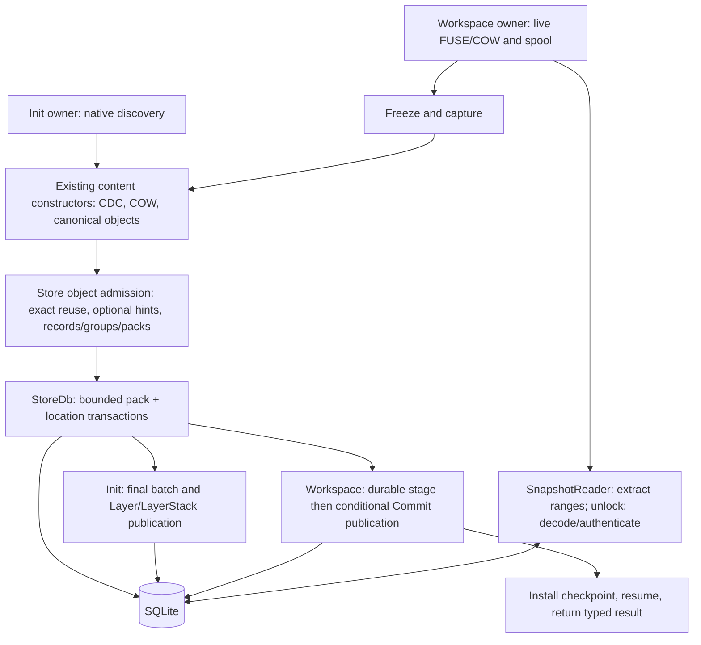

# v0.1.4 proposed storage architecture

Status: **proposed architecture v3**, 2026-09-08. Revises the independent review
of PR #77 against product revision `28177560c8f049c02192e18c263cdc5543c1ab52`.
This is a concrete design recommendation, not shipped behavior or implementation
approval. Proposed bounds below are engineering choices, not measured optima.
The schema-6/wire-1 new-Store-only compatibility scope is approved for development;
no migration or final release qualification is implied. The full benchmark
family and numerical qualification gates remain open. The newer development-smoke
scope/topology is recorded separately in [PR #80's pinned plan](https://github.com/Ephemeral-AI-Lab/layerfs/blob/d9ec9c6714ca31adb7a337d2ac0f40976513908c/docs/roadmap/0.1/0.1.4/storage-smoke-test-plan.md).
This revision implements/runs neither product code nor smokes. It supersedes the
quadratic admission protocol at reviewed head `628fc7191`: a finite batch cap is
not an acceptable substitute for linear candidate processing.

Authority: [research boundary](storage-efficiency-boundary.md).
The [physical format](sqlite-storage-format.md) owns exact wire fields and limits;
this document owns construction, selection, admission and lifecycle policy.
[Evidence](evidence.md) owns historical attribution. [Review disposition](review-disposition.md)
tracks finding closure, the later linearity/batching audit and design versus
empirical confidence.

## 1. Objective and boundaries

Reduce retained allocation through one synchronous object path shared by namespace
Init and Workspace capture/Commit. Preserve CAS, current CDC, extent/namespace COW,
FUSE, canonical identities, ordinary correctness and historical reads. All
selected representations, packs, locations and published history remain in SQLite.
Existing temporary spools remain separately accounted. Full/delta records and
raw/compressed groups are independent choices in one format.

A Workspace per tool call is an expected application flow, not a second storage
engine or mandatory cadence. About 1 call/s typical and up to about 10 call/s is
an individual/workload expectation; its per-agent/per-project scope must be stated
in any calculation. It is never an aggregate Store or machine ceiling.

Required encoding finishes before public success; later compaction does not
rescue the reported footprint. Multiple bounded admission transactions are allowed.
Synchronous does not mean one transaction, holding a writer during compression,
or a new durability guarantee. New fsync policy, crash recovery, failover and
power-loss work remain excluded. No background packer, external durable packs,
cloud service or second authoritative backend is added.

## Compatibility transition

Packed storage is an incompatible, explicitly versioned physical Store format.
The approved development schema is **6**, paired with pack wire version **1**.
M2/M3 implement this new-Store-only format; M4 retains these identities.
Retain the application ID, canonical encodings, ObjectIds, current CDC profile,
public operation outcomes and acknowledgement behavior. A schema version is not
part of a logical ObjectId. The existing exact-schema check must dispatch only to
explicitly supported schemas, never accept arbitrary tables or reinterpret bytes.

**Approved development transition:** explicit new packed-Store creation only. Opening an existing Store
never converts or rewrites it. The packed implementation rejects legacy formats
explicitly; existing compatible tools remain usable for those Stores. This is
source preservation, not a claim of legacy support in the new implementation.
Do not retain parallel writable object encoders just to minimize the patch.

If the owner requires existing Stores to move to the packed implementation, the
recommended route is an explicit separate-destination conversion using the legacy
reader as an import adapter. The source remains unchanged, and no automatic
replacement, deletion or conversion-on-open occurs. That subsequently authorized
contract must preserve supported IDs, canonical bytes, history and staging state,
or reject unsupported source state before making a destination usable. This
revision specifies no converter, migration procedure or conversion deliverable.

**Owner disposition:** the narrow v0.1.4 exception to the
[0.1 schema rule](../README.md#compatibility-boundary) and new-Store-only scope
were approved for M2/M3 development. M4 needs no repeated approval for that scope.
Legacy rejection and use of older compatible tools remain explicit. No converter,
new legacy writer, silent rollback of DELTA readability, or release qualification
is authorized. All non-format compatibility obligations remain.

## 2. Shared owners and operation boundaries

| Owner | Input and required output | Mutable state / memory | Lock and failure boundary |
| --- | --- | --- | --- |
| Init discovery | Native source -> bounded file/namespace tasks | Existing discovery and producer state | No Store permit/connection while discovering or waiting; failure publishes no root |
| Workspace capture | Frozen generation and COW/spool facts -> changed-state input | Existing live owner, host backing and spool | Preserve freeze, writer-quiescence and capture outcomes; these are not physical deltas |
| Content constructors | Input + retained roots -> authenticated canonical objects and complete candidate root | Existing builders, bounded output, root/child facts, optional hints | Source and canonical work outside Store serialization; fresh untrusted/spooled reads authenticate |
| Shared object admission | Owned canonical output -> committed or validated object/dependency facts | One bounded operation-owned accumulator and physical scratch | Protocol below; never return provisional inserts as admitted |
| Init publisher | Complete root/final prepared batch -> Layer and LayerStack | Existing Init result/receipt | Short permit and final transaction; name conflict leaves earlier admitted objects |
| Workspace publisher | Complete candidate -> retained stage -> conditional Commit/head | Existing expected head/base, stage and pending-publication state | Stage and publication stay distinct; head movement cannot roll back the retained stage |
| Workspace finalizer | Published outcome + prepared checkpoint -> installed active state | Existing checkpoint and spool lifecycle | Preserve installation/resume and published-but-finalization-failed distinction |
| Object reader | ObjectId -> authenticated canonical bytes -> role interpretation | Owned encoded buffers, decoder/output and existing bounded cache | Extract under connection; decode/hash outside it; malformed or unequal bytes fail before use |

The existing `objects.rs` admission/access owner gains a private physical codec;
no public codec API, backend trait, service, scheduler or plugin registry is needed.
Source discovery and capture stay distinct. Physical batch construction does not
make Init and Commit identical state machines.

## 3. Identity, reuse and small files

CAS supplies exact identity and sharing within a Store; CDC discovers reusable
content regions; COW retains unchanged extents and namespace structure. Keep the
current 8/16/32-KiB CDC profile and logical file graph. The 8-KiB minimum is not
padding: short final chunks are valid, and crossing it relocates no old object.
An accurate range edit can retain old slices directly; whole-file replacement
requires content discovery and does not inherit an accurate diff from writes.

Small and large files use the same full/delta record and group/pack path. Full
records may be group-compressed; raw groups are the same backend. Metadata and
content have separate group accumulators within the same pack accumulator.
Tiny-file inlining or removal of extent nodes is deferred until residual logical
metadata/index cost justifies a separately compatible canonical change.

Exact duplicates are filtered before delta search or compression. Reused IDs keep
their selected representation and location. Canonical length lives in the selected
object index, so membership and canonical-byte receipts never use compressed size
or decode groups merely to obtain a length. Required equality/integrity checks
still read and authenticate stored bytes; membership alone does not authorize use.

The source distribution (64.51% of unique regular contents below 8 KiB, only
15.88% of bytes) is historical Git-blob evidence, not SQLite allocation or read
frequency. No file-size population or different CDC profile is adopted here.

## 4. Delta hints and bounded selection

The record wire format supports FULL and depth-one DELTA. A base must already be
admitted, authenticated and selected as FULL, including when its group is compressed.
A speculative FULL in the same unadmitted batch is never a base: it might lose an
admission race to an existing delta representation. No forward references, base
copies for locality, global similarity index or scan of retained history is used.

### Hint provenance and producer handoff

Physical hints never change canonical bytes, logical inode identity or COW
provenance. The constructor must establish a predecessor once per changed regular-
file task when the following rule applies; it cannot silently omit the handoff
on the complete-build or captured-output route and call that a FULL fallback.

| Source-backed route at product 28177560 | Current fact / missing handoff | Required shared-path correction |
| --- | --- | --- |
| Same-inode truncate/rewrite | `FileData::Edited.base` survives truncate-to-zero and writes (`workspace-core/file_edit.rs:73-82,132-172`); `produce_file` also resolves `node.canonical` in frozen `base_inodes` (`changes.rs:1088-1117`) | Carry that retained FileState as physical predecessor through all same-file construction paths, including complete-build fallback |
| Complete-file builder | `FrozenFile::build` has `before`, but fallback drops it before `build_complete_file_partition` (`changes.rs:1330-1344`, `objects.rs:2879-2888`) | Extend the existing file-construction context, not the public API; preserve `before` for semantics and carry a separate optional physical predecessor |
| Tempfile renamed over a retained file | New node has `canonical=None`, `Edited.base=None`; live rename changes bindings and paths without transferring the destination inode (`workspace-core/namespace.rs:442-458,767-797`) | Resolve one final path against the pinned previous namespace as described below; never put that destination record in logical `before` |
| Payload emission | Full/replacement CDC callbacks pass bytes without file positions (`content/file/rope/build.rs:114-125,147-154`) | Carry new ObjectId, file-logical start and payload length beside authenticated output; replacement scans add the destination range origin |
| Early captured output | `capture_write`/`take_capture` require `base=None`; `CapturedFile` owns already-built output but no spans (`capture.rs:21-27,52-57,144-151,195-202`) | Record bounded span facts at original emission and carry them in that existing private output so later rename association works without re-CDC/rebuilding |

**Predecessor selection:** same retained canonical inode takes precedence. If none
exists for a changed regular-file task, select `node.paths.first()` from the frozen
node's already-owned ordered path set and resolve that one path in the Workspace's
pinned `base_root`. Carry `base_root` from `CandidateInputs` to `StableFileInputs`;
it is already owned, not a new snapshot or mutable Branch-head query. A regular file
there supplies a physical predecessor FileState. This is required for the ordinary
single-path tempfile/rename-over case, not a search over every alias. There is one
file task per dirty NodeId (`changes.rs:1036-1053`), not one per hardlink name.

An authenticated absent directory entry, non-regular predecessor, genuinely new
file, unlinked node without a final path, or Init without a pinned Workspace base
legitimately yields no predecessor. Do not catch every `MissingObject` as absence:
current `filesystem::resolve` uses that error for both absent bindings and missing
required inode data. Use existing directory/inode primitives to distinguish an
absent entry from damaged referenced data, which remains an integrity failure.
A rename chain/directory move or first hardlink alias with no old counterpart can
miss similarity; do not scan other aliases/old names or add a rename log/index.

The path-derived predecessor supplies **only** physical hints: never logical
`before`, metadata, canonical inode, hardlink relationships or retained Base pieces.
Replacing one hardlink alias must leave other aliases on their old inode. Bind the
hint context to the frozen generation and pinned root. Current live rename itself
can scan materialized nodes/paths; this storage revision adds no such scan and does
not claim the entire pre-existing filesystem lifecycle is globally linear.

**Chunk correspondence:** during whole-file construction, align increasing new
chunk intervals with the same numeric file intervals in the predecessor. A private
forward-only cursor retains only the old extent traversal stack/current leaf and
current descriptor. Advance each old descriptor once; select the first four distinct
overlapping prior payload IDs in extent order for each new interval. A long old
extent reused across intervals is one cursor position, not a restart. Load/advance each
old descriptor once, reusing the current descriptor for successive intervals, and
associate at most four hints per new interval; after four,
advance past further overlapping descriptors without repeated candidate searches.
Equal offsets are a similarity heuristic, not proof of matching bytes or CDC
alignment. Byte comparison and canonical authentication establish actual validity.

The current `rope::visit_extents` is a whole-tree visitor, not an existing resumable
cursor. Refactor its traversal into one private cursor/stream owned by the file
constructor; never call it from the root separately for every new chunk. Full
replacement hint work is O(new emitted intervals + old descriptors/nodes inspected),
plus indexed lookups, not O(new intervals times all old extents). It reads old
extent metadata, not the complete old payload stream. Actual candidate bases are
fetched only through the bounded physical selection policy.

**Localized edits:** retain existing COW and replacement-only CDC. Use already
visited old descriptors or one bounded tree seek per coalesced changed range;
carry the cursor forward within that range. Unchanged ranges trigger no discovery
pass, and a tiny range edit must not start a whole-old-file traversal. Metadata
builders may provide the single corresponding prior page they already replace.
A path lookup costs its components and indexed directory/inode traversal; it is
not a constant-time operation merely because it is performed once per task.

**Captured-output handoff:** extend each private selected payload-output entry
with its first emitted `(file-logical start, payload length)` for that file. Compute
it at original CDC emission before incrementing the existing payload counter.
Keep per-file entries in first-emission order through the existing bounded/spillable
output owner, before shared cross-file CAS deduplication. Repeated occurrences of the same ObjectId retain the first span, rather than
building a per-occurrence reverse index or rescanning aliases; this can miss a better
later base, an explicit selection approximation. Bind facts to NodeId, generation,
captured length/root and output identity; prune transient output using the existing
selection path, not an additional final graph walk. There is no global span index,
durable field, new RPC or second encoder.

After choosing the final path predecessor, consume these entries and the old cursor
once while consuming captured canonical output. Complete-build, range construction
and captured-output consumption hand the same internal `(owned canonical object,
bounded prior IDs)` to shared admission; the private span is then disposable. No
second source read, re-CDC or freshly built whole-graph walk is permitted merely
to recover lost context. Existing invalidated captures still use their normal
rebuild lifecycle. Missing span facts on a valid eligible captured route are a
handoff defect, not an optimization fallback.

Per file, optional correspondence inspects at most **4,096 old extent descriptors**,
**1 MiB of fetched/decoded predecessor metadata each**, and the existing bounded
path length/components. Across one candidate-construction operation, cap that
optional extent-correspondence work at **16 MiB fetched and 16 MiB decoded**;
the counters survive admission flushes. These caps do not silently suppress required
predecessor resolution. Once-per-task pinned path/inode resolution is separately
charged under normal construction resource limits and returns the existing resource
failure if those are exhausted. Resolve known task pages in bounded directory/inode
lookup waves using the existing batched reader; one logical path per file does not
require a separate scalar SQL/decode pipeline per file or hardlink alias. These are separate named correspondence budgets, not hidden in four emitted
hints. Charge skipped/repeated IDs and each actual fetched node. On exhaustion stop
additional optional discovery and report that reason; preserve hints already obtained
and ordinary canonical construction. One-time path lookup and available predecessor
handoff remain mandatory for eligible routes. No old payload graph scan, alias-times-
chunk lookup or retry is allowed. Init has no Workspace predecessor and continues
through this shared encoder with no hints. The #72 replay remains ordinary whole-
file replacement through Exec/FUSE, not forced SDK range edits.

### Preparation and selection policy

These deterministic caps are proposed engineering limits, not performance gates:

| Scope | Proposed limit / rule |
| --- | --- |
| Delta target/base eligibility | Same known canonical role; each canonical object <=64 KiB; other roles/sizes use FULL |
| Prior IDs per target | At most four; deduplicate before lookup |
| Full anchors | Prior FULL itself, or one decoded prior DELTA's declared FULL base; deduplicate anchors before fetching/trial |
| Per-target preparation | At most eight distinct record/group fetch paths, 512 KiB encoded bytes including framing, and 512 KiB decoded group bytes |
| Per-target trials | At most four, one per eligible full anchor; one base/index and one best delta retained at a time |
| Per-admission-batch preparation | At most 8 MiB fetched encoded bytes and 8 MiB decoded group bytes for hint/base preparation |
| Per-admission-batch delta work | At most 512 base trials and 16 MiB of candidate match-byte comparisons |
| Exhausted optional budget | Keep best complete eligible delta so far or FULL; never skip required integrity validation to fit a budget |

A hint exceeding a declared size/budget is skipped before its optional fetch. A
missing optional hint is ignored. Prior-record inspection validates framing and
codec output, but does not claim authentication of an unused prior DELTA target:
its extracted base ID remains an untrusted hint. The selected FULL base must be
fully authenticated and role-validated before a trial. Detected framing/integrity
errors or an invalid selected base fail the operation rather than being hidden.
If a prior target's canonical bytes are actually consumed, reconstruct/authenticate
it through the normal reader, charging that work. Account for prior-record inspection
separately from applying a delta; no unnecessary reconstruction is required merely
to discover an untrusted anchor hint. Sharing groups or
anchors can reduce actual work; cache hits cannot enlarge these policy budgets.
Required duplicate validation and public object reads are not optional hint work.

Use one bounded greedy COPY/INSERT matcher inside the physical encoder. Hash each
non-overlapping 16-byte base seed with the existing fixed hash primitive into a
fixed 4,096-bucket operation-local table. Each bucket retains at most four increasing
base offsets; discard overflow, do not grow a collision chain or search discarded
positions. At each increasing target offset hash its next 16 bytes, check only those
four positions byte-for-byte, extend matching positions within the comparison budget,
and choose longest match (lowest base offset breaks ties). Hash collisions can lose
compression opportunities but cannot increase probes beyond four. COPY requires at
least 16 bytes and advances by the chosen match; otherwise accumulate INSERT bytes
and advance one byte. Handle a shorter final suffix as INSERT.

At most four extensions accompany a target advancement by their longest match,
so match-byte visits are linear in target bytes, plus the linear base seed pass;
charge hashing, seed inspection and extension bytes to the work budget. Budget or
instruction-limit exhaustion discards the incomplete trial. Use one <=256-KiB table,
one base and one current/best delta owner; no global similarity index or per-append
reindex/sort is introduced. Canonical construction order is not changed by this
physical matcher. This algorithm is bounded approximation, not Git-equivalent search.

### M4 encoded-group selection (prospective revision)

Use the [finalized M4 plan](implementation-milestone-4-plan.md#encoded-alternative-policy).
Fix common group membership using FULL decoded sizes and existing role/pack caps.
For each target select the smallest complete admissible DELTA no larger than its
FULL record (tie: base ObjectId). This is only a bounded candidate heuristic;
it replaces the old per-record raw-size 12.5% acceptance gate.

Encode A (all FULL) and, only if eligible deltas exist, B (one selected mixed
FULL/DELTA assignment), each at most once with M3's level-1 codec. Independently
choose RAW if the complete compressed frame fails to save 16 bytes. Select B only
when `A_bytes - B_bytes >= max(64 bytes, ceil(A_bytes / 8))`, comparing complete
encoded groups; identical outer directory entries cancel. Otherwise select A.
This encoded-group threshold is a prospective engineering policy, not a measured
optimum or a whole-Store acceptance gate. No combinatorial search, growing-prefix
recompression or independently compressed per-record proxy is used.

Only the winner is stored. Compare one group at a time, retaining one A encoding
while building B, not two alternative packs. Charge all live capacities and trial
CPU inside existing reservations; release matcher/base scratch before codec work
where possible. Optional budget exhaustion stops further discovery/trials and is counted. Retain
completed eligible candidates for the group comparison if it still fits its bounds;
discard incomplete trials and use FULL where no complete alternative fits. Required
encoding and integrity failures propagate. Groups without useful deltas
and oversized RAW singletons use one route. See the plan's buffer-lifetime proof
obligation; no allocation limit or late-validation reservation is relaxed.

Only finally selected and admitted FULL representations become possible later
anchors. Rejection of a mixed group may select FULL even for a target with a useful
raw delta; a racing existing representation remains authoritative. Anchor renewal
is this local decision, not a timed rewrite or periodic maintenance pass. Exact A/B/A
recurrence still reuses the existing ID/representation. Depth one deliberately
trades potential compression for bounded dependency depth; Git parity is unknown.

## 5. Grouping, framing and memory

The [format](sqlite-storage-format.md) defines all wire sizes and rejection rules.
Normal metadata/content groups target 16/32 KiB decoded representation bytes;
normal packs cap decoded representation plus pack framing at 256 KiB. Oversized
records use the specified bounded singleton route. The current modern maximum
chunk is 32,789 **canonical** bytes including framing, not exactly 32 KiB.
The general canonical codec allows 16 MiB; ordinary new Store admission remains
at most 4 MiB minus one byte and 8,191 objects per transaction. Do not conflate
these limits or reject valid stored objects using the nominal group target.

No pack pads to capacity or waits for future calls. Each object has one selected
locator; unused records caused by an admission race are physical waste, not another
selected representation. Pack/group/record directories carry access/framing facts;
ObjectId and membership length belong in the selected index. Delta output length
is independently needed to bound reconstruction. No reverse index or duplicate
ObjectId in every header is added.

Reuse existing bounded queues, output owners and temporary spill mechanisms.
There is no current universal operation-memory pool: `objects.rs` separately
bounds candidate resident output (`CANDIDATE_MEMORY_BYTES`, 8 MiB), its index
(64 MiB), admission canonical payload (4 MiB minus one), and queued 256-KiB slabs;
Workspace mutation policy has its own `max_final_delta_memory_bytes` and partition
allowances. Do not borrow an index, live-mutation or queue budget for codec memory.

The proposed shared accumulator **replaces** the candidate/output ownership at
this boundary with one inclusive resident allowance no greater than that existing
8-MiB candidate limit (or a smaller caller-derived limit). Reserve up to **2 MiB**
of it for physical scratch, not 2 MiB in addition. Reduce resident canonical and
prepared-output capacity by that reservation and use the existing spill path for
the remainder. This is an explicit ownership refactor, not a claim that today's
CheckedOutputAdmission already shares this accounting. Upstream bounded input
slabs, private mutation state and the separate bounded identity index retain their
own charges; transfers move ownership rather than retaining two charged copies.

The scratch charge includes metadata/content group buffers, pack assembly buffers,
one base, one current trial and one best program, one retained encoded group
alternative during M4 comparison, the <=256-KiB match table, codec
context/window, and physical directories/locators. Canonical bytes and prepared
encoded bytes retained outside scratch use the remainder of the same allowance.
Cumulative 8-MiB hint-fetch/decode work limits are work counters, not resident
memory reservations. One active codec/base index per accumulator is permitted;
a codec adapter must bound actual allocation, not infer it from window size.

If a smaller allowance cannot fit optional delta scratch, skip that trial. Drain
or spill pending output and reduce grouping to fit required codec scratch; if the
minimum required codec plus current record cannot fit, report the ordinary resource
failure before admitting that batch. Do not silently store RAW because a required
compression attempt lacked memory. The explicit oversized RAW route is governed
by format size, not memory pressure. A valid large input may be streamed from its
existing spool while forming its RAW pack, avoiding two complete resident copies.
Codec-library/API selection must honor this reservation or require a prospective
spec change; no public resource bound is silently raised to fit an implementation.

No source read, producer wait, encoding or private-spool I/O retains a Store permit,
connection guard or transaction. Required reauthentication after spool reads remains
a trust boundary. Per-owner bounds and their simultaneous sums do not establish
a machine-wide bound when many operations/Stores are active.

## Admission protocol

### Three distinct synchronization boundaries

`StoreDb` has a FIFO operation permit and one connection mutex shared by readers
and writers. A SQLite transaction is a third, narrower scope. Reuse them; add no
per-Branch mutex map, reservation table, worker pool or scheduler. Only top-level
bounded admission and metadata-publication entrypoints acquire the permit; their
helpers accept existing context and never reacquire it.

Selected locators and admitted packs are immutable for this phase. No concurrent
reclamation, representation replacement or repacking is allowed. All object
writers, including direct candidate and reconciliation callers, route through this
same admission protocol. Current exclusive/single-owner Store access assumptions
remain; this permit is not a distributed lock.

### FIFO notification without broadcast fanout

The current `TicketGate` (`schema.rs:90-130`) uses one shared condition variable
and `notify_all` on every release. With W waiters that can cause O(W) wake/check
work per release. **Do not replace it with notify_one on that same condition
variable:** the wrong ticket could wake and leave the rightful successor asleep.

Replace only the existing gate's notification primitive with explicit FIFO handoff:
one gate mutex protects active/failed state and a VecDeque of one-shot senders.
Each waiting invocation owns the receiver of a standard-library capacity-one channel,
enqueues its sender once, and waits without the gate mutex or SQLite connection.
Release pops the oldest sender, retains active=true across transfer, and sends it
one grant; an empty queue clears active. Capacity one and one grant per node avoid
waiting for the recipient to be scheduled. A new entrant cannot bypass the selected
successor. Immediately wrap a received grant in the existing RAII permit.

A disconnected receiver is skipped once; each abandoned queue entry is removed at
most once. Cancellation remains cooperative at the existing blocking boundary;
a cancelled receiver that receives a grant releases it without DB work. Gate poison
or failure makes entry fail explicitly and drains/notifies pending callers once
with failure rather than stranding them. No public timed-cancellation API or queue
cap/Busy outcome is added. Failure cleanup may visit W waiters once; normal handoff
notifies one successor. Deque growth and abandonment cost are amortized linear
across enqueues/dequeues, not W work on every successful release.

This is an internal standard-library notification queue, not a work-execution queue,
worker pool or new scheduling service. It retains one small notification per blocked
invocation, no additional payload copies: O(W) aggregate waiter state. Existing
waiting operations still own their prepared buffers, so arbitrary concurrency does
not have a machine-wide memory guarantee. Uncontended entry and ordinary handoff
have constant/amortized bookkeeping; this is no measured scheduling-latency claim.

### One final recheck, with a batch-scoped admission permit

The previous shrinking-set retry is **removed**, not capped or hidden in a helper.
One admission episode owns a closed subset of whole prepared packs and takes the
permit once. All object writers use that permit. Selected locators stay immutable;
ordinary object reads acquire only the connection, never the admission permit.

1. Consume incoming authenticated canonical output in bounded pages, preserving
   equality checks and existing candidate/duplicate receipt semantics. Deduplicate
   within the page/batch using existing bounded identity tracking; process each
   supplied occurrence and its bytes once, rather than re-sorting accumulated output.
   Probe each distinct candidate's membership once in bounded SQL pages. Decode,
   authenticate and compare initial existing objects outside the permit and connection.
2. Prepare missing records/groups/packs outside both guards, using admitted FULL
   bases and the hint/work limits. Keep a direct candidate-to-pack/record association.
   Seal groups once; maintain pack size/count/offsets and projected validation reserve
   incrementally. Close a pack before the next record would prevent that pack alone
   from fitting admission memory. Select the next subset of whole packs in one forward
   pass, never by repeatedly rescanning/re-encoding a shrinking candidate batch.
3. Before taking the permit, make the subset's prepared pack bytes, **all** still-
   missing canonical comparison operands, and late-validation scratch available in
   the inclusive allowance. Borrow canonical slices from immutable prepared FULL/RAW
   records where possible and charge their backing allocation once; retain originals
   for compressed/DELTA records. Reread and authenticate sealed private spools now,
   using operation-held exact-byte digests for prepared pack bytes. No private-spool
   access or producer dependency may remain inside the episode.
4. Acquire the FIFO admission permit once. Under a short connection acquisition,
   perform **one** membership recheck for each initially missing ID in the subset;
   retain its locator/length or missing result. Close statements and release the
   connection. Retain the permit while validating newly existing objects through
   the batched validation below. There is no permit release/reacquire, membership
   retry, encoding, compression or source read. Other coordinated writers cannot
   change membership during this validation. Initial existing objects are not
   compared again; an unexpected changed locator is an integrity failure.
5. After all late duplicates authenticate and compare equal, use candidate-to-pack
   associations to mark winners in one pass. Acquire the connection, begin one
   bounded transaction, bulk-insert packs having winners and only winning locators.
   Existing locations are never UPSERTed. Skip zero-winner packs; retain/count unused
   records in mixed packs without recompression. An unexpected insert conflict is
   an integrity error, not a new retry. Commit, release both guards, then issue
   admitted/validated facts and receipts. Failed transactions issue no admission
   facts; earlier committed episodes remain and count if the operation later fails.

Late validation owns the permit but **not** a SQLite connection or transaction
while decoding/hashing/applying a delta. Helpers use connection-only extraction
and never reacquire the permit. This trades bounded writer queue time for removal
of quadratic repeated work: competing admissions and metadata publishers wait for
late validation; ordinary readers may interleave between connection acquisitions.
No promise of short elapsed time follows from the word bounded. Whole Init source
work, construction, correspondence discovery and new representation encoding remain
outside the permit. Queue wait under overload is distinct from processing complexity.

### Batched duplicate validation and memory reservation

For each initial-validation batch or late-validation episode, group known target
locators once. Extract/decode/parse each distinct target group once in the target
wave. Compare FULL targets immediately. Retain only selected DELTA programs and
base IDs in charged scratch; resolve distinct bases in bounded membership pages,
group their locators, then read each distinct base group once in the base wave.
Require FULL bases, authenticate each unique base once in that wave, and apply its
queued target programs without revisiting target groups. A group used in both waves
can be decoded twice, not once per requesting object. A bounded current-read cache
may remove that second read; no persistent cache hierarchy is required.

Size an episode **before** taking the permit for the worst selected late record,
not merely the candidate's chosen encoding. For target canonical length C<=64 KiB,
a stored DELTA program/record occupies at most `min(65,536, 41 + 9*C)` bytes: at
most C positive-output instructions, each at most nine framing bytes per output
byte, plus its header, and the hard group limit. Reserve the sum of these bounds
for potential retained programs, plus target/base locator associations, one encoded/
decoded group, one base/reconstruction buffer and the codec context. All fit the
existing <=2-MiB scratch reservation inside the <=8-MiB accumulator; close packs
and episodes earlier in a single pass when the next record cannot fit. This is a
memory-derived partition of an already linear protocol, not a smaller cap hiding
quadratic retries. No late discovery causes a new preparation/recheck loop.

For an oversized RAW singleton, compare/hash the existing RAW canonical range in
bounded pieces against the resident prepared RAW canonical slice, releasing the
connection before each compare/hash update. Prior equality to an already-validated
candidate plus identity hashing establishes its canonical validity without retaining
a second large object. Only canonical length above 65,536 excludes DELTA. For lengths 65,528-65,536,
inspect the **selected stored** representation and use the reserved two-wave route
if it is DELTA, streamed equality only after confirming RAW singleton framing.
The candidate's prepared FULL/RAW or DELTA choice does not determine the stored
kind; apply the same rule in either race direction. Count actual chunked BLOB reads. If required minimum
scratch cannot fit, use the specified resource failure before acquiring the permit,
not repeated splitting after a late conflict. Supplied duplicate occurrences still
pay equality work proportional to their actual bytes; deduplication cannot erase
that validation cost.

### Work bound

For N supplied object occurrences and U<=N distinct candidates in the batch, each
candidate has one initial membership visit and at most one final recheck: **<=2U
candidate-ID probes**. For one initial partition and one episode the page count
is `ceil(U/q)+ceil(U_missing/q)`. Across memory-derived episodes it is the actual
initial-probe page sum plus `sum_e ceil(U_missing,e/q)`; each episode has its own
tail. That affects SQL counts without adding candidate revisits. Each reused distinct candidate has one stored canonical comparison,
in either the initial or final phase, and each prepared pack/locator has one forward
winner/insertion pass. There is no loop whose successive iterations scan N,N-1,...
remaining candidates. Concurrent arrivals cannot increase these visit counts.

Validation is linear in requested canonical bytes, encoded/decoded group bytes,
record-directory entries and delta instructions actually needed by the two waves;
each unique group in a wave is parsed once. Group read amplification remains explicit,
not an object-API promise of payload-only I/O. SQLite index traversal is separately
O(log M) per key at retained index size M; batching reduces SQL/lock crossings, not
the unavoidable per-key index work. The broader contract below also accounts for
scratch indices, canonical ordering and file/tree traversal.

### Replacement of existing caller assumptions

Remove the operation-long permits from Init, `commit_candidate`, and
`commit_workspace_candidate` around construction/admission. Remove nested delivery
callback/final-flush permit acquisition from `construct_workspace_files`; the
shared admission entrypoint now owns it. `fork_branch`, `add_layer`, and stage
discard may keep their short metadata permits, with no nested acquisition.

Delete `clear_failed_direct_initialization` and **all four** callers, including
root-construction fallback/hard-link-overlap paths, when enabling interleaving.
Never run `DELETE FROM objects` after an interleaved Init. An empty observation
may skip an initial probe but never the serialized admission recheck. Construction
fallback reuses already admitted objects through the shared path. Private buffers
and temporary spools still release normally; committed unreachable packs/locations
remain and count. No operation ownership index or new reclamation pass is added.

The replacement covers raw checked/planned/direct insert and collision helpers,
not only the named fast path. Existing source discovery strategies may remain
where they serve real inputs, but they cannot select a different physical writer.

### All Init inputs share physical ownership

Remove Store occupancy as a physical pipeline selector. Current nonempty Init
(`layerstack.rs:61-105`) enters `directory_root` and `finish_parallel_candidate`
(`411-433`), then `merge_prevalidated` (`objects.rs:2962-2965`) clones producer
objects into a second parent ObjectBuffer before admission. Private serial collection
has the same ownership issue. This is inherited extra copying/spilling, not evidence
of a measured regression in the five-checkpoint smoke.

Every Init route--parallel native producers, serial import, source-topology fallback,
and empty-root construction--delivers owned authenticated finalized output through
the same bounded mechanism to the shared physical accumulator. Parent namespace
construction retains producer IDs, structural results, counters and dependency facts,
not a second copy of all payload segments. Replace the nonempty-Store parent merge/
replay/admission choreography; an initial empty observation changes no output owner
and never bypasses final duplicate validation. Keep private candidate collection
for actual preview/reconciliation callers that need unpublished data, not as a
second Init implementation.

Source topology still selects parallel or serial canonical construction. Preserve
seed/inode allocation, native metadata and cross-task hardlink checks, including
fallback triggers (`layerstack.rs:969-977,1250-1265,1725-1732`). Stop/drain the first
source strategy before at most one serial fallback through the same output sink;
no repeated fallback/re-import loop. This may make two linear source passes, whose
bytes/counts are reported. Already admitted speculative objects remain counted and
reusable; do not delete them. If parent construction needs child bytes, carry trusted
facts or use the existing bounded pending source/authenticated reader, flushing only
for a real dependency. Source correctness never justifies a parallel physical encoder
or whole-operation writer permit.

## 7. Flush, publication and finalization

An operation-owned accumulator spans file and metadata output. Producer-phase end
alone does not force a flush. A flush is required when count, canonical, physical
or simultaneous-memory bounds would be exceeded; when a constructor needs data
not available through carried trusted facts or the existing pending object source;
and before durable stage/publication needs those objects. Never add another
pending-object cache solely to save a transaction. Never wait for a future call.

After admission, the Workspace publisher takes one short metadata permit for its
existing committed stage followed by the distinct conditional-publication
transaction. Preserve expected Branch head/base checks, source ownership, no-change
behavior and stage deletion after successful publication. A `HeadMoved` result
can leave a complete retained stage; rolling that stage back with publication
would change the lifecycle. The direct candidate publisher preserves its own
current outcomes. Init's final batch executes preparation/reservation steps 1-3,
then the single final recheck and unlocked-connection late validation in step 4.
Retain the same permit and acquire the connection for winning pack/locator insertion
plus Layer/LayerStack publication in step 5's transaction. Neither recheck membership
again nor reacquire the permit. No encoding or dependency read occurs in that
transaction; failure preserves the existing publication/result distinction.

Publication uses carried authenticated graph and admitted-dependency facts plus
existing validation, not an exhaustive retained-history scan. An arbitrary
object's presence is not proof of complete logical or physical closure. Full bases
remain available even without a logical reference. Required physical work finishes
before publication, and required runtime finalization finishes before public success.

Carry the namespace root's already-authenticated inode-table-root field in the
existing prepared checkpoint, bound to the candidate root ID. If the published
outcome has that root, finalization may install this fact without rereading the
newly compressed namespace. If no matching trusted fact is available (including
an existing special lifecycle path), use the bounded authenticated read. Do not
retain a whole graph or create another cache to avoid one read. Preserve
INSTALL_BEGIN, paged INSTALL_NODE, INSTALL_END, pending-publication state, attribute
checks, spool retirement and resume. Report a published result followed by
finalization failure honestly; do not blindly republish.

## 8. Object reads and ownership

Use SQLite incremental BLOB reads on the rowid pack table. Query selected locations
in existing bounded batches, then read the fixed header, selected directory entry
and required encoded group ranges. Plan known requested slots/locators once and drain
forward through bounded **internal extraction batches**. Order selected locators
by `(pack_id, group_number, record_number)` before splitting those batches, preserving
public order/duplicates through existing slots. Within each batch/wave,
group by `(pack_id, group_number)` and parse/decode each distinct group once; a
second FULL-base wave may read a target group again. Later drains/dependent tree
waves can also repeat groups, and every such read/decode is counted. The [format](sqlite-storage-format.md) specifies framing validation.

Close all BLOB/statement handles and release the connection before decompression,
canonical hashing, role interpretation, delta application or a base request. A
base miss performs another bounded extraction and release; it must select FULL,
then authenticate before COPY/INSERT. Authenticate the reconstructed target and
check canonical length against its untrusted locator before returning it.

Reuse the current SnapshotReader's bounded cache. Do not add a persistent decoded-
group cache by default. Release request-local group buffers as soon as their last
requested record is consumed; dependent later tree lookups can therefore decode
a group again, an explicit cost rather than an assumed cache hit. Drain internal
read batches on memory limits; the public batch still preserves its existing
count/output contract. Large raw singletons are extracted/decoded one at a time within their canonical
bound, limiting scratch rather than total returned output. The current authenticated
batch API returns owned canonical objects; earlier results remain resident, and
its output charge is the sum of their canonical lengths. The codec-only ceiling
of 128 objects times 16 MiB is 2 GiB, not a small-memory guarantee. Ordinary filesystem
payload batches retain their existing tighter bounds. Do not silently narrow the
public batch contract to claim a lower output bound; caller/output memory remains
separate from bounded extraction scratch and persistent cache charges.

Remove the scalar temporary clone used only to construct a cache argument. Carry
identity authentication through the existing trusted internal read method so core
metadata does not hash the same immutable bytes again. Generic ObjectSource and
fresh persisted/spooled bytes still authenticate. Cache insertion may require one
owned copy; a shared backing slice is allowed only when it replaces actual copies
and charges the entire retained backing allocation. No zero-copy claim is made.

A cold object delta miss can require target and base directories/groups. Depth one
bounds physical dependency depth, not the number of metadata objects, extent
nodes, groups, copies or cache misses in a filesystem read. Warm CPU-bound reads
can regress while cold I/O improves. Small random reads, sequential reads,
namespace traversal and finalization reads remain distinct costs for later evidence.

## Reconciliation invalidation: shared view and indexed scopes

Current `ResolutionState::invalidate_if_mutated` (`reconcile.rs:149-187`) invokes
`resolution_fingerprint` per resolved conflict. That method (`changes.rs:400-449`)
builds full base/final manifests and scans the final map for every affected path.
C small conflicts over F manifest entries can therefore cause avoidable O(C*F)
manifest construction/selection, separate from object admission. `path_was_mutated`
(`reconcile.rs:198-206`) also scans the mutation map per conflict. These are existing
paths, not a measured new packed-format regression.

Build **one invocation-local invalidation view**, lazily only when a resolved
conflict actually requires a fingerprint check, after the existing capture and
quiescence boundary. Zero such conflicts create no manifests or new resource failure; reusing the charged base/final manifests and immutable final
BTreeMap for all conflicts in that invocation. Preserve materialization, current
attributes, alias sets, actual file-content/symlink reads and resource/error outcomes.
Do not substitute mutation generations for byte fingerprints: untracked/materialized
backing changes must still invalidate a saved choice. The view is not a persistent
cache and is rebuilt for a later invocation.

Select entries by exact key lookup, slash-component ancestor lookups, and a descendant
prefix range; root selects the view. Preserve existing lexicographic order, v2
fingerprint framing and repeated affected-path sections. Prefix selection must not
confuse `a/b` with `a/beta`, and must include ancestor metadata, not only descendants.
Use the same indexed selection on the existing ordered mutation map, comparing each
selected mutation generation to the conflict's resolution generation. A changed
fingerprint or newer intersecting mutation clears choice/generation/fingerprint as
before. Initial `resolve_workspace_conflict` and invalidation use the same helper
and byte semantics; no new digest format or persistent subtree index is needed.

The correction eliminates per-conflict manifest rebuilds and scans of unrelated
entries: one manifest build plus indexed selections and actual fingerprinted entries/
bytes. **Remaining scope:** overlapping directory/root conflict scopes still repeat
fingerprinting under the existing exact stream semantics. This can exceed linear
work in distinct file bytes across all conflicts. It is not solved by the admission
protocol and is not labeled an all-Commit linearity guarantee. Removing that repeated
hashing would require a separately justified fingerprint representation change; this
revision does not silently change resolution validity or add a digest cache. The
strict <=2U recheck claim belongs to shared object admission, including objects
produced by reconciliation, not every preceding reconciliation operation.

## Complexity and batching contract

This contract separates removal of the **quadratic recheck** from repair of
**scalar-but-linear crossings**. A batch name or one encompassing transaction
does not make per-object SQL or per-ID I/O batched. No finite constant cap or
individual-agent QPS makes an O(N^2) admission algorithm acceptable.

| Variable | Meaning |
| --- | --- |
| N / U | Supplied current-operation object/record occurrences / distinct candidates in the current batch |
| B | Bytes processed, with supplied canonical, encoded extraction, decoded groups, instructions and emitted output reported separately; repeated I/O is included explicitly |
| G_b / G | Distinct groups in internal batch/wave b / total sum_b G_b, including repeats across drains and target/base waves; not globally distinct groups in a public request |
| M / M_p / Q | Existing Store object-index size / pack-index size / existing operation scratch-index size |
| T | Touched namespace/extent metadata nodes, including one-pass predecessor correspondence nodes |
| H / F_ns / C_conf | Retained historical states / current invalidation-view entries / resolved conflicts; no history scan is introduced, and reconciliation costs are scoped separately |
| P / W | Winning prepared packs / winning object locators in an admission episode |
| V / q | Effective SQLite bound-parameter limit / membership page capacity min(128,V), further limited by statement bytes/memory |

Aim for O(N+B+T+G) orchestration excluding explicitly identified index and canonical
ordering costs. Array slot access and incremental byte/count/offset totals are
constant-time; append/growth is amortized linear in unique appended bytes. Existing
BTreeMap/BTreeSet access is O(log Q) or O(log G), not O(1); ordinary SQLite lookup
and index update are O(log M) per key. Group maps/identity tracking get a bounded
number of such accesses per record, not repeated full scans. Existing O(N log N)
canonical sorting remains where required, once in its owning construction stage.
Do not sort accumulated candidates after every append or replace every B-tree with
a hash map merely to change a notation. The new fixed-bucket physical matcher
bounds hash collisions independently of input and does not require a global index.

### Authoritative bulk SQL

Replace `insert_checked_object_batch`'s scalar `statement.execute` loop
(`objects.rs:3928-3962`), not just its outer transaction. The existing
`insert_initialization_object_batch` (`objects.rs:3878-3916`) demonstrates bounded
multirow insertion. The shared packed owner applies that pattern to all callers.

After the final membership/equality phase, retain the permit. For P>0, obtain
`coalesce(max(pack_id),0)` once using the indexed integer key, assign the next P
positive i64 pack IDs, and check the whole range for overflow before insertion.
Use bounded multirow `object_packs(pack_id,data)` INSERTs (two bound values per row)
and `objects(object_id,canonical_length,pack_id,group_number,record_number)` INSERTs
(five per row). Explicit IDs preserve associations without relying on RETURNING
row order. They remain local locators, not portable identities. No persistent
allocator/reservation table is needed; rolled-back unselected IDs may be reused.

For row caps k_p<=floor(V/2), k_o<=floor(V/5), SQL executions are one MAX query plus
`ceil(P/k_p)+ceil(W/k_o)` INSERT statements, rather than P+W scalar executions.
Also respect effective SQL-length, BLOB/byte, resident parameter and admission limits;
V alone does not authorize a large statement. A limit smaller than one required
row is an explicit error, not a zero-sized loop or scalar fallback. Do not query
membership again between these INSERTs or ignore authoritative uniqueness failures.
Transactions and connection acquisitions scale with bounded pages/episodes, not
individual objects. SQLite still updates an index for every inserted key, roughly
O(W log M + P log M_p); these local operations are not network round trips.

### Existing scratch indices and ID-order I/O

`SpillableObjectSet::insert_page` currently loops over scalar `insert` after spill;
`order_missing` uses scalar `contains` (`objects.rs:1946-2023,2091-2110`). Replace
the retained page paths with bounded multirow scratch insertion and membership.
In one scratch-page transaction use `INSERT OR IGNORE INTO seen(id) VALUES ...
RETURNING id`, split by V, statement/memory limits. Returned IDs form a set, not
input order: walk the original page once, emitting/removing a returned ID at its
first occurrence. Preserve newly-inserted flags, duplicate equality checks and
candidate accounting; increment count only after successful completion.

Page insertion must also reach streaming `admit_unique_page`'s direct `seen.insert`
caller (`objects.rs:3370`), not only the helper named insert_page. Preserve pending,
newly seen and already-flushed distinctions; a scratch membership flag is not an
authentication fact. Batch selected-order rebuilding (`objects.rs:2161`) and the
memory-to-scratch transfer too. Preserve genuine singleton/root calls and the
existing reachable-query interface; this is not a new query traversal engine.

For `order_missing`, read input ID pages, query scratch membership in at most q-ID
IN statements, then append selected IDs in original construction order. Keep the
final selected-cardinality check. Membership SQL scales as ceil(N/q), not N. Both
Store and scratch indices retain their documented per-key indexed cost; batching
reduces executions/locks. Scratch uses journal_mode=OFF: on a mutation failure,
abort/invalidate the owning operation rather than claiming rollback restores a
usable set/count. Publish a newly built spilled index only after successful creation.
No scratch recovery subsystem or durability change is introduced.

`SpillDiskIndex::insert/location` (`objects.rs:2718-2745`) is another scalar scratch
path and must be covered, not left behind the changed seen-set API. Preserve pending
read-after-put visibility: existing pending bytes/location facts answer reads before
a flush. At a bounded spool flush, write the pending canonical data, bulk-insert its
`(id,offset,length)` rows in a scratch-page transaction (three parameters per row),
then clear pending metadata only after success. Batch requested locations with at
most q IDs and restore requested order/duplicates through direct slots. Do not turn
every put into its own implicit scratch transaction or every known page into scalar
location SELECTs. Scratch failures invalidate the owner; these current OFF-journal
transactions are not per-object fsyncs and no fsync saving is claimed.

For memory-to-disk location-index construction, **carry existing offset/length facts**
in pages from the **union by ObjectId** of the current absolute-location map and
its pending tail. Capture the pending buffer start (`end - pending.len()`) before
flushing/clearing it; convert its relative pending offsets to absolute file offsets.
Emit equal `(id,offset,length)` facts once and fail on unequal duplicates. Replace
`from_spill`'s tiny header reads and per-record seeks (`objects.rs:2670-2707`) in
that transition; the writer already knows the frame locations. Include the threshold-
triggering record even if it was not inserted into the old map. Publish the new disk
index only after the complete transferred union succeeds; transfer records
progressively within the existing allowance rather than clone the full index.
If progressive ownership transfer fails, abort the owning operation rather than
claiming its partly drained old index can continue unchanged.
If an existing necessary spool traversal remains, use bounded buffered/page framing,
checked offsets/end bounds and sequential read-ahead rather than unbuffered field
reads. Preserve genuine random lookup support and count unavoidable seeks.

Carry locations when already available to selected-order consumption; otherwise
page-resolve ordered IDs and reuse bounded buffered spool reads. No new persistent
location/order index or whole-payload rewrite is required. The existing parent/private
spool responsibilities remain, with fewer scalar crossings.

`IdOrder` currently writes/reads each 32-byte ID through an unbuffered File
(`objects.rs:1638-1683`). Use bounded page I/O / stdlib buffered readers and writers,
with 64-KiB buffers charged to the existing 1-MiB spill-I/O allowance (sum simultaneous
buffers). Explicitly flush/seal and propagate errors before opening the existing
read-by-path visitor; do not rely on Drop or add a mutex solely to hide an unflushed
writer. Keep exact ID order and distinguish clean EOF from a truncated 1-31-byte
last record. Sequential data transfers then scale with ceil(32N/buffer_bytes),
subject to short reads/writes; this is a buffering contract, not a syscall benchmark.

### Group/read batching and single-pass byte work

For known requested IDs, perform bounded locator pages and build the requested-slot
plan once, order selected locators by physical pack/group/record before splitting,
then consume it forward through bounded internal extraction batches.
Within each internal batch, group known target locators once and fetch/decode/parse
each distinct target group once, followed by one grouped FULL-base wave with distinct
base IDs. A group may be decoded again in the base wave, a later internal drain or
a dependent tree level; total group cost uses sum_b G_b and actual encoded/decoded
bytes, not the number of globally distinct groups in the public request. Do not
repeatedly scan unresolved requests or operate independently on every object when
its group is already in the current batch. Preserve result order/duplicates using
slots rather than SQL row order. Unknown tree levels necessarily form later waves.

Admission reserves its closed episode's complete program/association scratch before
taking the permit, so late validation does not split or recheck after acquiring it.
Ordinary public reads may drain internally while preserving count/order/duplicates
and output-memory semantics; they need not fail merely because the whole request's
new-format scratch cannot fit at once. Retained canonical results remain charged
separately. Group repeats across drains are explicit amplification, not hidden cache
hits; no extra persistent cache or history-wide prefetch is introduced. Oversized
RAW singletons may use chunked range extraction/incremental validation, counting the
additional BLOB calls and bytes. Codec, framing and instruction work is linear in
the bytes/records actually processed by those forward batches, with per-group format
bounds; no growing-prefix or repeated shrinking-request scan occurs.

Maintain record counts, byte totals, directory offsets and winner counts as records
arrive. Encode each closed-group alternative at most once (one ordinarily, at
most two for M4 selection) and assemble only winners with one final framing pass; no recompression/copy of the entire accumulated pack per appended record.
Framing validation walks each decoded directory and selected instruction stream
once per wave; duplicate records share that parse. Equality/hash work processes
actual supplied/reconstructed bytes once per required trust-boundary pass. Several
constant passes are linear and must be counted; N growing-prefix passes are not.

Init necessarily reads source entries/bytes and constructs their namespace. A
localized edit touches changed bytes and T affected tree nodes, with indexed point
seeks and bounded hints; it does not traverse H retained states or every file.
Whole-file correspondence is one forward metadata cursor, not one full old-tree
walk per chunk. Existing canonical sorting and existing rename implementation costs
are disclosed separately; this contract does not claim all filesystem operations
are O(1) or linear wall time. Queue delay, cache misses and aggregate CPU/disk pressure
remain separate from these algorithmic and call-count bounds.

## 9. Operation crossings and minimal replacement

These are source-derived or design counts, not measured samples. N is attempted
objects, A early admission batches, R other construction/finalization queries,
F changed-fact pages and J checkpoint-install pages. SQL counts exclude transaction
control unless stated; local SQL is not a network round trip.

| Operation | Current source at 28177560 | Proposed required work |
| --- | --- | --- |
| Small changed Commit with content/metadata each fitting one batch | Typically four commits: two admissions, stage, publication; >=4 writer acquisitions plus reads | Three commits if dependency/memory-safe phase accumulation combines admissions; otherwise four or more. No guaranteed reduction |
| Its SQL | N+9+R plus conflict queries; four transactions add eight BEGIN/COMMIT statements | At most two membership visits per unique candidate, one pack-ID MAX lookup and parameter/byte-bounded multirow pack/location inserts; stage/publication preserved |
| Its process/transport calls | One public Commit, no intrinsic Exec; remote live capture F+2 backing calls, installation J+2 requests, plus pause/metrics/resume and conditional spool work | Zero additional public methods, Exec or RPC requirements from physical encoding; local versus transport placement remains explicit |
| Bulk Init | One Init, no intrinsic Exec/RPC; A+1 commits; whole-operation permit | A'+1 bounded admission/publication commits, permit released between batches and during construction; initial/final membership pages are bounded independently of racing arrivals |
| Object miss | One SELECT/connection acquisition, no explicit commit, one Store hash, no codec | One locator query and three ordinary cold range calls for header/entry/group, or counted chunked RAW-singleton calls; second path for a cold separate-group full base; RAW has no decompression |
| Copies | SQLite-to-Vec, scalar temporary clone, possible cache clone, file-output copy; core metadata may rehash | Encoded extraction, decode output, optional record/output copies, delta output and necessary cache copy; remove redundant scalar copy/rehash, charge actual owners |

An already-open cold small-file read with a leaf extent root needs FileState,
extent root and payload: three current object lookups, plus namespace lookup if
needed. The scalar wrappers can cause five hashes in that example. The same
logical graph remains in the proposed format; deltas can add up to three distinct
full-base paths. Coalescing does not eliminate dependent traversal.

| Action | Final component or removed work |
| --- | --- |
| KEEP | Canonical codecs, CAS/CDC/COW, source/capture owners, existing bounded producers/spools and lifecycle results |
| MERGE | Physical checked/planned/direct placement into existing object admission; one accumulator with existing pending source/facts |
| REPLACE | Raw objects.bytes SQL/access/collision helpers with selected-object index and packed reader/writer; compatibility transition remains explicit |
| DELETE | Shrinking-set admission retries; whole-Store Init cleanup; repeated whole-file hint scans; phase-only flushes without dependency reason; redundant scalar clone and trusted rehash |
| REPLACE | Scalar checked-object INSERTs with bulk pack/locator SQL; seen/location scratch loops with page operations; IdOrder field I/O with sealed buffering; disk-index replay with carried location facts |
| REPLACE | Store broadcast TicketGate notification with explicit FIFO successor handoff; no shared-condvar notify_one shortcut |
| MERGE / DELETE | Occupancy-split Init ownership and parent payload cloning into one finalized-output sink; retain real source/hardlink strategies |
| REPLACE / REMAINING SCOPE | Reconciliation per-conflict manifests/full-map scans with one invalidation view and indexed scopes; overlapping exact fingerprint work remains explicitly outside the admission linearity claim |
| EXTEND EXISTING OWNER | File producer/captured-output context gains first-span/prior-file hints and one private extent cursor; no new global index or RPC |
| DEFER | Global similarity index, deep chains, separate tiny-file backend, new cache hierarchy, plugin interface, worker pool, repacker and cloud services |

The indispensable addition is physical record/group/pack encoding and decoding.
The existing Store object owner can own it; it replaces raw placement rather than
adding another public API or retained data backend.

## 10. Benefit and evidence limits

Exact CAS/COW already contributes to the baseline; count only incremental effects.
Compression of FULL records, DELTA programs and metadata affects overlapping
bytes. Add no independent percentage savings for the same bytes. Packed placement
still pays per-object index entries, logical metadata, group/record framing,
full-anchor retention, SQLite allocation and partial/unreferenced packs.

The matched historical control reports 940,310,528 allocated LayerFS bytes,
289,480,704 allocated Git bytes without deltas and 56,373,248 with deltas. Its
799,638,421 canonical LayerFS bytes alone are about 14.19 times delta-packed Git;
even eliminating all noncanonical allocation cannot achieve that objective.
Compression/delta opportunity is material, but online shallow hints may miss Git's
bases/chains and force more anchors. The owner's objective is to get sufficiently
close to matched Git allocation with a worthwhile storage/latency tradeoff; exact
parity is not required, and its impossibility has not been established. No numerical
closeness tolerance is assigned here. See [evidence](evidence.md) for immutable
sources and candidate-specific qualifications; no new ratios are predicted here.

Git retains selected contents, paths, executable bits and symlinks, not all LayerFS
filesystem metadata. Use matched selected roots, not the original clone history.
Git foreground construction and later packing are separate costs. LayerFS's claimed
footprint exists at synchronous acknowledgement; no later compact value replaces
it. Tiny operations flush partial groups and cannot wait for later compression
context. Required preparation, collision reads and finalization count wherever
they occur, even when the final SQL Commit timer is short.

## 11. Aggregate load and tradeoff

For a declared per-agent/per-project rate r_i, aggregate arrivals are
`lambda_store = sum(r_i)` and serialized utilization is approximately
`lambda_store * E(total serialized service per operation)`. Connection-held service
sums all lookups, admissions and publication; permit-held service is a separate
quantity. Tool-call rate is not SQL transaction rate. A formatter or Init can
produce much more work than a small edit at the same call rate.

Shared projects in one Store contend on its permit/connection and host resources.
Separate project Stores have separate DB locks but share CPU, disk, memory/cache
and scheduler capacity, with no assumed cross-Store deduplication. Bounded FIFO
admissions improve opportunities to interleave; they guarantee neither p99 latency
nor a global memory cap. No new concurrency service is selected. Account for
queue time, late-duplicate validation, compression CPU, reads and simultaneous active-operation
memory instead of inferring capacity from LLM delay.

The owner may accept about 50% more elapsed time for genuinely Git-comparable
allocation, but rejects that slowdown for only 10% less storage. This is no blanket
allowance for each operation, read latency, Init throughput or resource use. No
1.25x Git tolerance is adopted. Manageable read/write overhead is a moderately confident design expectation for
normal small-edit agent workloads: exact reuse avoids unchanged work, codecs run
outside Store serialization, and redundant copies/hashes are removed. Late-duplicate
validation now intentionally retains the admission permit with the connection
released; its read/decode/hash cost contributes to competing writers' queue time. Group/base
reads and new-content encoding still add costs that may or may not be offset by
less I/O or fewer admission phases. Actual allocation, foreground latency, queue
time, read behavior and CPU/memory/I/O qualification remain **not yet measured**
until separately authorized evidence. This is not a prediction of unacceptable
overhead. Aggregate capacity remains uncertain until workload and summed service
demand are known; no single-agent rate establishes machine capacity. The existing
boundary/correctness checklist follows unchanged
in scope; this revision does not design or run its verification.

## 12. Boundary and correctness checklists

These are obligations for the future implementation, not claims of passing tests.
The checklist scope is preserved. [PR #80's development-smoke plan](storage-efficiency-boundary.md#development-smokes-and-qualification)
now owns the confirmed smoke direction/topology and remaining prerequisites;
full-family qualification remains open. This revision does not expand or execute
the checklist or the smoke plan.

### Shared architecture and storage

- [ ] Init and Workspace Commit use the same canonical/physical admission path.
- [ ] All authoritative packs, object locations and history records are in SQLite.
- [ ] Public filesystem semantics, COW isolation and canonical IDs are preserved.
- [ ] Existing objects are reused without unnecessary recompression or copying.
- [ ] Small and large files use one pipeline; no backend migration at 8 KiB.
- [ ] Successful operations finish required encoding before acknowledgement.
- [ ] No later compaction is needed to achieve the primary reported footprint.
- [ ] Multiple transactions retain complete-root publication and no-change behavior.

### Encoding, lookup, and retained-state correctness

- [ ] Full, raw, compressed and delta records reconstruct exact canonical bytes.
- [ ] Invalid lengths, offsets, codec framing, COPY ranges and output sizes fail.
- [ ] Depth one is enforced; delta-to-delta bases and cycles are rejected.
- [ ] Physical base dependencies remain readable even without direct logical refs.
- [ ] Duplicate admission and recurring A/B/A content preserve identity and accounting.
- [ ] Empty/tiny files, final partial groups, group boundaries and oversized valid
      object handling are correct; no capacity padding is misreported as payload.
- [ ] Growth/shrink across CDC thresholds preserves old states and current bytes.
- [ ] Metadata-only changes preserve content and supported filesystem metadata.
- [ ] Multi-Branch shared content and later divergent writes remain independent.
- [ ] Reads through the public Workspace/FUSE path and normal reopen are correct.
- [ ] Ordinary admission/publication/finalization failures retain honest status and
      allocated-byte accounting without duplicate publication.

### Performance, compatibility, and evidence

- [ ] Read/write amplification, queue time, memory and SQLite scopes are explicit.
- [ ] Compression-group reads do not silently retrieve/decode the whole pack.
- [ ] Canonical, encoded, record-count and queue bounds are independently enforced.
- [ ] Small Commit latency, larger Init throughput and read behavior are all evaluated.
- [ ] Numerical tradeoff gates are frozen before candidate qualification.
- [ ] Existing-Store reader/schema handling is explicitly agreed before format work.
- [ ] Historical reports and failed results retain their original identities.
- [ ] No durability, power-loss or crash-recovery work is added to this phase.
- [ ] Implementation uses existing shared modules and focused regressions rather
      than scenario-specific product paths or a new backend framework.

## 13. Cloud evolution seams

Canonical IDs and root semantics do not depend on paths, rowids or local pack IDs.
The pack format has explicit versioning, self-contained offset origins and codec
bounds; the selected index is a location hint, never an authentication authority.
Those are format requirements now. No cloud-facing trait or service is added.

A future exporter can preserve pack BLOB bytes and generate a portable locator
manifest mapping ObjectIds/canonical lengths to portable pack references and
record locations. Local numeric pack IDs are translated, not treated as global
identities. All authoritative **local** locators remain in SQLite; this future
manifest is transfer metadata, not a second local index. Whole selected packs need
no reframing/recompression; selective transfer may carry unrelated records or
require a separately scoped repack to avoid them. No universal zero-repack promise.

Physical closure is enumerable without a persistent dependency table: traverse
selected roots' logical object graph, inspect each selected record using bounded
group decoding, collect each DELTA's base ObjectId, resolve and authenticate its
selected FULL representation, and include its group/pack/locator. Bases contribute
physical decode bytes, not new logical filesystem roots; their own canonical graph
need not be traversed solely to apply COPY. FULL bases terminate physical recursion.
Retain all required selected bases for as long as dependent representations live.
Export/GC implementation is deferred; a future repacker must preserve this invariant.

Cold remote access may require locator, header/directory and group requests, then
the corresponding full-base path; logical metadata traversal adds dependencies.
Small decoded groups and depth one do not imply one request or low network latency.
Cache/coalescing benefits include memory and miss costs. Oversized raw singleton
objects retain their explicit larger transfer bound.

| Cloud concern | Disposition |
| --- | --- |
| Versioned framing, portable canonical/base identity, bounded decoding, dependency enumeration | Format obligations specified now |
| Translated locator manifest, selective-transfer overfetch/repack, cross-pack request fan-out | Documented migration costs |
| SQLite replication versus immutable objects plus authoritative metadata | Future topology choice; not both implementations |
| Metadata service and conditional publication | Existing publication seam is suitable; service implementation deferred |
| Tenant authorization and cross-project dedup permission | CAS equality is not access authorization; future service policy |
| Replication, failover, consensus, remote recovery/fsync, cloud benchmarks | Deferred cloud work, outside this phase |

[Issue #52](https://github.com/Ephemeral-AI-Lab/layerfs/issues/52) records cloud intent.
Its referenced `docs/roadmap/0.3/README.md` is absent from the inspected published
revision; do not invent it from a local draft. The older architecture roadmap puts
platform work at 0.3 and synchronization at 0.4; #52's newer sequencing is a planning
status gap, not a v0.1.4 implementation gate. SQLite cannot simply become a mutable
shared object-storage file; replication does not merge independently writable DBs.
Its current MEMORY/OFF/EXCLUSIVE/WAL-rejection policy needs a separate cloud contract.
Current Workspace leasing and HeadMoved behavior are not future automatic Branch
reconciliation, and physical packing changes neither.

## 14. Deferred discussion and remaining decision

**Owner policy decision:** the compatibility/release transition above. This is the
remaining policy blocker, not a request to approve an irreversible conversion.

**Documentation decisions now specified:** shared ownership, interleaved admission,
immutable race handling, canonical-length index/FKs, range extraction, codec/wire
bounds, hint provenance/work ceilings, approximate selection, accumulation and
physical dependency/export seams. Implementation must honor them or revise this
proposal explicitly; it may choose private function names and a pinned codec
library/API without introducing another architecture. The format defines the
codec capability contract; no dependency or executable implementation is added here.

**Development smokes:** the first five frozen #72 checkpoints, frequent edits,
and small-file Init/readback, using host SQLite/SDK plus managed Docker daemon and
real FUSE, are documented in [PR #80's plan](storage-efficiency-boundary.md#development-smokes-and-qualification).
The smoke topology and five-checkpoint prefix are no longer unspecified. That plan
owns its still-open synthetic fixtures, budgets, entrypoints and execution prerequisites.

**Full new benchmark family, remaining population/environment details and numerical
qualification gates: TBD.** Do not copy smoke observations into a universal claim or
silently change historical contracts. This specification revision implements/runs
no product code, smoke, verification or benchmark, and adds no campaign beyond the
separately documented plan.

The proposed design constants can be changed prospectively with rationale before
implementation selection; they are not measured conclusions. A later wire/schema
change needs an explicit version/compatibility disposition. Nothing in design
confidence establishes actual storage ratios, latency or empirical qualification.

## References

- [Current object owner](../../../../crates/layerfs-layerstack-store/src/objects.rs)
- [Init and its fallback callers](../../../../crates/layerfs-layerstack-store/src/layerstack.rs)
- [Direct and Workspace candidate publication](../../../../crates/layerfs-layerstack-store/src/workspace.rs)
- [Store mutex, FIFO permit and schema validation](../../../../crates/layerfs-layerstack-store/src/schema.rs)
- [Workspace construction context](../../../../crates/layerfs-workspace/src/changes.rs)
- [Live checkpoint installation](../../../../crates/layerfs-workspace/src/live_backing.rs)
- [Git pack format](https://git-scm.com/docs/gitformat-pack)
- [SQLite incremental BLOB access](https://sqlite.org/c3ref/blob_open.html)
