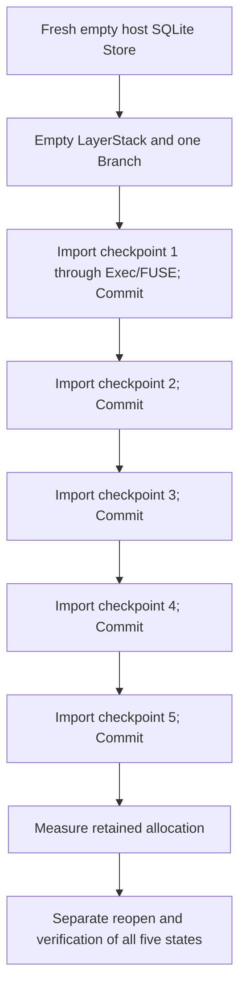

# v0.1.4 storage-efficiency smoke-test plan

Status: **development smoke plan**, 2026-09-08. Records the agreed three-test
direction and real product topology. This is not a full benchmark campaign,
release qualification, or evidence that the storage proposal is implemented.
Outstanding fixture choices and execution limits must be frozen before running
comparative candidate samples; this document invents no performance thresholds.

Related: [release scope](README.md), [storage boundary](storage-efficiency-boundary.md),
[architecture spec](storage-architecture-spec.md), [evidence](evidence.md),
[issue #18](https://github.com/Ephemeral-AI-Lab/layerfs/issues/18), and
[DeepSeek experiment #72](https://github.com/Ephemeral-AI-Lab/layerfs/issues/72).

## 1. Purpose and scope

Give the implementation agent a fast, repeatable way to detect incorrect storage
behavior and evaluate the direction of storage/time changes. The real DeepSeek
checkpoint replay is the primary storage control; localized edits and small-file
reads protect the rest of the filesystem workload.

| Smoke | Main question | Product path |
| --- | --- | --- |
| DeepSeek five-checkpoint replay | Does the actual retained-history storage trajectory improve? | Empty Store, ordinary import through Exec/FUSE, repeated Commit, historical reads |
| Frequent edits and Commit | Are localized updates and retained versions still economical? | SDK range edits and ordinary Exec/FUSE writes, separately reported |
| Small-file Init and readback | Do small-object overhead and read costs remain acceptable? | Namespace Init, mounted reads, a few changes and Commit |

These are three development tests, not three large benchmark matrices. Exact
family/scenario identifiers are not assigned here. The owner still prefers a
new storage-efficiency family rather than renaming or redefining old families.
Reuse existing infrastructure and helpers without importing an old acceptance
population. The full new-family benchmark discussion remains separate.

No product implementation, measurement, durability or crash-recovery campaign is
started by this plan. Ordinary correctness and existing public behavior remain
required. Do not add a storage-only shortcut that bypasses filesystem operations.

## 2. Required environment

Smoke reduces the workload, not the authenticity of the environment.

```text
macOS host
├── Public SDK / coordinator
├── SQLite Store
├── Canonical construction and Commit publication
├── Physical spool backing
└── Pinned source and prepared checkpoint inputs
          │
          │ existing authenticated host/container connection
          ▼
Managed Linux Docker container
├── LayerFS daemon
├── Real FUSE-mounted LayerFS Workspace
├── Ordinary input staging outside FUSE
└── Importer / filesystem workload helper
```

Follow [benchmark/AGENTS.md](../../../../benchmark/AGENTS.md) and
[fs-bench-pro QUICKSTART](../../../../benchmark/fs-bench-pro/QUICKSTART.md).
The live Workspace operation core may reside with the daemon as allowed by the
current architecture; this does not move SQLite or canonical publication into
Docker.

- Use the same macOS machine and declared resource/cache treatment for compared
  arms. Record exact source, host binary, runtime image and input identities.
- Reuse the managed runtime with 2 CPUs, 2 GiB RAM, no swap, 256 PIDs, `/dev/fuse`,
  and the existing required capability/security configuration.
- Reuse authentication, mount readiness, resource sampling, cleanup and the
  shared measurement lock. Run resource-sensitive work serially.
- Explicitly create a FUSE Workspace. Giving a container `/dev/fuse` alone does
  not prove the workload used the mounted LayerFS path.
- SQLite, SDK/coordinator, canonical construction/publication and physical spool
  remain on the host. Do not substitute host materialization, container-owned
  SQLite, direct database insertion, or a historical container-Store route.
- No data-sharing bind mounts. Transfer input to ordinary container staging and
  let the public workload mutate FUSE. Do not use `docker cp` directly into FUSE
  as a substitute for the measured importer.
- Reuse compatible binaries/images, immutable inputs and protected preparation.
  Rebuild matching artifacts after relevant source changes. Unknown preparation
  compatibility must not silently reuse an old-format Store.
- Each replay/history starts with independent mutable state. Never reuse a
  completed history as a fresh construction sample. Do not clear OS or build
  caches routinely or call warm/uncontrolled cache state cold.

The existing shared runner's `--smoke` selects the smallest supported registered
case. It does not automatically implement this five-checkpoint replay. Wire the
selected workloads into the current infrastructure explicitly; do not claim
existing registration or CLI support before it exists.

## 3. Smoke 1: DeepSeek five-checkpoint history

### Fixed input population and lifecycle

Use the first five entries of #72's frozen manifest, with source pinned at:

```text
b0a7d2ce3b4c19d7452e364b2d7acbfa87e707ed
```

Manifest SHA-256:

```text
03f21acfb415907f521217e7a972ed512265c8d0c2da0f8034e2ff3014334271
```

They are reachable-revision ordinals 100, 200, 300, 400 and 500 in the recorded
parent-before-child traversal, not the first five Git commits. Read their SHAs
from the existing manifest rather than selecting against a moving branch.

Start from a fresh empty Store, one empty LayerStack and one durable Branch.
Use repeated Commit with no Add, preserving the original lifecycle.



Reuse immutable source inputs, the existing importer and independent Git-derived
expectations. Preserve absent-path removal, file/directory/symlink transitions,
executable modes and the original normalization policy. Changed files retain the
original whole-file replacement semantics; do not convert them to precise SDK
edits to improve the storage result.

Each checkpoint uses:

```text
Host exact Git input
  → container staging outside FUSE
  → public Workspace Exec runs importer
  → exact synchronization through FUSE
  → drain execution output and require terminal success; writers closed
  → host SDK Commit and authoritative result
  → acknowledged source SHA to retained-state mapping
```

A successful process exit is not proof of content correctness. Verify all five
retained states against the independent tree/content oracle, including supported
path types, modes and symlink targets. Keep verification outside operation time.
Measure performance storage before verifier-created records or projections can
change its numerator. Verification must use the managed FUSE path, not a host
materialization replacement.

### Required observations

- Selected and acknowledged checkpoint identities; created/no-change outcomes.
- Allocated Store bytes after each checkpoint and at the end, including overhead
  and required sidecars. Capture compact allocation observations, not an expensive
  full object census inside each operation timer.
- Canonical versus physically encoded bytes, and relevant pack/group/full/delta
  counts where the candidate provides them. Missing metrics are unavailable, not
  zero; the raw-row baseline has no requirement to produce packs or deltas.
- Preparation/transfer, synchronization, Commit, finalization where exposed,
  and complete replay wall separately. Account for work wherever it actually runs.
- Verification coverage/outcome, host/container resource scopes, temporary peak,
  and cleanup status.

The prior five-checkpoint result is reference evidence. Establish an unchanged
candidate baseline under this smoke procedure before attributing improvement.
Five early checkpoints are a fast signal, not proof that the full history gap is
closed. The full 157-checkpoint replay remains later confirmation after a stable
candidate. Do not silently change the development prefix when results disappoint.

## 4. Smoke 2: frequent edits and Commit

Use a small fixed history with two explicitly distinct operation surfaces:

1. Public SDK range edits to exercise known-range COW behavior.
2. Ordinary writes and complete-file replacements through public Exec/FUSE to
   exercise capture and newly constructed similar objects.

Report those surfaces separately; do not substitute one for the other or pool
them as an engine-speed comparison. Each arm uses independent initialized state.

The eventual fixture must cover successive similar versions, a return to an
earlier content version, and an unchanged Commit. Verify current and historical
bytes independently after operation timing. Preserve no-change mappings without
inflating created-state counts.

Observe edit/capture-plus-Commit elapsed time, required finalization, incremental
canonical/encoded/allocation growth, exact reuse, and historical read correctness.
Once delta encoding exists, confirm the fixture exercised a delta and can read
its target and full base. A pre-delta baseline reports that coverage as not
applicable, not failure or fabricated coverage.

**Still to freeze:** exact files, sizes, edit sequence, history length, initial
state preparation, and expected representation coverage. Choose the smallest
population that exercises the required boundaries. No old large-edit matrix or
sample count is adopted automatically.

## 5. Smoke 3: small-file Init and readback

Use a deterministic small tree informed by the verified DeepSeek distribution:
empty and tiny files, small source-like files, duplicate content and some
incompressible data. Include the supported modes/types needed for correctness.
This is not the installed `node_modules` population unless separately specified.

```text
Namespace Init through the public path
  → mount Workspace and read through FUSE
  → change a few files through public Exec/FUSE
  → Commit
  → read current and retained states
```

Include growth across the current CDC minimum and a metadata-only change. The
same small/large object path must preserve earlier states; no expected storage
backend switch at 8 KiB.

Observe total and incremental allocation, canonical/encoded bytes, index/framing
cost, partial-pack sizes, Init and small-Commit time, and small-read cost.
Where available, report requested versus decoded bytes and group/base reads.
Do not claim low decode cost solely from warm-cache reads or infer allocation
from payload length. Source-tree completeness and content checks stay outside
operation timing.

**Still to freeze:** exact file count/size distribution, content generator,
read selection/order, edit schedule, cache policy and representation coverage.
The chosen input must exercise the selected format's boundaries without growing
into a miniature full campaign.

## 6. Baseline, result shape, and interpretation

Record one unchanged code baseline before storage changes using the selected
smoke contract. Preserve identical logical inputs and operation semantics for
candidate runs. If a format transition requires different prepared Stores,
record their provenance and prove input equivalence; do not reuse incompatible
prepared artifacts or count migration as fresh history construction.

A compact summary should contain:

```text
run / source / binary / image / input identity
smoke name and operation surface

correctness: PASS | FAIL
representation coverage: observed / not applicable / missing
storage: total allocation, incremental growth, canonical and encoded bytes
encoding: full/delta, group/pack counts, index/framing observations
elapsed: Init, mutation/synchronization, Commit, reads, total wall
resources: host and container separately; temporary peak
cleanup: PASS | FAIL
comparison: baseline → candidate, absolute values and changes
```

Correctness PASS is distinct from optimization success. Report storage/time
regressions explicitly. No fixed performance pass threshold, percentile claim,
or Git-parity claim is established by these smoke observations. Close decisions
need the separately agreed repetition/noise policy; do not rerun only favorable
cases or discard valid slow samples.

The primary footprint is achieved at synchronous operation completion. A later
repack or reclamation cannot silently improve it. Expensive accounting scans and
historical reads remain outside operation timers, with their own elapsed scope.

Git is not part of the default smoke iteration. If a Git size reference is added
for Smoke 1, construct and preserve an exact five-state control under a frozen
policy. Do not divide five LayerFS states by the existing 157-state Git size.
Measure Git construction and separate packing honestly; no inherited history
or metadata equivalence claim beyond the matched scope.

## 7. Iteration and failure handling

```text
One coherent implementation change
  → smallest relevant focused regression
  → affected smoke
  → inspect correctness + storage + time + cleanup
  → retain, revise, or reject
  → all three smokes before declaring a stable candidate
```

| Change | Typical selected smoke |
| --- | --- |
| Delta selection or base handling | Frequent edits, then historical replay when stable |
| Pack/group layout | DeepSeek replay and small-file reads |
| Shared admission/publication | All three |
| Record parser only | Focused parser regression and relevant mounted smoke |

Do not rerun unrelated passing cases after every patch. Required affected product
regressions remain separate. Avoid turning every smoke into a broad fault matrix.

Stop at the first unresolved correctness failure. Preserve pending input, last
acknowledged state, phase, public result, source/runtime identities, receipts,
container logs and available Store evidence before cleanup. Respect the existing
shared measurement lock and unrelated runtimes. Stop writers and close handles
where possible; label incomplete shutdown diagnostic rather than clean/resumable.
Inspect authoritative Commit status before retrying a publication that may have
succeeded. No blind retry, direct SQL repair, or disabled verification.

## 8. Remaining implementation prerequisites

- [ ] Locate and reuse the original #72 preparation/import/verification helpers;
      they may reside on the published experiment branch rather than main.
- [ ] Freeze the concrete Smoke 2 and Smoke 3 fixtures and representation witnesses.
- [ ] Set explicit per-test setup/operation/verification timeouts and disk/memory
      budgets consistent with existing infrastructure. No arbitrary latency
      target is imported here.
- [ ] Specify baseline revision, preparation compatibility, output retention and
      development comparison/repetition policy.
- [ ] Implement the smallest shared-infrastructure entrypoints; no claim that
      `--smoke` already selects these tests.
- [ ] Run the unchanged baseline and record actual total wall. Choose any workload
      adjustment prospectively and preserve earlier observations.

Aim for fast focused iteration; no 10–15-second completion promise is made before
measuring the real Docker/FUSE lifecycle and verification. Do not shrink required
product work or weaken correctness to satisfy an informal wall-time wish.

## References

- [Existing managed runtime](../../../../benchmark/fs-bench-pro/shared/runtime.py)
- [Existing shared runner](../../../../benchmark/fs-bench-pro/shared/runner.py)
- [Original DeepSeek report](https://github.com/Ephemeral-AI-Lab/layerfs/blob/1c7c9235115d1b4f21bc2eae7af822552b7be3ed/docs/roadmap/0.1/0.1.4/deepseek-history/results.md)
- [Original frozen experiment specification](https://github.com/Ephemeral-AI-Lab/layerfs/blob/1c7c9235115d1b4f21bc2eae7af822552b7be3ed/docs/roadmap/0.1/0.1.4/deepseek-history/README.md)
