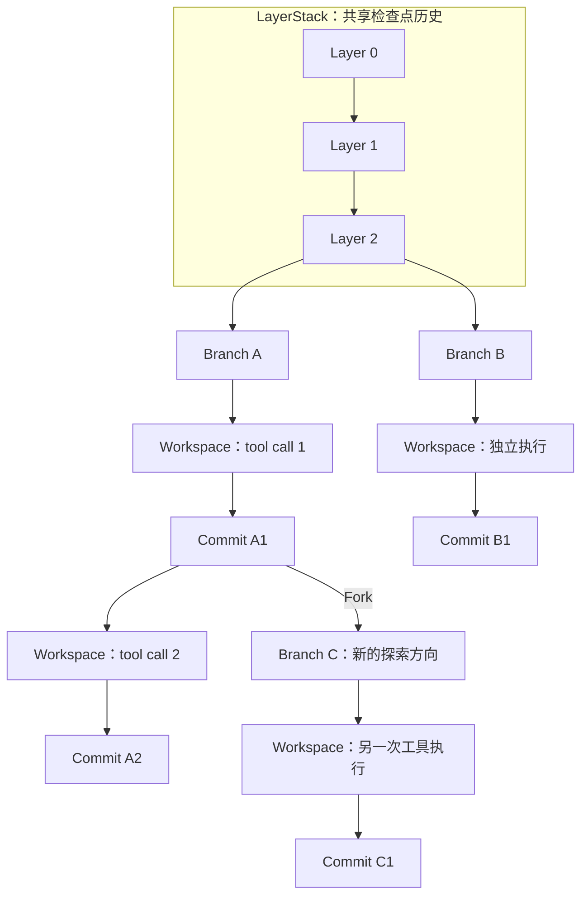
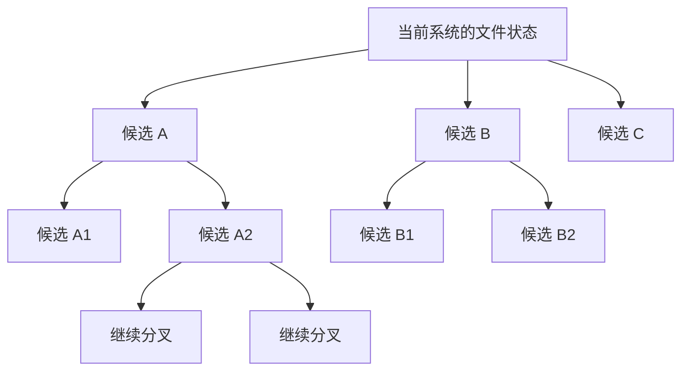

# LayerFS：面向 Agent 的递归文件系统

> 状态：项目架构阐述与长期愿景。
>
> **Workspace per tool call. Zero-copy forks. Branchable exploration.**

LayerFS 是一个开源的 Recursive File System（RFS，递归文件系统）项目。我们围绕 Agent 的工具执行组织文件状态：用 LayerStack 保存共享历史，用 Branch 展开工作与探索路径，用 Commit 保留中间状态，用 Workspace 为每次影响文件状态的工具调用提供独立的可写视图。

每个保留的文件状态，都可以成为后续执行与分叉的起点。Zero-copy fork、COW 和 CAS + CDC 让不同路径复用已有内容，使隔离执行、细粒度历史和递归探索建立在同一套文件状态架构之上。

**我们的 mental model 是：逻辑上独立的执行空间，物理上共享的文件状态，以及可以反复分叉的演进路径。**

## 01｜Mental model：LayerStack → Branch → Commit → Workspace

理解 LayerFS，可以从一份项目文件状态开始。

这份状态保存在 LayerStack 的某个 Layer 中。Agent 从这里创建 Branch，沿着自己的路径工作。每次工具调用进入一个基于确定状态的 Workspace，在其中读取和修改文件；需要保留的结果形成新的 Commit。后续调用从新状态继续，另一个探索方向也可以从这个 Commit 分叉出去。



图中的箭头表示状态来源与执行过程。Branch 保留自己的 Commit 历史，Workspace 将其中的确定状态投影为工具可操作的文件系统。选定 Branch 的头部还可以通过 Add 发布为新的 Layer，进入共享检查点历史。

### LayerStack：共享文件状态的有序历史

一个 LayerStack 由有序、不可变的 Layer 组成，可以承载一个项目或执行环境的共享检查点。

每个 Layer 都表达完整的逻辑文件快照。读取某个 Layer，就能看到那个检查点对应的文件状态；未改变的内容与结构在底层继续共享。

例如，L0 可以是初始项目，L1 是接纳一轮开发成果后的状态，L2 是下一轮工作的结果。三者都具有完整的逻辑视图，物理存储则复用它们共同拥有的对象。

### Branch：一条独立演进的路径

Branch 从一个 Layer 或可分叉的历史 Commit 出发，承载后续变化。它可以对应一个开发任务、一个协作单元，或者一种候选方案。

Branch 为路径提供身份，并指向当前进展。不同 Branch 可以从同一个状态出发，独立演进；一条路径上的中间状态还可以成为新 Branch 的起点。

### Commit：保留下来的不可变状态

Commit 保存 Branch 演进中的文件状态，并与此前历史建立关系。它让中间结果能够被读取、比较、恢复和再次分叉。

在 workspace per tool call 的工作方式下，运行时可以将一次工具执行需要保留的文件变化对应到一个 Commit。多个 Commit 组成连续的工作轨迹，选定成果再以 Layer 的形式进入共享历史。

### Workspace：一次工具执行的独立文件视图

Workspace 从 Branch 的确定快照创建，为工具提供临时、独立的可写文件视图。工具在其中执行，结果可以显式保存或放弃，空间在生命周期结束后清理。

**Workspace 可以结束，Commit 继续存在；Branch 可以继续分叉，共享历史持续复用。**

这四个对象分别组织共享检查点、演进路径、中间状态和实际执行。LayerFS 将它们连接为一个可以不断重复的过程：

```text
已有状态 → 创建 Workspace → 执行工具 → 保存 Commit
   ↑                                      │
   └──────── 继续执行，或 Fork 新 Branch ────┘
```

## 02｜Workspace per tool call：让每次文件变化拥有执行边界

我们的核心使用模型是 **Workspace per tool call**：每次影响文件状态的工具调用，都进入自己的 Workspace。

一个 Workspace 中尚在进行的修改保留在自己的文件视图内。其他 Workspace 继续看到各自的起点与自身变化。这样，多个 Agent 可以分别编辑、构建和测试，并形成各自完整的结果。

一次工具执行因此具有明确的四个阶段：

| 阶段 | 含义 |
| --- | --- |
| 确定起点 | 固定本次执行所依据的文件快照 |
| 隔离执行 | 在独立可写视图内完成文件操作 |
| 形成结果 | 捕获变化，显式保存或放弃本次结果 |
| 继续工作 | 从保留状态执行下一步、展开新分支或发布检查点 |

执行的生命周期覆盖工具实际工作的过程；异步命令的启动与后续轮询可以持续关联同一个 Workspace。文件视图通过物化或 FUSE 等投影方式提供给现有工具，编译器、测试程序和编辑工具可以围绕普通文件操作工作。

隔离与发布分别具有清晰边界。一次修改先在自己的空间中完成，再作为完整结果参与后续协调。Branch 可以连续积累修改、构建和测试的状态，LayerStack 则接纳有意义的共享检查点。

这一粒度也为执行来源追踪提供基础。运行时可以把 Agent、任务、tool-call ID、输入状态、输出状态和验证记录关联起来，组织面向工具调用的 audit 与 blame：某份变化来自哪次执行，基于哪个起点，又如何进入最终结果。

## 03｜为什么去重是架构核心

Workspace per tool call 会产生大量独立空间；保存中间结果会产生大量历史状态；递归分叉又会让这些状态展开为更多路径。

这些状态通常高度相似。同一份代码库可能被多个 Agent 同时使用，一次编辑可能只修改几十行，相邻两次工具执行也可能共享几乎全部文件。随着执行次数、历史深度和探索宽度增长，相同基础内容会被反复引用。

**我们希望存储增长主要跟随新的变化，而让已有内容被尽可能多次复用。**

可以用一个简化示意理解这一点：假设基础内容为 1 GB，100 条路径各自产生约 1 MB 的独有变化。完整复制每条路径的基础内容，就会产生约 100 GB 的基础副本；共享存储的目标则接近一份 1 GB 基础，加上各条路径的独有变化及相关结构数据。这个示意用于解释复用关系，实际占用还包括分块、元数据、数据库和临时投影等开销。

去重因此影响三个尺度：

| 尺度 | 共享什么 | 支撑什么 |
| --- | --- | --- |
| 一次执行前后 | 未改变的文件内容和结构 | 细粒度保存工具执行结果 |
| 多条并行路径之间 | 相同项目基础与相同对象 | 更多独立 Workspace 与候选方案 |
| 多层递归探索之间 | 共同祖先状态和可复用内容块 | 更宽、更深的探索与历史保留 |

对 LayerFS 而言，去重关系到我们能够经济地保留多少中间状态、展开多少候选方向，以及让多少执行共享同一份基础。

## 04｜Zero-copy fork、COW、CAS + CDC 如何配合

这些机制分别作用于创建路径、修改状态和保存内容的过程。

### Zero-copy fork：引用已有状态，创建新的路径

从已有 Layer 或可分叉 Commit 创建 Branch 时，LayerFS 复用现有状态根，无需复制规范内容对象。

新 Branch 获得独立的演进身份，同时共享分叉时的完整逻辑状态。分叉建立新的路径关系，实际文件视图由 Workspace 的投影机制提供。

这让“再尝试一个方向”能够从已有工作直接出发。

### COW：独立修改，继续共享未改变部分

Copy-on-write 让不同路径共享不可变的基础状态。发生修改时，LayerFS 构建新的受影响内容或结构，并复用未改变的文件区域与子树。

例如，一条路径修改某个文件，另一条路径仍然可以读取原来的版本。两者在逻辑上独立，原有共享状态保持不变。

COW 将独立演进与结构复用结合起来，使新的 Commit 能够继续共享此前状态的大部分结构。

### CAS：相同内容，共同保存

Content-addressed storage 根据规范化内容生成对象标识。相同规范内容具有相同身份，可以在一个 Store 内跨文件、跨 Branch、跨 LayerStack 复用。

不同路径即使分别产生了相同对象，也可以共享同一份已保存内容。内容身份还为读取验证和历史状态引用提供基础。

### CDC：局部变化，局部新增

Content-defined chunking 根据内容确定分块边界。对大文件进行局部插入、删除或修改时，未改变区域能够尽可能复用原有内容块。

CAS 识别相同对象，CDC 则帮助局部变化后的文件继续暴露可复用的内容区域。二者结合，让去重能够深入到文件内部。

### 一次完整循环

```text
Fork 新 Branch
  → 引用已有状态，零复制规范内容对象

Workspace 中执行修改
  → 保留独立文件视图，记录本次变化

保存 Commit
  → COW 复用结构，CAS + CDC 复用内容

继续 Fork
  → 新结果成为下一层执行与探索的起点
```

**Zero-copy fork 复用起点，COW 复用结构，CAS + CDC 复用内容。** 这些机制共同支撑逻辑隔离、物理共享的文件状态模型。

## 05｜LayerFS 相对 Git + worktree 的直接优势

Git + worktree 提供仓库版本和独立工作目录。**LayerFS 进一步把 Agent 执行所需的文件状态，做成可隔离、可保留、可恢复、可递归分叉的基础资源。**

优势集中在三个方面：

- **隔离到每次工具调用。** SDK 提供 Workspace 创建、执行、捕获、Commit 和 End，运行时可以将它们组织为 tool-call 生命周期。每次调用都有明确起点、独立文件视图和可保留结果，便于追溯变化、放弃失败尝试和从中间状态继续分叉。
- **保存执行文件状态。** 保存范围由 Workspace 的管理边界决定，可以包含源码、已安装依赖、生成产物，以及受支持的 mtime、权限位、硬链接关系等文件系统信息。
- **独立执行，共享底层内容。** Zero-copy fork 复用起点，COW 复用结构，CAS + CDC 复用内容，让检查点和分支共享已有基础。FUSE Workspace 读取共享不可变状态，各自的修改独立记录。

### 具体能力对比

以下比较 Git + worktree 自身与 LayerFS；安装缓存、目录复制、reflink 和外部挂载共享属于可以另外叠加的机制。

| 具体能力 | Git + worktree 自身 | LayerFS | LayerFS 的直接优势 |
| --- | --- | --- | --- |
| 继承执行目录中的文件 | 检出所选提交中的文件；不会自动带上源目录中未提交、未跟踪或被忽略的内容。 | 从保留的 Layer / Commit 投影已纳入快照的文件，保存范围不由 Git 跟踪状态决定。 | 直接继承执行起点：将已保存的源码、依赖和产物一起交给后续 Agent，减少重新拼装文件状态的步骤。 |
| 保留文件系统信息 | Git 历史保存文件内容、树结构及部分模式信息；mtime、完整权限位和硬链接关系不随普通提交完整恢复。 | 在支持的文件系统语义范围内保存和恢复文件内容、目录、mtime、权限位及硬链接关系。 | 更完整地恢复文件状态：同时还原内容与受支持的元数据，减少权限、时间戳或链接关系变化造成的执行差异。 |
| 复用已安装依赖 | 未纳入提交的 `node_modules` 不会被新 worktree 自动继承，需另外安装、复制或共享。 | 将安装结果纳入文件快照，再从该状态创建 Branch 和 Workspace。 | 安装一次，多条路径复用：在环境兼容、安装结果可复用时，避免各 Agent 为同一份依赖重复安装。 |
| 提供共享的可写文件视图 | worktree 命令本身不提供工作目录的 COW 共享存储保证。 | FUSE 视图共享不可变基础、隔离修改；物化投影另有文件复制成本。 | 隔离写入，共享基础：FUSE 下多个 Workspace 读取同一份不可变内容，各自保存修改，减少重复基础数据。 |
| 组织工具调用级状态 | 版本操作由 Git 提供，工具执行、前后检查点和目录生命周期由上层额外编排。 | 同一 SDK 提供执行空间、状态捕获和历史操作，供运行时直接组合。 | 缩短状态管理链路：直接组合每次调用的隔离、保留、放弃和后续分叉，减少运行时自行拼接版本与目录操作。 |
| 保存相似文件版本 | 内容寻址对象可以复用，packfile 可对相似对象进行 delta 压缩。 | CDC 暴露可复用内容区域，CAS 共享对象，COW 复用结构。 | 在内容构建时复用文件区域：局部编辑后的新状态可以共享未改变的块与结构，支持高频检查点和分支历史。 |

**POSIX 操作由 worktree 所在的宿主文件系统提供，工具可以正常使用；差异在于文件状态是否被历史保存，以及恢复时能还原什么。** Git 的相关机制见 [Git Objects](https://git-scm.com/book/en/v2/Git-Internals-Git-Objects)、[git worktree](https://git-scm.com/docs/git-worktree)、[gitignore](https://git-scm.com/docs/gitignore) 和 [Packfiles](https://git-scm.com/book/en/v2/Git-Internals-Packfiles)。

### 例子：安装一次，保存状态，再分叉给十个 Agent

假设十个 Agent 使用相同运行环境，依赖安装结果可直接复用，且 `node_modules` 没有纳入 Git 提交。

- **Git + worktree：**同一个 commit 可以检出十个工作目录，但其中不会自动出现已安装的依赖，仍需另外准备。
- **LayerFS：**先在一个 Workspace 中完成安装，将包含依赖的文件状态保存为 Commit，再分叉给十个 Agent。各 Workspace 可以读取已保存的依赖；FUSE 下共享底层内容，后续修改独立记录。

**复用安装完成的状态，可以避免为了取得同一份依赖而分别重新安装。** 如果仍执行十次安装，下载、解包、脚本和 CPU 工作仍按实际执行发生；内容去重不会自动消除这些工作。

我们把文件状态保存、恢复、分叉、内容共享和执行生命周期整合进同一套引擎，直接服务于高频工具调用、多 Agent 协作和递归探索。性能优化围绕创建、执行、捕获与分叉的完整路径展开，具体收益通过同等工作负载验证。

Git 继续管理项目审查与代码交付，LayerFS 管理 Agent 为得到结果而经历的文件状态与探索路径。

## 06｜应用一：Multi-agent coding development

多 Agent 开发需要让多个参与者同时推进工作，并将各自成果组织为一个一致的项目状态。

LayerFS 为这一工作方式提供文件状态基础：多个 Agent 从明确快照出发，每次工具调用进入自己的 Workspace，修改先在独立视图中完成，再形成可检查的候选结果。

### 隔离执行，为冲突协调提供完整输入

Workspace 隔离使并发变化具有清晰归属：每份候选结果都有自己的起点和最终文件状态。系统可以围绕共同基线、候选变化和当前状态进行三方协调。

例如，A 修改一个模块，B 修改另一个模块，两份结果可以独立保存，再参与协调。如果它们修改同一位置，双方结果与基线也都能保留，为冲突选择或新的修复执行提供依据。

**隔离负责保存独立贡献，协调负责组织共同结果，验证负责检查准备接纳的状态。**

在我们面向多 Agent 的协作架构中，工具执行可以并发展开，进入共享分支的结果有序接纳。运行时结合读取依据与验证反馈，决定直接接纳、重新验证或在新状态上继续执行。这样，每次接纳都围绕明确的文件状态进行。

### 以工具调用关联贡献与历史

运行时将执行身份与状态历史连接起来后，开发过程可以回答：哪个 Agent 的哪次调用生成了变化，执行依据是什么，验证发生在哪个状态，以及最终结果经过了哪些协调。

同一套记录也能帮助 Agent 从相关中间状态重新出发，尝试另一种修复方法。

### 协作单元可以继续展开

一个开发任务可以分解为多个子任务，每个子任务又可以创建自己的分支与工具执行。中间成果保存在各自路径中，经过协调与验证后形成更高层的成果。

```text
共享项目状态
  → 多个 Agent / 子任务
  → 各自的 Branch 与 Workspace
  → 独立贡献
  → 协调与验证
  → 新的共享检查点
```

这一应用围绕“共同完成一个结果”展开。Workspace per tool call 提供执行边界，历史与协调机制连接多份贡献，共享存储复用它们共同依赖的项目基础。

## 07｜应用二：Multi-lane RSI 与 MCTS rollout

另一类任务需要保留多个候选方向，并通过反馈决定继续探索哪条路径。

在这里，Branch 可以代表一种修复方案、一组工具修改、一种执行策略或一个自我改进候选。多个候选从同一状态出发，各自运行、各自评测，并从有价值的中间结果继续分叉。

### 从 single-lane 迭代走向 multi-lane 探索

我们对 single-lane RSI 路线的核心判断是：**递归深度与探索宽度是两个独立维度。**

一个系统可以持续修改自己、评估自己，再继续修改很多轮，却始终沿着一条活跃轨迹前进。每轮后续改进都继承这条路径此前做出的选择。

我们认为，递归自我改进应该保留展开替代路径的能力。同一个中间状态可以产生多个改进候选，每个候选独立推进和评测；有价值的节点继续扩展，不同方向可以在搜索过程中持续比较。



**RSI should be recursive in depth and branchable in breadth.**

递归自我改进应该能够向深处迭代，也能够向多个方向展开。

### MCTS 如何使用可分叉的文件状态

Monte Carlo Tree Search（MCTS，蒙特卡洛树搜索）可以围绕候选状态组织选择、扩展、模拟与反馈回传，在探索新路径与继续投入已有高价值路径之间分配计算。

LayerFS 为这样的搜索节点提供可引用、可恢复、可再次分叉的文件状态。搜索器可以从一个节点创建 Branch，通过 Workspace 执行动作，保存结果，并将评价信息关联到新节点。

完整工作流由可组合的部分构成：

| 部分 | 职责 |
| --- | --- |
| LayerFS | 保存、读取、比较与分叉文件状态，提供独立 Workspace |
| Agent Runtime | 组织工具执行、上下文、运行配置和外部交互 |
| 搜索器 | 选择节点、生成候选、分配探索预算 |
| 评测系统 | 提供测试、任务验收或其他环境反馈 |

节点可以同时关联对话历史、运行配置和评测记录，使文件状态参与完整的搜索过程。共享内容让不同候选复用基础环境，递归 Fork 让新的中间结果继续产生下一层路径。

### RSI：让改进过程本身能够分叉

Recursive Self-Improvement（RSI，递归自我改进）可以把 Agent 使用的代码、工具、策略配置等作为改进对象。每轮提出多个候选，在独立空间中运行评测，保留选定结果，并将其作为下一轮改进的起点。

```text
当前基线
  → Fork 多个改进方向
  → 各自修改与执行
  → 评测候选结果
  → 选择值得继续的状态
  → 再次 Fork，进入下一轮改进
```

我们的愿景是推动 Agent 从主要围绕单条轨迹持续推进的工作方式，发展到以真实执行反馈组织的可分叉探索：

> **From single-trajectory exploitation to branchable exploration.**

MCTS 同时组织 exploration 与 exploitation。LayerFS 希望提供能够承载这种选择的文件世界，让系统既能继续深化已发现的有效路径，也能从历史节点展开新的可能性。

## 08｜Recursive File System：RFS before RSI

我们用 Recursive File System 定义 LayerFS，强调的是状态、执行与分叉可以反复组合。

一个工具结果可以成为下一次工具调用的起点；一个中间 Commit 可以成为新 Branch 的起点；一个子任务可以继续展开自己的子任务和候选方案。每一层执行都拥有独立文件视图，每一层历史都能够复用已有内容。

递归执行关系可以持续扩展，底层文件状态按照共享对象组织。逻辑探索树中的许多节点，可以共同引用同一批基础内容。

> **RFS before RSI.**
>
> 我们相信，要让递归自我改进充分展开，文件执行环境首先应该具备递归分叉的能力：保留当前状态，尝试多个方向，并从任何有价值且可分叉的中间结果继续探索。

这也是两大应用共享的架构基础：

| 应用 | 如何组织路径 | 如何使用结果 |
| --- | --- | --- |
| Multi-agent coding development | 多个参与者独立执行，递归分解工作 | 协调与验证贡献，形成共享成果 |
| RSI / MCTS rollout | 多个候选独立演进，递归扩展搜索 | 评估与选择节点，继续有价值的路径 |

两者都需要独立 Workspace、明确历史、低成本分叉和可复用内容。一个侧重整合贡献，一个侧重搜索候选。

## 09｜以开源方式推动 AgentFS

我们希望推动 AgentFS 成为 Agent 基础设施中的一个明确方向：围绕工具执行组织文件状态，让隔离、历史、分叉与复用成为运行时可以直接组合的能力。LayerFS 是我们对这一方向的开源实践。

文件系统提供状态基础，运行时组织执行，搜索算法组织探索，评测系统提供反馈。不同项目可以在共同的状态模型上实现不同的 Agent 工作方式，从并行开发到多分支 rollout，再到递归自我改进实验。

我们的长期目标是让 branchable exploration 成为 Agent 的常规能力：一个想法可以进入独立 Workspace 成为真实尝试，一个有价值的中间结果可以长出新的分支，一份已经存在的文件状态可以被更多执行反复复用。

**LayerFS：每次工具执行拥有独立空间，每条探索路径共享已有状态，每个保留结果都有机会成为下一层探索的起点。**
